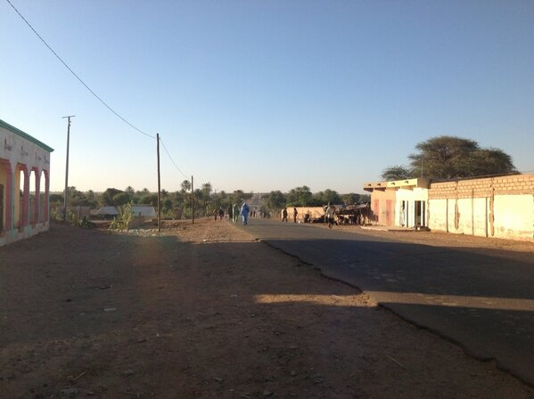
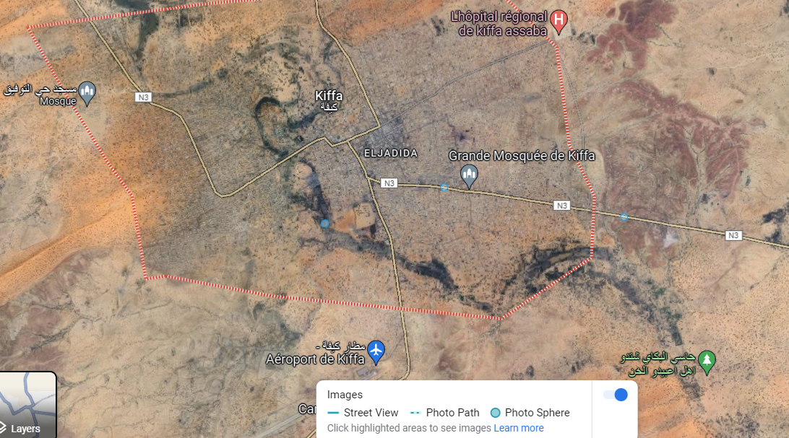
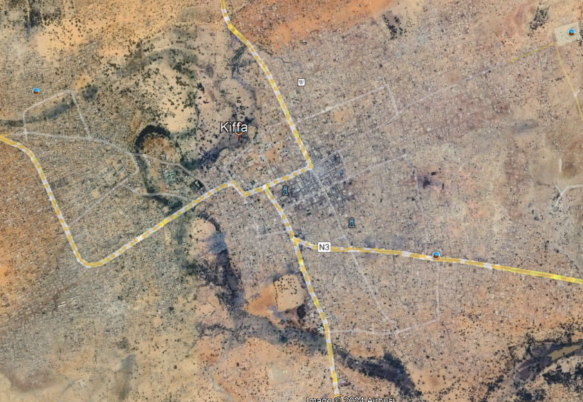
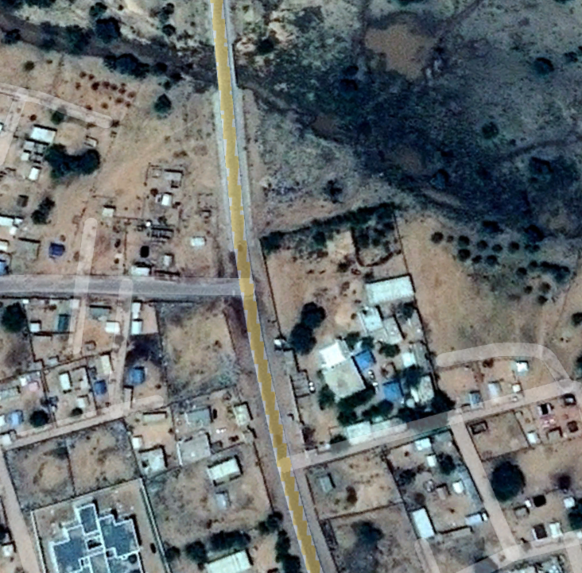
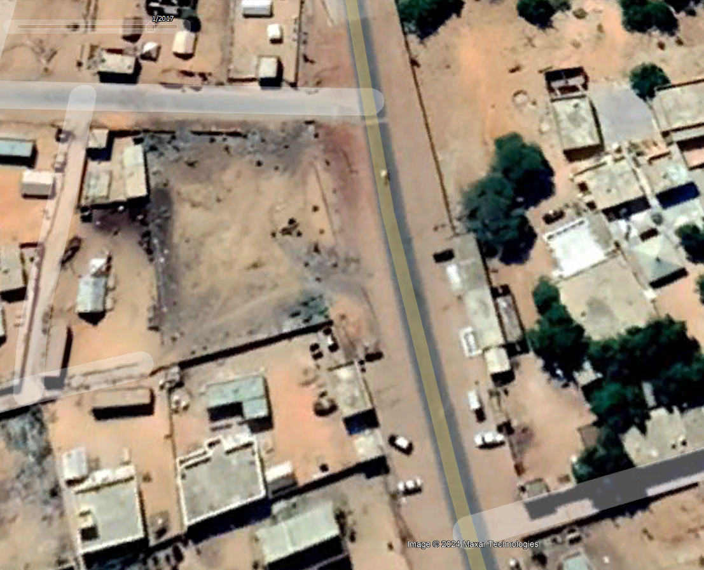
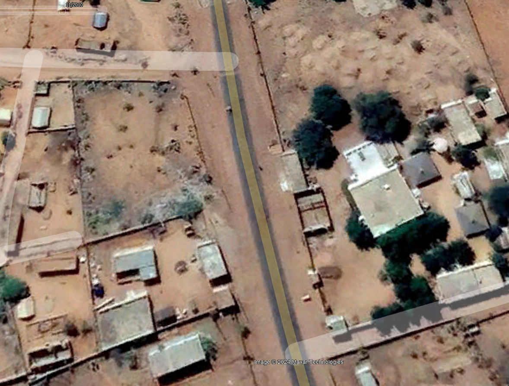
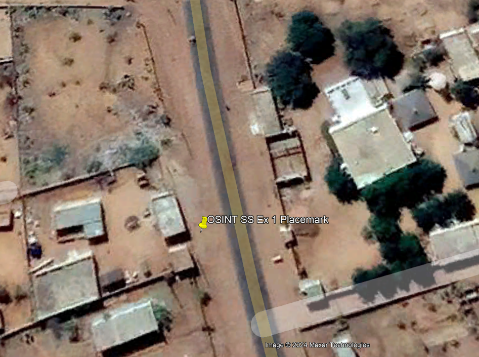

# OSINT Exercise 001 
[Link to full briefing](https://gralhix.com/list-of-osint-exercises/osint-exercise-001/) of OSINT Exercise 001  
Creator of Exercise: Sofia Santos

## Task Goal:
To identify the coordinates of where the photo was taken.

### Write up and Thought-Process
**Part 1: Initial Clues**  
a. City name mentioned -- Kiffa. 
Quick check on [Google Maps](https://www.google.com/maps/place/Kiffa,+Mauritania/@16.6201938,-11.4283135,14z/data=!3m1!4b1!4m6!3m5!1s0xe8b1f14d26e8c71:0x7799d6879ffe8fc4!8m2!3d16.6258353!4d-11.4055282!16zL20vMGIxeGdr?entry=ttu) shows its a city in Mauritiana.  

b. Observations from the photo: shows a road leading out of the city? Why out -- the buildings stop, and its greenery on either side of the road. Handy when looking up roads and matching terrain in google maps.  

c. Road is not looking like a highway. Dust on either side, would probably be a smaller-road, or side road.  

**Part 2: Investigation on Google Maps**  
Altered the Google map view to have the satellite (helps with distinguishing the terrain colours) and street view (to drop the pin, and have a view of the surroundings). 

Street view in this city is very limited. There are 3 small areas with a successful photo sphere, the rest of the city's streets aren't captured. 

Screenshot of Kiffa with the roads highlighted and 3 blue dots indicating photo spheres (only documented parts of the road).

Streetviewing these 3 spheres, they're showing that they aren't the accurate coordinates. 

So, to proceed, let's explore the city in Google Earth. 

**Part 3: Investigation on Google Earth**  
On Google Earth, after zooming into Kiffa, we can modify the layers like how we did with Google Maps. 

As the photo shows a road, that's paved, and tarred, let's investigate the major roads heading out the city from above. And also, from Part 1, we know that there's a part of the road with greenery on both sides. 

Attempted a man-drop, but it's only a view from the top. So from the top-view, let's roughly see the area of buildings that are the likely coordinates. 

From the photo, on the right-hand side of the road, there is a building, and some trees right next to it. 

On the left-hand side of the road, a building, and some electrical cable poles. But these things are not very clearly visible in satellite photos. They could be blurry.

Shortlisted road from which photo could've been taken

One good way to test/confirm their presence is if they emit shadows. For that area, we can try to toggle the timing of the satellite photography with the timeline bar at the top. After toggling to the past (suggested date: 11/2010, and 1/2017) those are visible. 

Snapshot from the past (Nov 2010)

Snapshot from the future (Jan 2017)

The rough area of the road has been narrowed down. Therefore, a suggested coordinate might be:
16°36'34.10"N, 11°23'51.99"W. (OSINT SS Ex 1 Placemark)

Estimated coordinates with placemark in Google Earth

Pushing the placemark a little more to the left of the road, as that's roughly where the camera person stood.

### Credits:
Full credits to Sofia Santos for putting together this exercise

