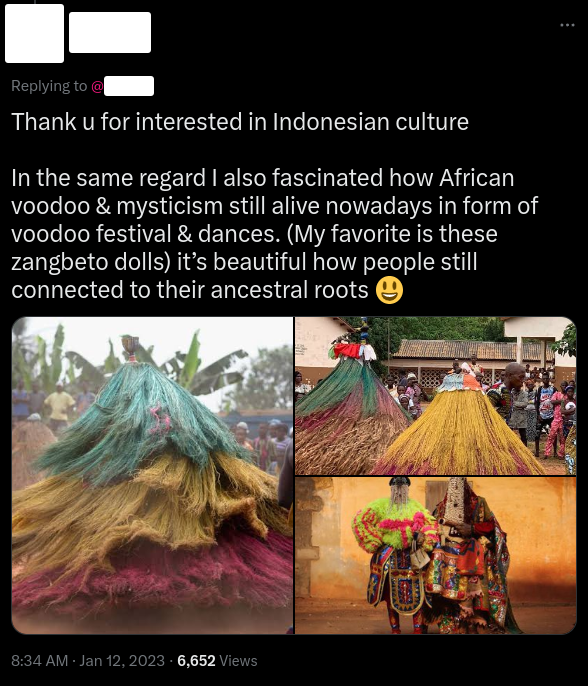

# OSINT Exercise 010
[Link to full briefing](https://gralhix.com/list-of-osint-exercises/osint-exercise-010/) of OSINT Exercise 010  
Creator of Exercise: Sofia Santos

## Task Goals
A Twitter user shared three photos of an event.

Find the following details about the photos:  
I) Which event is being celebrated in the photos?  
II) Which two photos were taken by the same person?  
III) The two photos mentioned above were taken in the same city. The photographer was previously in a different city. Find out the name of that city.  

### Write up and Thought-Process

**Part 1: Photograph location and creator**  
After attempting a rough image reverse upload of the screenshot with the tweet, a couple of results came together. One that explained a little more was at this [link](https://tripfreakz.com/offthebeatenpath/voodoo-festival-in-benin). This gives a hint that these are pictures from a Voodoo Festival in Benin, and a little write-up of how it came to be. The write-up also mentions that an important city for voodoo practitioners is Ouidah, Benin. There's a chance the photos in the Twitter post could come from there or not, as the article also mentions other countries this is practiced in. From the photo gallery attached to the post, the 1st and the 20th photo from the gallery match the ones published in the Twitter post.  

So it could be roughly confirmed that this is a celebration of a Voodoo festival in Benin. Let's try to find another search result from the image look-up, to confirm this.  

One other handy result, was this one from [GettyImages](https://www.gettyimages.it/immagine/voodoo-festival-celebrated-in-benin). This is a further confirmation that the festival took place in Benin, specifically, in a city called Ouidah. So chances are, this photographer, has indeed been to Ouidah, Benin, to capture this [photo](https://www.gettyimages.it/detail/fotografie-di-cronaca/zangbetto-performs-during-a-voodoo-ceremony-on-fotografie-di-cronaca/146328923?adppopup=true).  

We've found that photographer, Dan Kitwood, took and uploaded the above photo. He's also the owner of this [photo](https://www.gettyimages.it/detail/fotografie-di-cronaca/egungun-spirits-stand-during-a-voodoo-ceremony-fotografie-di-cronaca/146313088?adppopup=true).  

**Part 2: Where had the photographer gone before Ouidah, Benin?**
For the final task, to find out where the photographer was, it would be useful to see if he publishes more details about where he visits as he travels.  

The first approach was to look up in his collection of Getty Images. After doing a custom search of 31st Dec 2011 to 31st Jan 2012, some images that come together from this are some photos he took in Contonou.  

Intriguingly, when looking across his photos of Cotonou, between these two in his portfolio, we see a jump in dates. The one on the left was created on 13th Jan 2012, and the one on the right was on 6th Jan 2012.  

Given that his write-up of his Voodoo pictures from above mention that he captured them on Jan 9th, and Jan 10th respectively, there's a feasible chance, the photographer was in Cotonou before going to Ouidah.  

Therefore, the solutions to the tasks are:  
I) Voodoo Festival in Ouidah, Benin  
II) Photos were the one on the left side and the bottom right  
III) Based in Cotonou before coming to Ouidah  

### Credits:
Full credits to Sofia Santos for putting together this exercise.