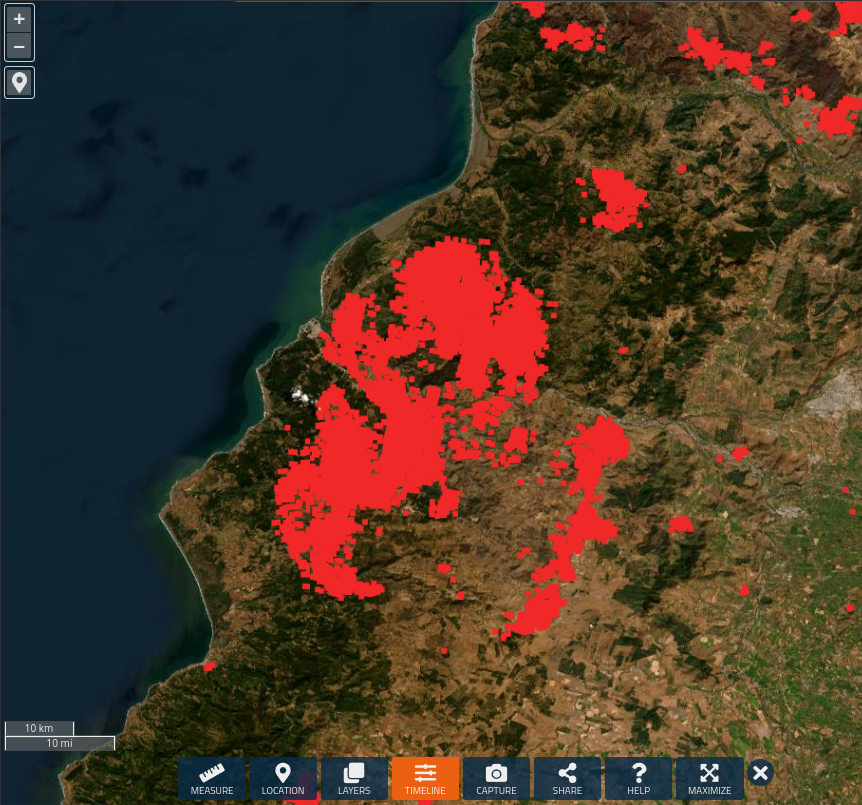
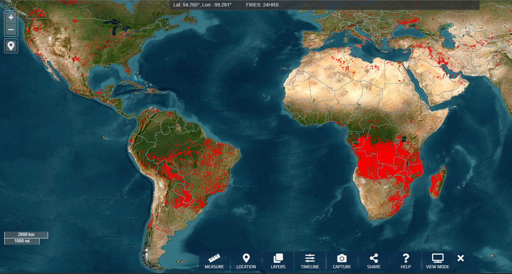
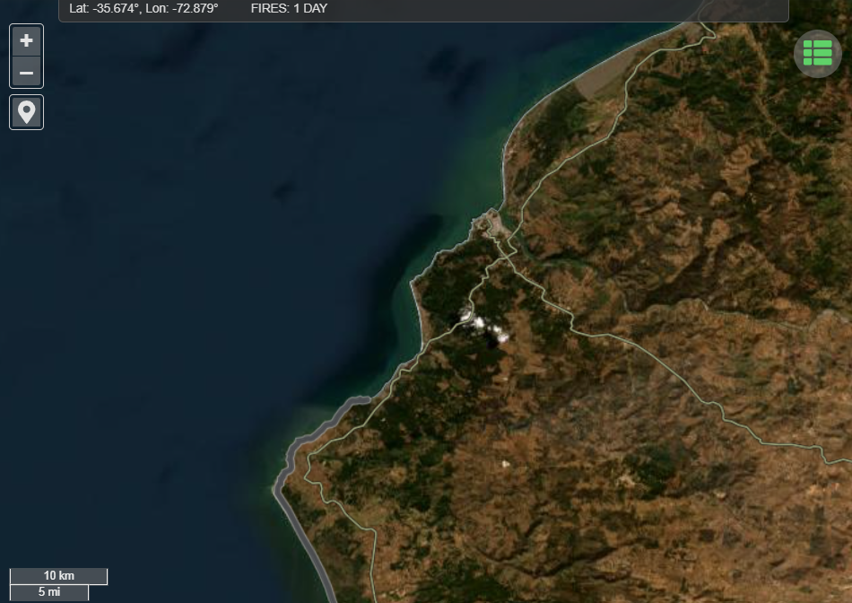
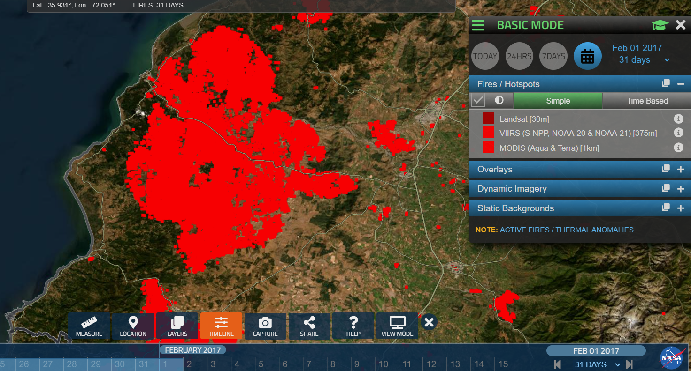
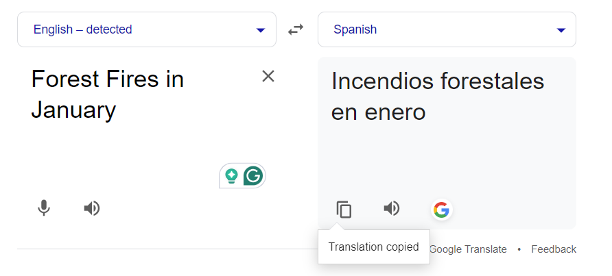

# OSINT Exercise 012
[Link to full briefing](https://gralhix.com/list-of-osint-exercises/osint-exercise-012/) of OSINT Exercise 012  
Creator of Exercise: Sofia Santos

## Task Goals
The screenshot below shows satellite imagery from a coastal area. Each red pixel represents a 30 metre centre point containing a thermal anomaly. The data is from January.  

Find out the following: 
I) To identify the website that made the task photo  
II) Which country is the task photo of  
III) The screenshot shows a photo of a specific date. When was it captured?  

### Write up and Thought-Process

**Part 1: Initial Thoughts about Task photo**  
With regard to website, there is a certain stylised way the zoom buttons, the length markers and the various action icons of the photo are of the photo. So that's something specific to look at.  

 That fact that a coastline is present tells us, that the country cannot be landlocked.  

Next, of the area itself: there is a coastline, and inwards that, loads of greenery. Potentially a forest? And most of these thermal hotspots are scattered in the greenery portion of the photo. Assuming the greenery indicates forests, is this an image of a forest fire?  

Finally, considering that the data came from January, then it might be forest-fire season in an area that is experiencing high temperatures/low rainfall. Could it potentially be the Southern Hemisphere? 

So the first to consider, is the website this image is from.  

**Part 2: What website does the photo belong to?**

Perhaps, instead of a image reversal search, let's consider what initiatives monitor data like this. It could be along the lines of a hotspot weather watching initiative. With those ideas first, let's attempt a google search.  

One potential query to try was: "websites that monitor thermal anomaly around the world", and here was its [result](https://tinyurl.com/3dk9tyhy). 

And let's explore the first result, the one of NASA's FIRMS. And interestingly, this looks very similar to our task photo, in terms of the User experience, and map toggle buttons!  

Therefore, that's the first part solved: the website is [FIRMS](https://firms.modaps.eosdis.nasa.gov/map/#d:24hrs;@0.0,0.0,3.0z) - Fire Information for Resource Management System.  

**Part 3: Trying to identify the country**  
With the timeline button, there's a possibility to see fires that happened in January. However, it is worth considering that the photograph showed one coastline area, at one time, in one day of January.  

But one good thing, in the FIRMS UX, is that, it is not possible to rotate the map. At best, one can zoom in and zoom out. Therefore, a good chance that the zoomed in picture, at 10km-10 miles, is of a coastal place with the sea in the North-Western-ly direction. (Unless, there is a way to rotate the view, and I hadn't found it). One nice thing to note are the two small snowspots also, in our task photo.  

So, before checking the coastline of all the countries in the world that have water in the NW direction, let's first see if this coastline can be found anywhere on the internet first.  

**Part 4: Narrowing the country of thermal activity**  
By Image Reversal of the task photo, here is one [candidate](https://southamericawineguide.com/bio-bio-and-itata-fires-2023-information-and-how-to-help/) and it mentions Chile.  

Chile is a potential country as it has the water by its NW-direction, and it's a Southern Hemisphere country. By navigating along the Chilean coastline, in this case, going north, helps us find, that coastline with the 2 snow spots. And the coastline shape matches the task photo's.  

As per the cursor on the FIRMS webpage, the rough coordinates of those snowspots are Lat: -35.425° and Lon: -72.429°. That roughly translates to being in Chile.  

**Part 5: Narrowing the date of thermal activity**  
When toggling across the dates in FIRMS, it's becoming clear that Jan 2023, didn't have this massive fire in Chile. But looking back at the task qn, it's some January, but not in the recent years. There's a chance it can be historical data, and that's recorded here in the app. 

Therefore, one thing to do was to see the firemap across the entire of Jan, in that Chilean portion of the coastline, and see how the fires have been for a month.  

In the FIRMS website, I chose the setting in the dates to include 31 days of data from the date I was toggled at. So, to get the whole January data, one idea is to choose cut-off date of Feb 1st, of the current year, and set the number of days to be 31, so that 31 days leading up to Feb 1st, the fire data will get plotted. With 31 days of data plotted, the next is to check through each past year, and see how the plot changes.  

And in that manner, one potential year was 2017.  

As the aggregated fire data in Jan of all previous years were not as intense, 2017 was a potential candidate.  

And so, the best thing might be to look up forest fires in the Chilean domain, or in the local language (like OSINT exercise 007). Taking the idea from the walkthrough, this was a rough search result to use:  

 

Combining this query and 2017, more narrowed results will appear. Amongst them, the [wikipedia page](https://es.wikipedia.org/wiki/Incendios_forestales_en_Chile_de_2017) has been useful, with the daily report section. That gives a range of Jan 15th - Jan 30th 2017.  

When toggling back in FIRMS, with the day interval set to 1 Day, and cut off date at Jan 30th, and working backwards, the task photo's spread of the forest fire points matches that of [Jan 26th's](https://firms.modaps.eosdis.nasa.gov/map/#d:2017-01-26;@-72.12,-35.52,9.81z)

Therefore: the solutions to the task are: 
I) The photo coming from the FIRMS website - https://firms.modaps.eosdis.nasa.gov/  
II) The satellite photo is of Chile  
III) The date of the captured data being Jan 26, 2017  

### Credits:
Full credits to Sofia Santos for putting together this exercise.
