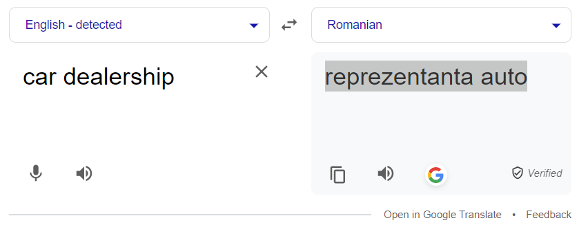
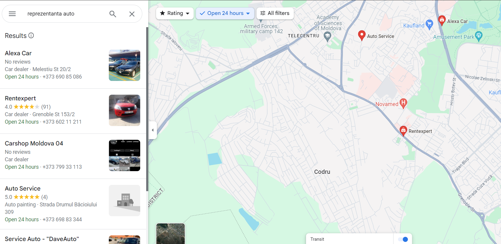
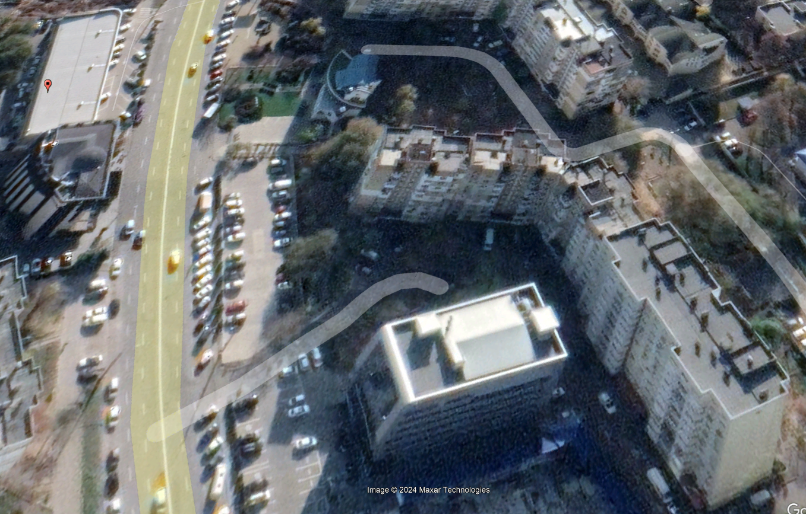
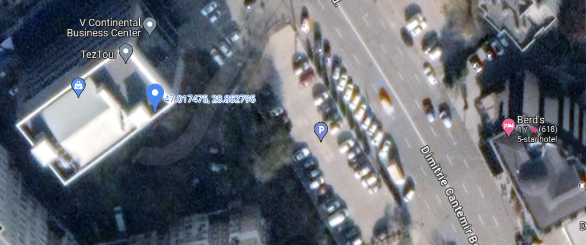

# OSINT Exercise 014
[Link to full briefing](https://gralhix.com/list-of-osint-exercises/osint-exercise-014/) of OSINT Exercise 014  
Creator of Exercise: Sofia Santos

## Task Goals
The video below was recorded during an earthquake.  
Find out the following: 
I) What was the magnitude of the earthquake?  
II) What are the coordinates of where the camera was likely located in order to record this scene?  

### Write up and Thought-Process

**Part 1: Initial Thoughts about Task photo**  
Some clues are in the thumbnail photo above, of the video. 24th Sept, 2016. Video was recorded from 02:18am to 02:20am in the local time. Caption below on the right hand corner specifies Terminal 3? Some camera from the airport or transport hub?

No particular feature of the roads, buildings or landmarks indicate any particular country at this time.

First thing to do is to confirm where the location of the video. 

**Part 2: Narrowing the city/country this took place in** 
Attempting a google search of [earthquakes in Sept 2016](https://tinyurl.com/y2k2twjf) gives a number of reports of the various countries quakes had struck at.  

Amongst the result, one potential candidate is a quake that occurred in [Romania](https://www.volcanodiscovery.com/earthquakes/quake-info/1422939/mag5quake-Sep-23-2016-Romania.html). The quake's recorded time is close to the one reflected in the video. Potential chance that the video recorded an aftershock. Furthermore, the link also elaborates that the quake was felt in nearby countries like [Chișinău, Moldova](https://www.volcanodiscovery.com/earthquakes/quake-info/1422939/mag5quake-Sep-23-2016-Romania.html#:~:text=Quakes%20in%20Romania-,NEARBY%20PLACES,-The%20closest%20larger).  

To check it further, under the "Videos" tab, there is a [video link](https://www.youtube.com/watch?v=lvGpouFqmJ0), that's the original uploader, who shared the exact same video under a different link, and at the same date as the Romanian earthquake, and the video's time frame. Its description mentions Chișinău.  

Given that the earthquake originally happened in Romania, and after vetting through a number of search results, the earthquake quoted to be at a 5.3-5.7 magnitude on the Ritcher Scale. The Moldovan Press described it as a [5.8](https://www.moldpres.md/en/news/2016/09/24/16007583).  

**Part 3: Coordinates of the camera that captured the video**  
So, it's confirmed that the video was from Chișinău, MDA. And the original video also has a location called "Terminal 3". Being the capital of Moldova, the first place to investigate would be its airport. But its understood that there is only [one single terminal](https://www.cestee.com/airport/chisinau-rmo/terminal) in their RMO airport. That means that "Terminal 3", might not be an actual place. 

So it's better to look at the thumbnail for more clues. There's a main road, 3-lane into and outside of the area. The foreground shows a parking square with flags in front of it. Plus, there's a white building in the background. And a very brightly lit building on the left side of the video.  

That can be one clue: what building is very brightly lit at 2am in the morning? That's a high electricity bill. And that building is only 1 storey high. Is it a showcase type building? Car Showcase perhaps? 

Similar to the Ex 12, let's find the Romanian version for the phrase:  

And insert that into Chișinău's view in Google Maps:  

And investigate this further, we can pay attention again to the video thumbnail. It's a large road with 6 lanes total. It curves against the brightly lit car shop. So with that road curve in mind, let's narrow a shop down in Google Maps.  

After a lot of zoom-ins and cross-checking against the solution video, the car dealership was this [one](https://g.co/kgs/ezRK58t).  

And from this location, the next thing to do is to find the camera's coordinates.  

**Part 4: Camera Coordinates**  
The video's thumbnail shows a few more details that would be good to explore in Google Earth instead. There's a car park, and a couple of flag poles. From the earlier OSINT Ex 3, those tend to get captured well enough to find a good estimate of a coordinate.  

After inserting the address of the car dealship shop, and rotating the view on Google earth, a rough picture of the vicinity can be narrowed down.  

In addition, the facade of the L-shaped building also looks similar to the one in the video. It would make sense that the camera was sitting in one of the higher floors of the square-ish building in the foreground.  

In Maps, that building is called the V Continental Business Centre. Given how much of the L-building is captured, it would be in the top left hand corner of the building. That's roughly here as per Maps.  

As per that, the rough camera coordinates would be: 47.017475, 28.852795. 

Therefore, the solutions to the questions would be:  
1. At a 5.8 magnitude (quoting the country's press agency's link).  
2. Coordinates of the Camera: 47.017475, 28.852795.

### Credits:
Full credits to Sofia Santos for putting together this exercise.