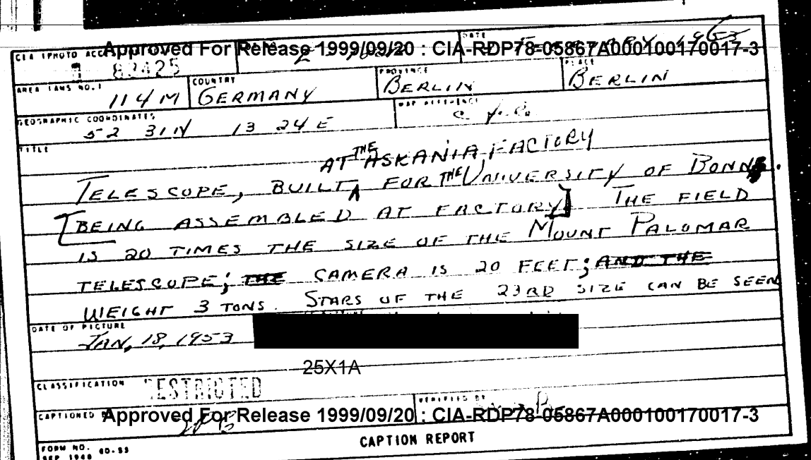
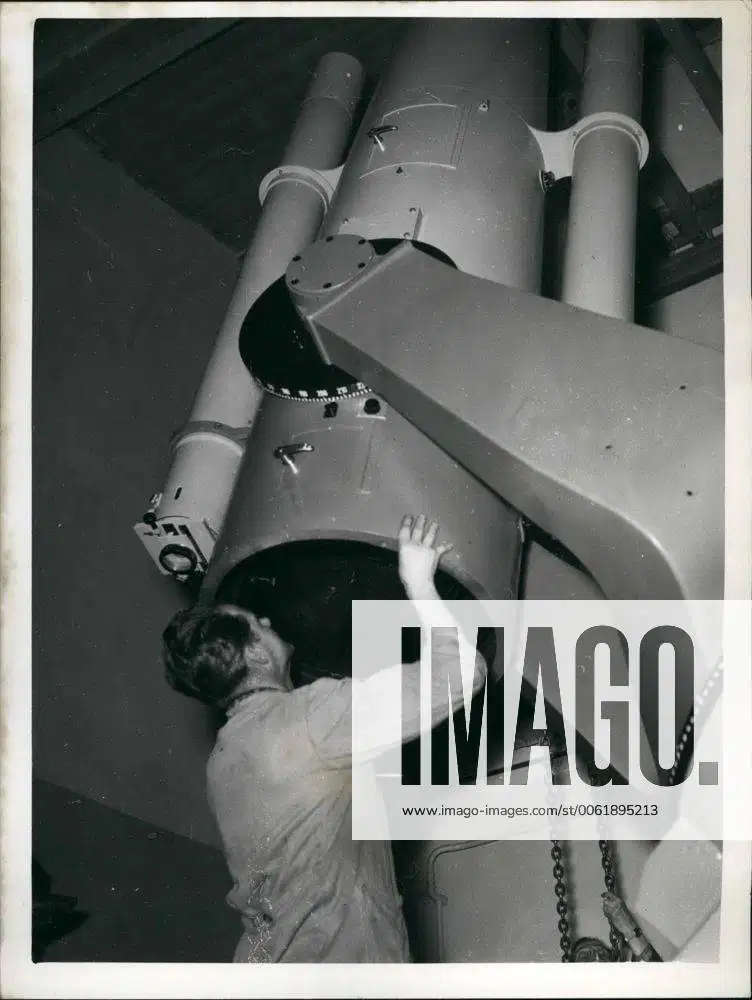
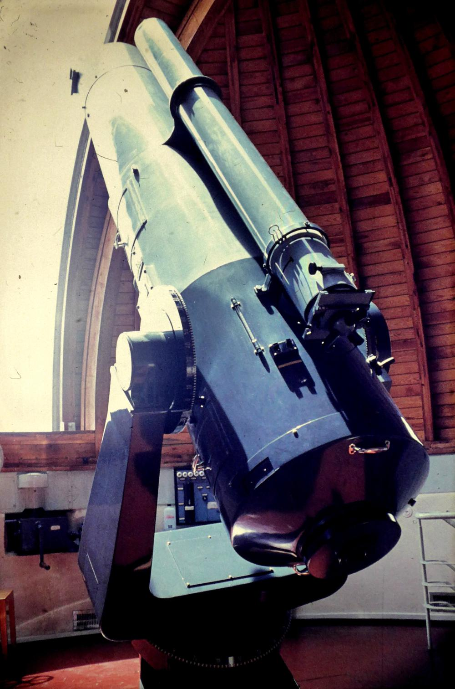
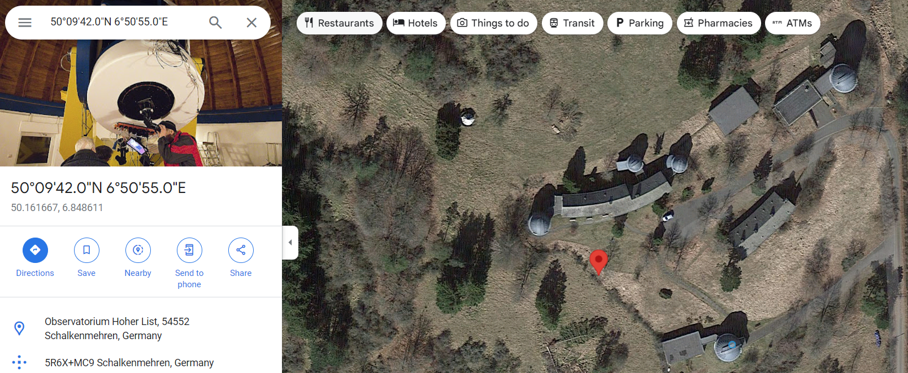
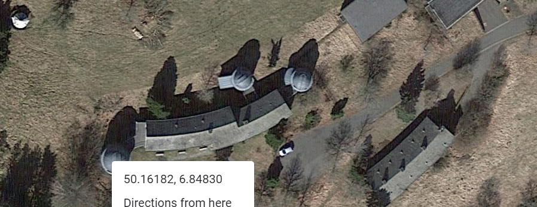

# OSINT Exercise 015
[Link to full briefing](https://gralhix.com/list-of-osint-exercises/osint-exercise-015/) of OSINT Exercise 015  
Creator of Exercise: Sofia Santos

## Task Goals
The image below is a screenshot taken from a CIA declassified document. 
It depicts a caption report of an undisclosed photo taken by an agent. The text mentions a telescope “being assembled at factory“.

Find out the following:  
I) A photo that matches the description on the caption report. 
II) The exact location of where the telescope was placed once completed. 

### Write up and Thought-Process

**Part 1: Initial Thoughts about Task photo**  
Starting first to make out what fields are written here clearly:  
Geographic Coordinates: 52 31 N, 13 34 E  
Country: Germany  
Province: Berlin  

Title: Telescope, built at the (H/A)skania factory for the University of Bonn. (Being assembled at the factory). The field is 20 times the size of the Mount Palomar. Telescope; Camera is 20 feet; weight 3 tons. Starts of the 23rd Size can be seen.  

Date of Picture: Jan 18, 1953  

CIA's Approved for release: 1999/09/20  

There is not much of a context to be deciphered as of yet, except for the fact that it's about a telescope, its specifications and its abilities. Looking at the date of the photograph, it might be a vintage photo, or something in the archive of city records? Or of the university itself?  

Even though it is a photo that was green-flagged for release to the public, it might only be published by specific sites relating to CIA archives or something to that effect to get its fully history and details.  

**Part 2: Finding a photo to match the description** 
After an initial search of this in Google:  

It's clear that this telescope is a big deal. A few sources quote that manufacturing the telescope is a huge step post-war, and it's meant for advancing the astro-sciences. Amongst the results, of a few, is this [eBay link](https://www.ebay.com/itm/375475001451). When looking at both the front and the back of the photo, we can see the actual photo and the date it was made at the back: 18th Jan 1953.  

Furthermore, the write-up in the back, also matches the title from the CIA report card of the photo, mentions the factory name (Askania), Mount Palomar, and similar magnifying effects of the telescope.  

Therefore, this could count as a fitting photo for the caption report.  

**Part 3: Location of telescope after manufacturing**  
So, from the CIA card of the photo, there are some things to recap about the telescope:  

<li>Weight is 3 tons </li>
<li> It's camera is 20 feet (long?) </li>
<li> Meant for Bonn University </li>

One site that comes up, when attempting the google search of "Askania factory telescope university of bonn 1953" is the [Portal to the Heritage of Astronomy](https://web.astronomicalheritage.net/index.php/show-entity?identity=114&idsubentity=1). That sounds like a suitable place to know about the historical equipment that was used in certain observatories.  

And interestingly, University of Bonn is also listed there.  

The website features photos and illustrations dating back to the 1830s, and it can serve to understand the timeline of what has been happening in the University for the Astro department at this time.  

In our case, a telescope from a factory in Berlin, is coming to Bonn University, in 1953. As of Jan 18th 1953, it was recorded to have been under assembly. Therefore, its completion and delivery can come after that. Therefore, when browsing in the website, there's a section of [Modern Instruments since the 1950s](https://web.astronomicalheritage.net/index.php/show-entity?identity=114&idsubentity=1#:~:text=Modern%20Instruments%20since%20the%201950s%20%2D%2D%20Hoher%20List%20Observatory) and interestingly, the 2nd equipment listed is "34/50cm Schmidt Telescope, Askania of Berlin, 1954". When crosschecking the archival photo with what we've seen previously, we can see some similarities in the stature of both telescopes.  

|From Part 2's eBay link|From Astro Heritage link|
|:-:|:-:|
|||

When revisiting the Astro Heritage link, it mentions that the telescope is placed at the Hoher List, Tower 1. When finding the term "Hoher", we can see the website mentions it earlier, that it is an observatory to which the telescope is based at. Therefore, chances are, the telescope, after manufacturing, would've gone to the Hoher List Observatory, Tower 1.  

The next is to find its proper coordinates.  

**Part 4: Telescope's Coordinates**  
It's narrowed down to Tower 1 of the Hoher List Observatory. The same website has listed that Observatory's coordinates at: "Lat. 50° 09′ 42″ N, long. 6° 50′ 55″ W, elevation 549m above mean sea level." This will mean that Tower 1 is near that area.  

One thing to also note is that the Hoher-List observatory was closed, but its history has been recorded elsewhere. Another [website](https://www.hoher-list.de/en/historie/) also confirms its history. When investigating the website further, under its "Instruments" section, we can see a [labelled photo](https://www.hoher-list.de/en/instrumentarium/) of the observatory! And to double confirm, Turm is the german word for "Tower"! Now we know, which is Tower 1. 

Comparing this top view from Maps, vs the labelled picture in the instruments section of the website, we can see that Tower 1 is the first circular dome from the left. 

And therefore, its respective coordinates are: 50.1618227350251, 6.84829822860176.

### Credits:
Full credits to Sofia Santos for putting together this exercise.