# OSINT Exercise 016
[Link to full briefing](https://gralhix.com/list-of-osint-exercises/osint-exercise-016/) of OSINT Exercise 016  
Creator of Exercise: Sofia Santos

## Task Goal
On November 25, 2020, a Twitter user shared the photo below. It depicted a military aircraft flying over an “undisclosed location”.
The task is to disclose that location.

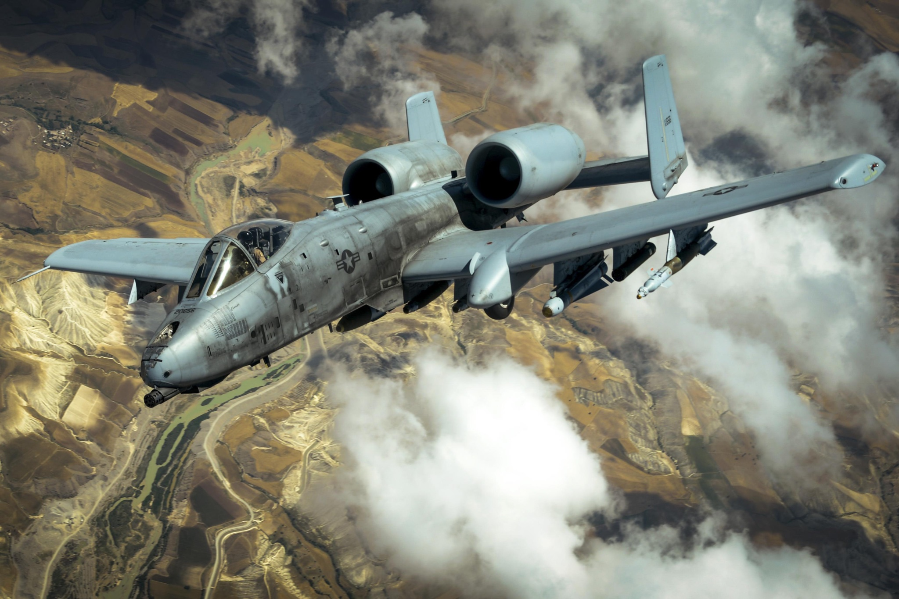

### Write up and Thought-Process

**Part 1: Initial Thoughts about Task photo**  
Just re-iterating here the properties of the photo:
<li> Published on Nov 25, 2020 </li>
<li> 5:08AM was the supposed time of upload -- Mind, this is the upload time in the viewer's timezone, not the original poster's. </li>
<li> Caption says: An Air Force A-10 Thunderbolt II flies in an undisclosed location after receiving fuel from a KC-10 Extender. Air Force "camera emoji" by Staff Sgt. Michael Battles </li>

**Part 2: Piecing together some first thoughts** 

So, it's probably speaking about an Air-Force mission after it was over. Given that it was written in English, it might need to be some Anglo country's Air Force.  

The upload time, is quoted to be early morning. For this, I'll rule out any EU or African countries, because it's highly unlikely that missions will get spoken about that early in the morning. It might only happen in the evening times, or EOD after missions.  

With those 2 clues, chances are this is a photo "post-mission" potentially from US or Canada.  

Googling the "A-10 Thunderbolt II", one [potential link](https://www.af.mil/About-Us/Fact-Sheets/Display/Article/104490/a-10c-thunderbolt-ii/) that came in is from the US Air Force. This is a brief link to the history of the aircraft, and its features. To take note: it says "Close air support for ground forces" and "can be used against ... ground targets, including tanks and other armoured vehicles". What this shows is that the Thunderbolt II can conduct airstrikes.  

So the first to be confirmed is that, it's an striker aircraft of the US Air Force, and that tweet would've been published at the EOD once it was over.  

**Part 3: Finding what a KC-10 Extender means**  
Once again, the same website, also helps give us some details about the other thing mentioned in the tweet --  the ["KC-10 Extender"](https://www.af.mil/About-Us/Fact-Sheets/Display/Article/104520/kc-10-extender/). The main point here is that, the KC-10 helps out in aerial refuelling of other Air Force aircrafts.  

So the fuller story of the tweet could be: 
The Thunderbolt received fuel from the Extender. And highly likely, either the Sgt himself or his staff was airborne at the time this was taken, along with the Thunderbolt.   

**Part 4: More directive clues from websites** 
One very beautiful feature the air force website provides is that, at the end of the fact sheet, of both the AC-10 and the KC-10, there is a link that provides us access to more photographs taken of the same model of the planes like so:  

Chances are, for such military photos to be published onto social media, some kind of parameters would've been set for the photo to have before becoming worldwide knowledge. Hence, one other avenue to ensure the image could be from is in this [DVIDS link](https://www.dvidshub.net/feature/a10featurepage). However, when checking each respective aircraft's DVIDS link, this particular photo by S.Sgt Michael Battles was not available. So this is not fully useful, we'll need to try another route.  

Should we consider looking up the actual name of the officer who took this photo? And by doing so, his actual link to his portfolio on, none other than, [DVIDS itself](https://www.dvidshub.net/portfolio/1094284/michael-battles) was made available. But scanning through the images shown in 2020 yielded no photo from the tweet, so let's try another route.  

**Part 5: Googling once again** 
It turns out, that there was a more direct result that appeared by just googling ["staff sgt michael battles Thunderbolt II"](https://tinyurl.com/47w2c6xh). The second result, from the Department of Defence gave a [promising lead](https://dod.defense.gov/OIR/gallery/igphoto/2001755712/). 

The link mentions that this photo was taken when Operation Inherent Resolve was taking place in May 2017. Intriguingly, with that new piece of information, and filter out the images taken by Battles' in DVIDS link (for the whole of May in 2017) we get this [result](https://tinyurl.com/3562rsub). Therefore, multiple photos of the same Thunderbolt aircraft was taken, when it was supporting Operation Inherent Resolve.  

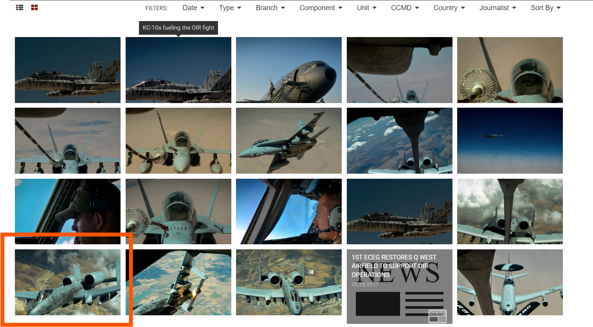

Having found the original task image on the DVIDS webpage, here's it's fuller description:  

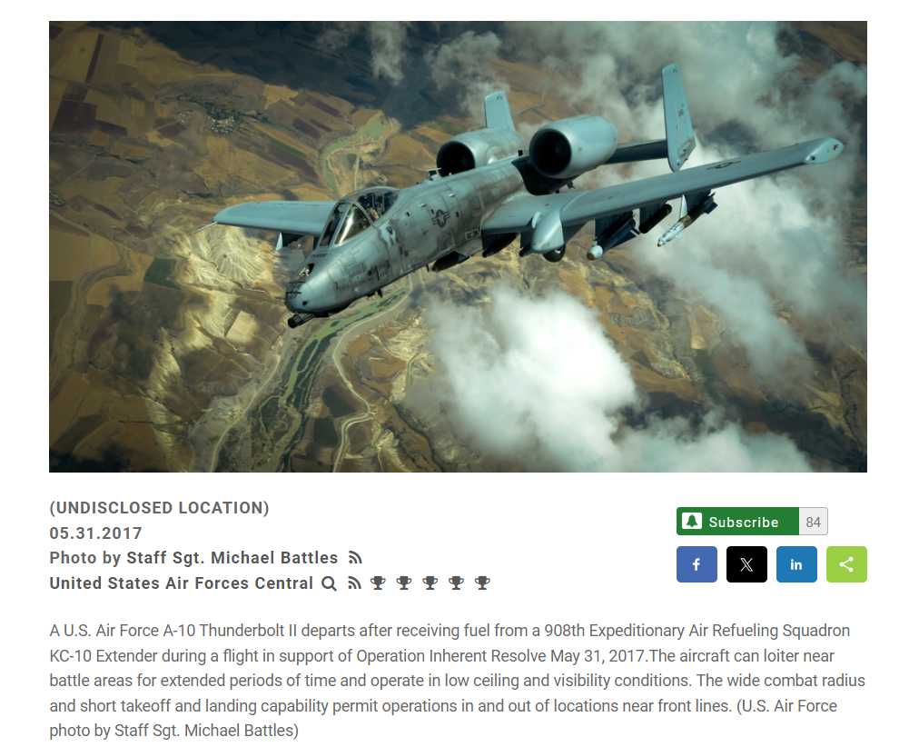

With more details of the photo found out, let's carry on. 

**Part 6: Narrowing the countries this aircraft was flying above** 

From the Department of Defense website, there's a small description about [Operation Inherent Resolve](https://dod.defense.gov/OIR/). Bottom line up front: Its goal was to defeat ISIS. That helps narrow a region down - into Syria and Iraq. In that same webpage, there's a More Stories Button, and potentially, that can help us narrow down, what happened on the day the photo was taken.  

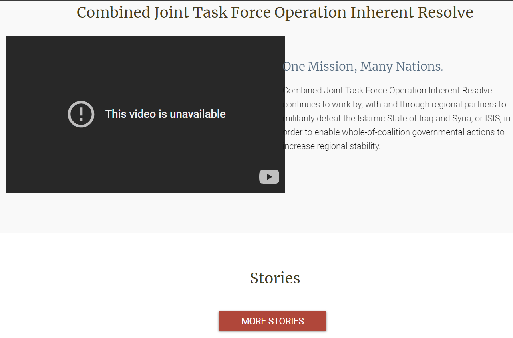

One feature to be grateful for in this archive of stories of this Operation is that each story has a date listed. Here, the article with the date May 31, 2017 onwards would be useful to know if this particular airstrike is mentioned, and possibly its path, or target.  

After a bruteforce-like search, the article dated May 31, 2017 is [Officials Provide Details of Latest Defeat - ISIS Strikes](https://www.defense.gov/News/News-Stories/Article/Article/1197495/officials-provide-details-of-latest-defeat-isis-strikes/). It's closer to the top as it's nearer to the end of the Operation.  

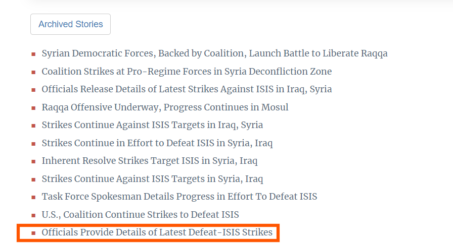

When reading that archived report, we can see that it includes details of air strikes that took place on May 29, 2017 at:  

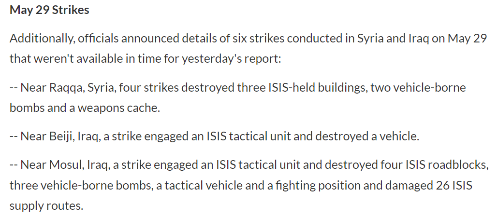

In that same manner, when we look at the [next report](https://www.defense.gov/News/News-Stories/Article/Article/1198981/us-coalition-continue-strikes-to-defeat-isis/), the areas mentioned are:  

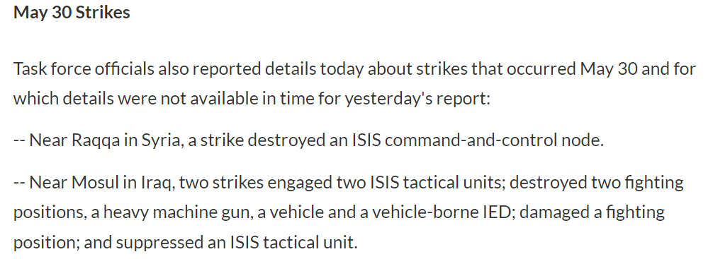

Further along, one other [report](https://www.defense.gov/News/News-Stories/Article/Article/1200604/strikes-continue-against-isis-targets-in-syria-iraq/) mentions May 30 strikes too:  

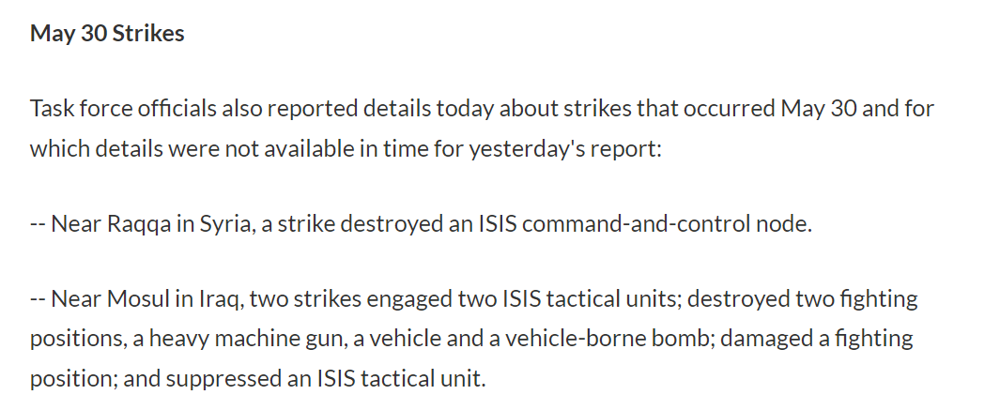

From there, when looking at the other articles written that come afterwards, there's no more mention of strikes in May. The next one mentions June 2nd.  

However, for the sake of argument, we could also assume that the plane might've finished the strikes in May, prepared itself by refueling and proceeded to another area in June for its operation. Let's also navigate quickly what regions were mentioned for the report that speaks about [strikes in June 2nd](https://www.defense.gov/News/News-Stories/Article/Article/1201992/).   

Let's now compile out the areas of the region to consider as the Thunderbolt's path.  

**Part 7: Areas and Cities to consider before delving into Google Maps/Earth** 

So, from the above articles: the areas of interest in that time window have been:  

1. Raqqa, Syria
2. Beiji, Iraq
3. Mosul, Iraq
4. Abu Kamal, Syria (in the strikes of June 2nd)

**Alongside this**, one other source that can help was our narrowed photos gallery of the day from the [DVIDS link](https://tinyurl.com/3562rsub). Interestingly, from the gallery, the photo next to our task one, shows a huge water body. When inspecting Image 8, 15, 16, and 13 from [here](https://www.dvidshub.net/image/3441689/kc-10s-fueling-oir-fight), they show physical features that are a good bookmark to begin with. 

Therefore, for starters, let's begin with finding that water body first.  

**Part 8: Water body first, and then the other areas**  
On Google Earth, using Raqqa's coordinates and investigating the surrounding areas, the narrowed water bodies are these:  

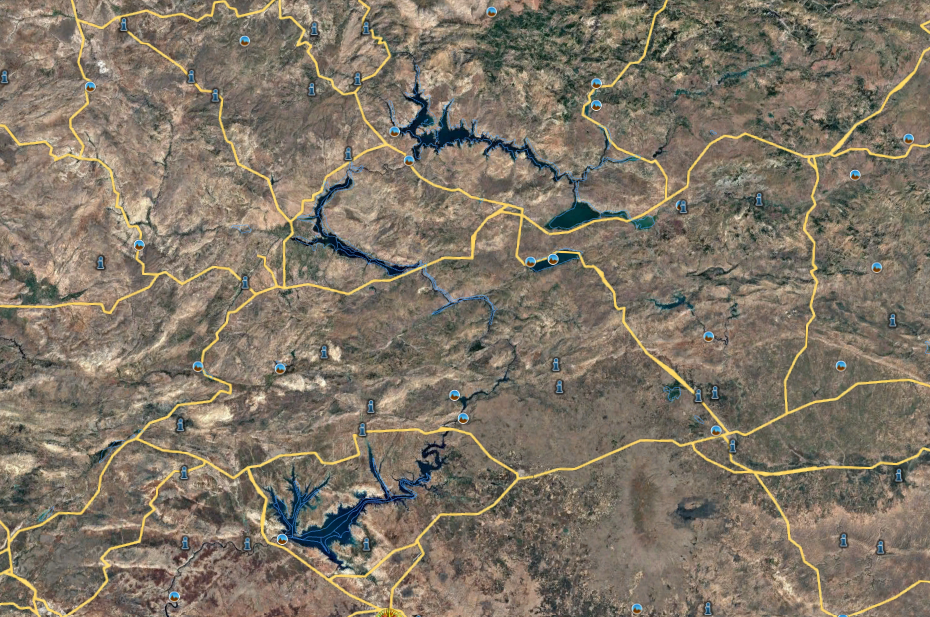

Amongst the gallery photos, let's have a look at [Image 15](https://www.dvidshub.net/image/3441689/kc-10s-fueling-oir-fight), as that one clearly shows the water body the ThunderBolt flying over.  

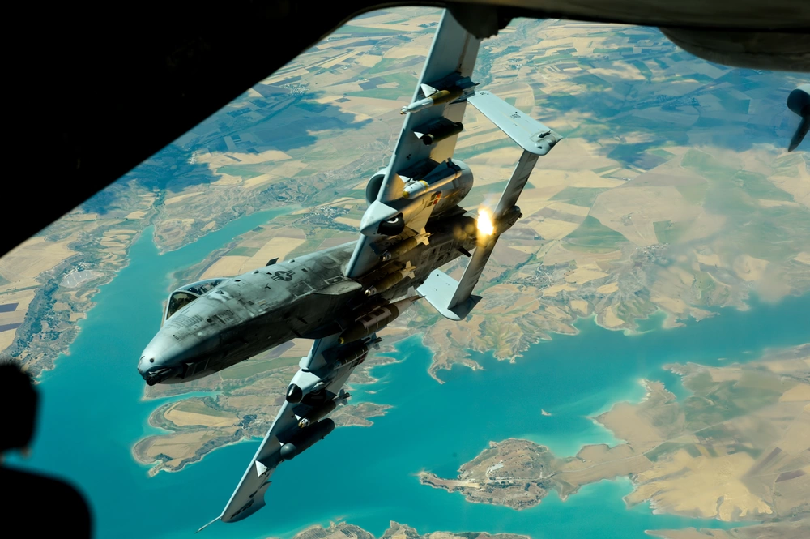

We can see that the land below has a very unique feature (that pear shaped piece of land), and it's at a water body. In Google Earth, that same area could be spotted when inspecting the borders of the biggest water body. Placemarking that piece of land on Earth (37°41'29.05"N, 38°20'52.42"E).  

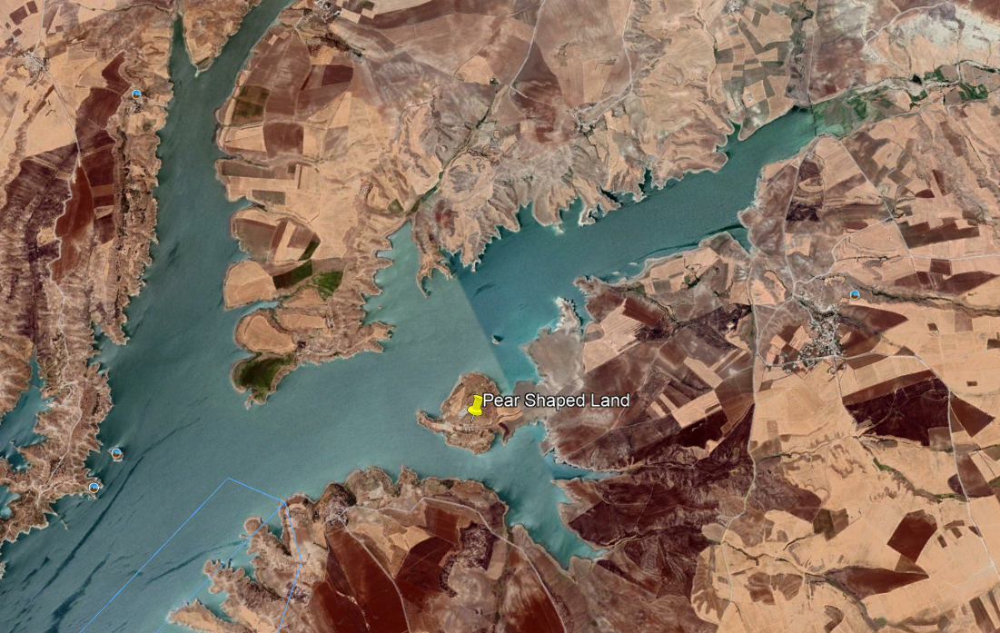

So we can see there's a rough region over which the Thunderbolt was above. Let's reinspect the task photo, and see what other physical features can help us. 

Closer look at the area, we can see a green-ish river below the plane. We can see that it's also got river islands (the natural greenery sticking out of the river) And near the right wing tip, a whitish hill. And interestingly, in Google Earth, in the Northwest of the pear land, we can see rivers of a greenish tinge.  

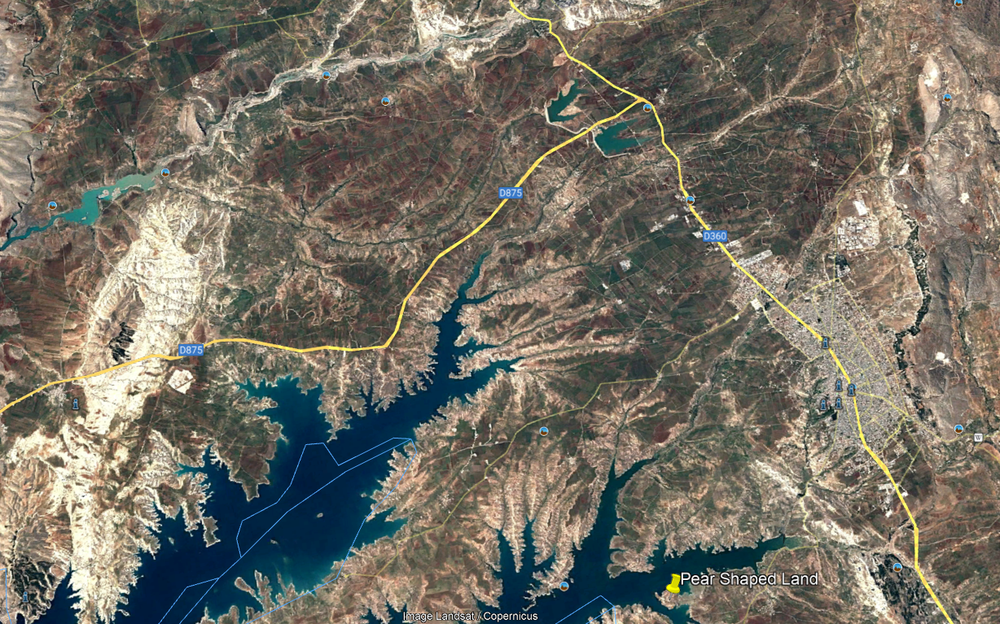

Looking up in the white-ish, rocky areas of the rivers, there's a possible area with such a river island.  

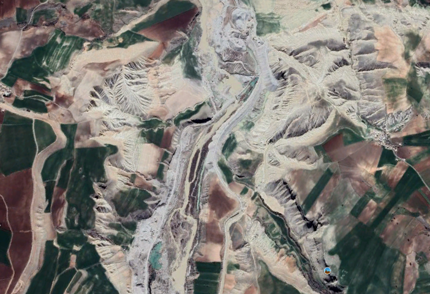

Placing a marker here: it's coordinates are roughly 
37°39'31.08"N, 38°5'43.51"E. 

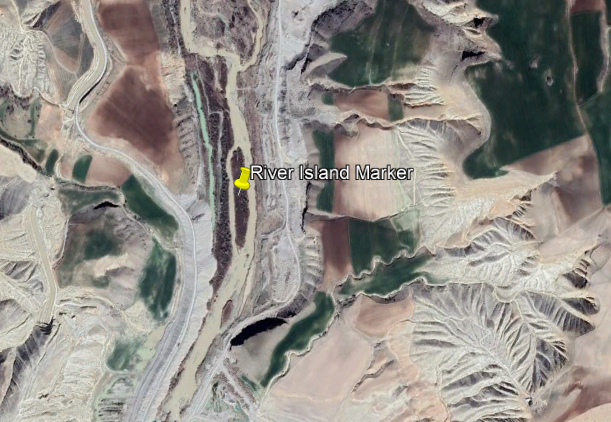

### Credits:
Full credits to Sofia Santos for putting together this exercise.