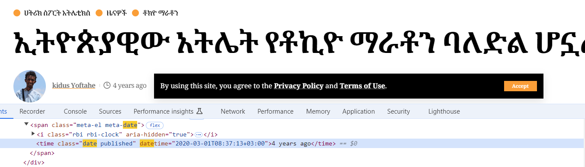
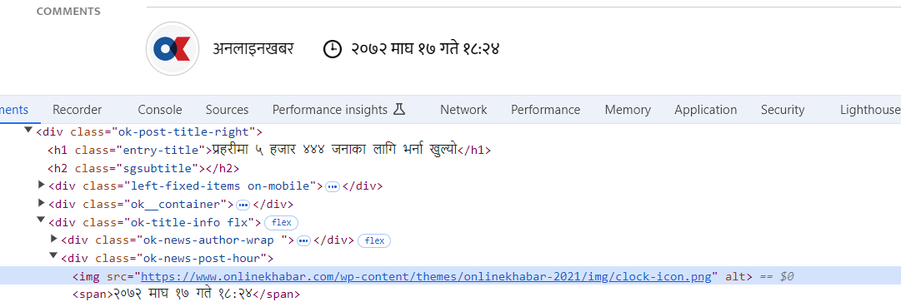
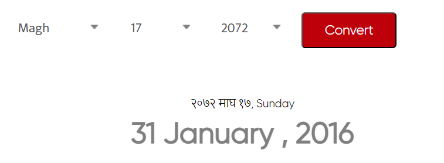
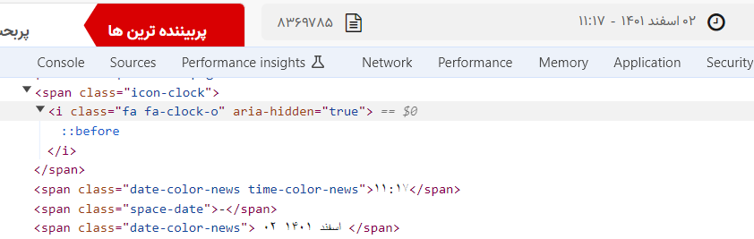
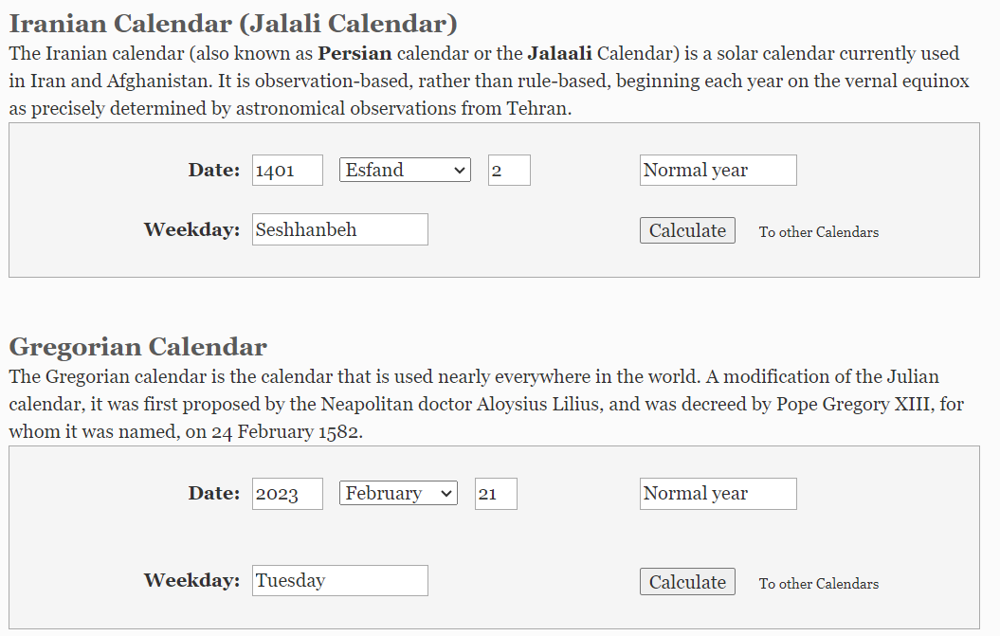

# OSINT Exercise 017
[Link to full briefing](https://gralhix.com/list-of-osint-exercises/osint-exercise-017/) of OSINT Exercise 017  
Creator of Exercise: Sofia Santos

## Task Goal
The majority of countries around the globe use the Gregorian calendar. However, there are other systems to measure and organise time. Below you will find three news articles from countries that have not adopted the Gregorian calendar.

The task is to find their publication dates, in Gregorian date format.

1. “ኢትዮጵያዊው አትሌት የቶኪዮ ማራቶን ባለድል ሆኗል !” [Link](https://www.hatricksport.net/%e1%8a%a2%e1%89%b5%e1%8b%ae%e1%8c%b5%e1%8b%ab%e1%8b%8a%e1%8b%8d-%e1%8a%a0%e1%89%b5%e1%88%8c%e1%89%b5-%e1%8b%a8%e1%89%b6%e1%8a%aa%e1%8b%ae-%e1%88%9b%e1%88%ab%e1%89%b6%e1%8a%95-%e1%89%a3%e1%88%88/)  
2. “प्रहरीमा ५ हजार ४४४ जनाका लागि भर्ना खुल्यो” [Link](https://www.onlinekhabar.com/2016/01/381827)  
3. “در پنجمین شب جشنواره موسیقی فجر کدام گروه‌ها پا به صحنه می‌گذارند؟”[Link](https://www.yjc.ir/fa/news/8369785/%D8%AF%D8%B1-%D9%BE%D9%86%D8%AC%D9%85%DB%8C%D9%86-%D8%B4%D8%A8-%D8%AC%D8%B4%D9%86%D9%88%D8%A7%D8%B1%D9%87-%D9%85%D9%88%D8%B3%DB%8C%D9%82%DB%8C-%D9%81%D8%AC%D8%B1-%DA%A9%D8%AF%D8%A7%D9%85-%DA%AF%D8%B1%D9%88%D9%87%E2%80%8C%D9%87%D8%A7-%D9%BE%D8%A7-%D8%A8%D9%87-%D8%B5%D8%AD%D9%86%D9%87-%D9%85%DB%8C%E2%80%8C%DA%AF%D8%B0%D8%A7%D8%B1%D9%86%D8%AF)  

### Write up and Thought-Process

**Part 1: First Article**  
For the 1st article, a quick eye into their Instagram shows they're based out of Ethiopia. That is consistent with the agency's logo, as it's comprised of the Pan-African flag colours (also present in Ethiopia's flag). Plus, once translated to English, the [contact page](https://www.hatricksport.net/about/) also lists a number beginning with that country code.  

In the article, the date is not spelled out in DD/MM/YYYY format. But there's an icon that says the article was published 4 years ago. When right-clicking that, and choosing the "Inspect" option, there's an actual date of publication recorded behind the scenes.  

As per that datetime, it was taken back on March 1st, 2020. To confirm that order of YYYY-MM-DD, a confirmation [link](https://en.wikipedia.org/wiki/2020_Tokyo_Marathon) from Wikipedia, also shared the same winner and the winning time he completed the marathon in. 

**Part 2: Second Article**  
For the 2nd article, there's a contact email and phone number. As per the country code published there, this article is from Nepal. In addition, this URL mentions "2016/01/381827" - there's a chance that this article might have come from 2016 January. But it'll need to be confirmed.  

Similarly, as in the first article, inspecting the clock icon next to the author shows the date it was published. Interestingly, it's written in the same Nepali script.  

So some translation between the scripts is required, so let's dig further. 

Copying that date time here: २०७२ माघ १७ गते १८:२४. Let's break it up into a table and check each character against the [numbering system](https://en.wikipedia.org/wiki/Numbers_in_Nepali_language), and a simple Nepali to English convert for the characters. 

With a side-by-side comparison with the numbering system's link above: the year, date, and time comes to: 2072-MAGHA-17, on 18:24.  

| Year   | Month | Date   | Extra Char | Time |
| -------- | ------- | -------- | ------- |-------- |
| २०७२  | माघ   | १७ | गते    | १८:२४  |
| 2072  | MAGHA  | 17 | ON    | 18:24  |

While it would've been lovely to see a news article from the future, this shows that it's not quite the Gregorian calendar's date. So for that, we can try out a [date converter](https://www.hamropatro.com/date-converter) and for our Nepali date above, the corresponding Gregorian date is: 31st January, 2016.  

**Part 3: Third Article**  
For the 3rd article, at the bottom, the agency calls itself the "World's Largest Persian Language News Agency". Also, in the link, the country domain is ".ir" -- matching it to Iran. That checks out with the language it's published in.  

One thing to note: the Persian script goes from the right to the left, and that's why the time has come before the date.  

| Time  |  Full Date   | 
| -------- | ------- | 
| ۱۱:۱۷  | ۰۲ اسفند ۱۴۰۱  | 
| 11:17  | 02 1401  Esfand |

Once again, after translating the [numerals](https://sites.la.utexas.edu/persian_online_resources/numbers-1/) and the [calendar month](https://sites.la.utexas.edu/persian_online_resources/numbers-1/calendar/), the publication date, anglicised is 11:17, 02 1401 Esfand. In [Gregorian](https://www.iranchamber.com/calendar/converter/iranian_calendar_converter.php), that translates to 21st Feb, 2023. 

Therefore, the publication dates of the articles, in the Gregorian form are:  
1. 1st March, 2020
2. 31st January, 2016
3. 21st February, 2023

### Credits:
Full credits to Sofia Santos for putting together this exercise.
