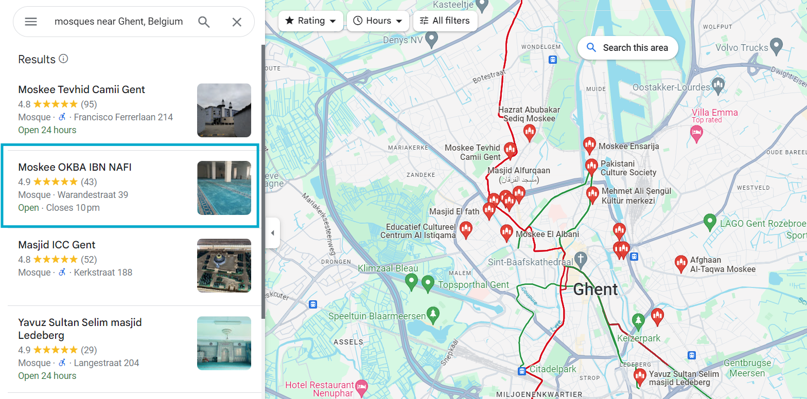

# OSINT Exercise 019
[Link to full briefing](https://gralhix.com/list-of-osint-exercises/osint-exercise-019/) of OSINT Exercise 019  
Creator of Exercise: Sofia Santos

## Task Brief & Task
The text below is a partial transcript of a phone call in which you can only read one side of the conversation. Despite the text being completely fabricated for this exercise, the location described is real. Your task is to geolocate where the person was at the time of this fictitious phone call.

### Write up and Thought-Process

**Part 1: Initial Thoughts**  
Taking it sequentially. Starting with the person who was dropped at the destination - addressing them as 'A'. 

In sum, taking out the main point from each line both of them speak:  

**Gist per line: A's Dialogue**
1. Got dropped off by a group to some destination. Destination might have some event, so A's punctual. Says the destination looks different than what they were informed about. 
2. Mentions a new carpet. Reminds A of a swimming pool. So the place's new carpet's potentially blue?
3. Got scolded for making fun of a blue carpet? 
4. Met someone the caller asked about. Managed to chat before prayers. Place might be a place of worship.  
5. Talks about it being a safe city. Not a native. So A's potentially a foreigner. 
6. Knows German. 
7. Mentions about another language. Native language of the place? 
8. Feels no hurry about learning the previous language. Can get by with German for the time being. 
9. Wonders if a cousin can teach them the native language, asks about cousin's residence. 
10. Cousin's residence is 1.5 hours from where A is: Assuming he's taking the call at the place of worship post prayers. 
11. Got asked about interest to see the sea... a country with a shore/beach. A river also near the worship place? 
12. River and sea is apparently connected. Caller got promised by A they'll go to cousin's place soon, and cuts the call. So cousin might be near the sea?

**Part 2: Narrowing a suitable country, and suitable city**  
From the breakdown of the gist per line, there are some things to assume to start narrowing down the country first.  

There's mention of German being spoken, and another possible language. A language more native in the country. Potentially a place in the EU.  

Has a river that connects to the sea, near the place of worship, so that will narrow a couple of countries to start.  

Upon Googling which countries speak german, the 4 countries listed are:
1. Germany
2. Austria
3. Belgium
4. Luxembourg

Amongst the 2, ruling out Luxembourg and Austria, as these guys are landlocked, and no access to the sea. Leaving behind Belgium and Germany.  

Now, let's consider Belgium. There's a better chance it's Belgium, as in the phone call: German is mentioned, and another language apart from that. Belgium has two others in its official belt: Dutch and French. More so than Germany, let's dig deeper within Belgium. 

Taking a quick peek into a favourite Youtuber called Geography Now, in his Belgium episode. There's mention of a [German speaking minority area in BEL](https://youtu.be/0TuMvWCbM-g?si=LmcDKPD4DR0G9XdV&t=164) in Liège. Let's potentially start there, and see if water bodies can be spotted. 

**Part 3: Water features of Liège, Belgium (and others if necessary)**  
The next big clue to consider in Liège, Belgium is its water features, looking especially for a river and its connection to the North Sea. Starting with a [Google Map of Liège](https://tinyurl.com/mr3he5ww), we can see the river (Meuse) cutting through the city. We've also learnt that Meuse, is a river, that drains into the North Sea.  

However, one other thing to note from the call is that, the travel time between the place of worship to the cousin's residence, is nearly 1.5 hours apart. And one assumption to make is that the cousin might be residing near the sea. So chances are, A will need to be a city that's at a travel time of 1.5 Hours away from sea. 

And Liège cannot be it, as its travel time is double that was quoted above.  

So, let's cut the distance in half, and explore instead from, potentially Ghent. That's a major city for train exchanges, so there's a chance there.  

And so, Ghent is a better option to geolocate the places of worship for A's phone call. 
Let's see if there are notable places of worship near or along the Meuse river within Ghent.  

**Part 4: Places of worship in Ghent**  
Let's first begin with Mosques in Ghent. There are other places of worship to consider, but taking into account that A is relatively new, the use of the term "prayers", and upon googling sample interiors of churches and mosques, there's a higher likelihood that there's a chance it's a Mosque. Given how vast the carpets would need to be, and being rectangular, it can look like a pool (provided it's also blue).  

And behold, when narrowing down the mosques, a promising result does appear: the Moskee Okba Ibn Nafi.  

When cross referencing more pictures of the mosque, in its [Facebook profile](https://www.facebook.com/okbaibnnaafi.gent/), we can see a change in the carpet colours. It's changed from maroon and gold to the blue.  

When looking into its surroundings better, it's near the main station of Gent, plenty of bus stops nearby, a canal - the Achterdok and a stream/river - the Leie.  

Upon further look-ups, the Leie itself is not a major river, but it acts as [a tributary](https://en.wikipedia.org/wiki/Scheldt#:~:text=(Hofstade)-,Lys/Leie%20(Ghent),-Mandel%20(Wielsbeke)) for the larger river that flows across France, Belgium and Netherlands - the Scheldt.

Hence, the geolcated Mosque is: [Mosque Okba Ibn Nafi](https://maps.app.goo.gl/HpYGUKFuZjqwxnXE7) at the coordinates 51.05809805541387, 3.736810988350337. 

**Credits**
Full credits to Sofia Santos for putting together this exercise.

Additionally, as a crash course of Belgium to start the investigation: [Geography Now's Belgium Episode](https://www.youtube.com/watch?v=0TuMvWCbM-g)