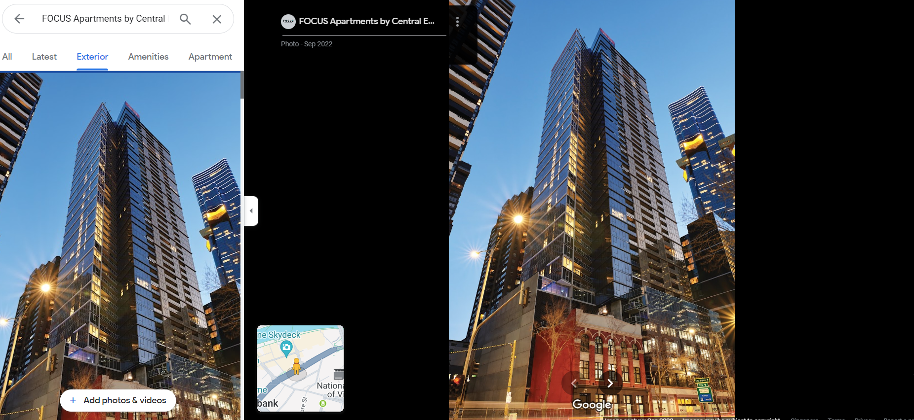

# OSINT Exercise 002
[Link to full briefing](https://gralhix.com/list-of-osint-exercises/osint-exercise-002/) of OSINT Exercise 002  
Creator of Exercise: Sofia Santos

## Task Goals
To identify:  
I. The name of the train station seen in the photo  
II. The name and height of the tallest structure seen in the photo?  

### Write up and Thought-Process
**Part 1: Initial Clues**  
Dividing the photo into 3 portions:  
a. Foreground: train tracks

b. Middle ground: the train platform itself. Name here mentioned is Flinders Street. 

c. Background: A lot of buildings towards the right half. The left half has a building's spire. 

**Part 2: Investigation on Google**  
For Goal I: The photo itself has the train station name published ~ Flinders Street.  

Some Googling of its platform shows this is a station in Melbourne, AUS. But there could be multiple stations with the same name in the world.

Verified with a google search of "Flinders Street Platforms", and seeing results. 
The font of the station name matches across in other pictures like this one below, and [this photo's link](https://wongm.com/2022/03/empty-platforms-at-flinders-street-station/) indeed verifies that the station is based in Melbourne:  

Now, it's confirmed the station is in Melbourne, next is to check its vicinity in Google Earth. 

**Part 3: Investigation on Google Earth**  
After copying the coordinates of Flinders Street from Maps, and inserting it into Google Earth, we get this neighbourhood of buildings, and the train tracks. 

The next thing is to orientate and see the area as if the photographer would if he were elevated. 

That way, we can roughly see the buildings and their heights. To confirm even more, let's do a man-drop and see that same cluster of buildings from a street view. 

And there we are! Even though these buildings were blocked by the platform in the first photo, we can see from this street view, they match the tops of the buildings that were there. We see 
1) the spire, 
2) the round white building, 
3) HWT brown angular building,
4) IBM brown angular building, 
5) and that fancy white hotel? building. 
6) the blue building

Now, amongst the 6, let's decipher who's the tallest. 

**Part 4: Who's the Tallest?**  
By observing, we can ignore the hotel and round white buildings, and focus on the other 4, as the photos indicate that they're not as high-rising. And so, for Goal II, it could be between the HWT, IBM buildings, the spire, and the blue building.

Let's first establish: who does the spire belong to? 

Back in Google Maps, using 3D view (roughly) the building with the spire belongs to Arts Centre Melbourne. 

Its [website](https://www.artscentremelbourne.com.au/exhibitions-collections/preserve) shows a wireframe logo with the spire and its [Wikipedia page](https://en.wikipedia.org/wiki/Arts_Centre_Melbourne) confirms the spire belongs to the centre. 

Also, the about summary of Wikipedia mentions its [height](https://en.wikipedia.org/wiki/Arts_Centre_Melbourne#:~:text=Arts%20Centre%20Trust-,Height,-162%C2%A0m%20(531)), at 162m.

Moving on to the brown buildings.  
From the pictures, we can roughly see the tower names: the first is HWT and the other is IBM. 

With some help from Google, these two buildings are part of a [Southgate Complex](https://www.suntecreit.com/southgate-complex.html). This indicates that HWT Centre is 25-storeys, and IBM Building is 30-storeys. 

With extra searching, it's found out that
[IBM Building](https://www.skyscrapercenter.com/building/ibm-australia/13493) is 131m tall. But to verify that HWT Centre is shorter, [this](https://mapcarta.com/W27165313) confirms its height, at around 111m. 

Moving on to the blue buildings  
From the street view, it's looking like the blue building is probably the tallest of them all. When cross checking in Google Maps, it looked like it appeared to be missing...?
 

There's a chance that our view from above is not the most up to date, but regardless of pushing the clock to the most recent time, it still appears to be flat.  

Let's then see if Google Maps, might give a clue. Given the rough arrangemnt of the buildings, we might need to do a mandrop into those lightly outlined streets in yellow. 

Something to note about our blue building is its red-ish top (from the task photo). As the building is diagonally behind the IBM one, there'll be a few buildings' facades to crosscheck.  

A rough place to begin the mandrop on Maps, might roughly be near this traffic junction.  

While man-dropped, and checking the facades, some can get removed as an option due to no sighting of the red top.  

For one, that isn't clear, we can find what the building is after clicking it, and checking its exterior. One potential candidate is Focus Apartments, as part of its exterior photos, we can see the rough red item on the top. But let's find more details about the building. 

Its official [website](https://focusmelb.com.au/) also shows a picture of the building with the red top, and by cross-checking its quoted address on google map, and this site that mentions the [building's specifications](https://www.skyscrapercenter.com/building/focus-melbourne/38852), it's quoted to be 166m. 

Hence, the final answers are:  
Goal I - Train station name is Flinders Street.  
Goal II - The tallest building is the FOCUS Apartments Building, with a height of 166m.

### Credits:
Full credits to Sofia Santos for putting together this exercise

