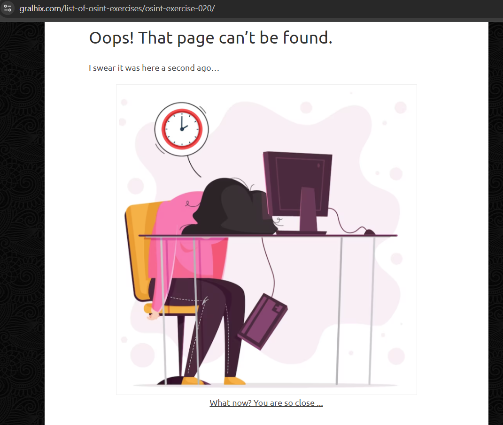
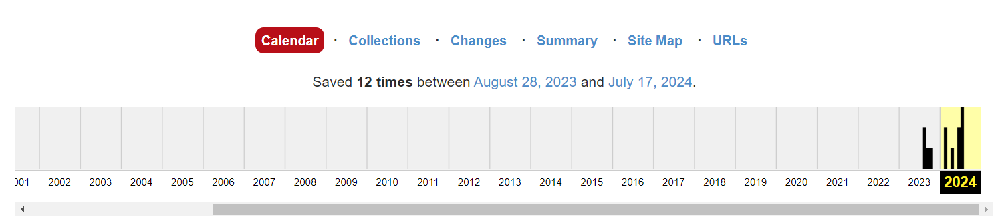
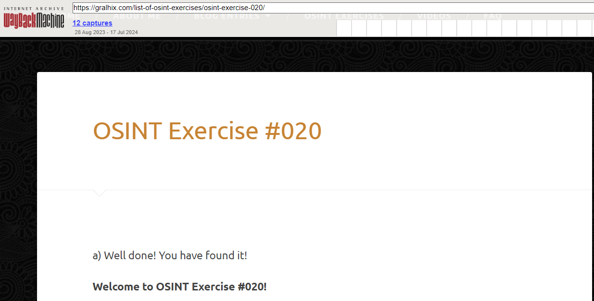
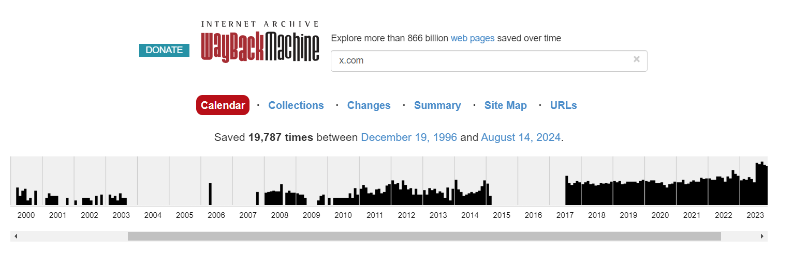
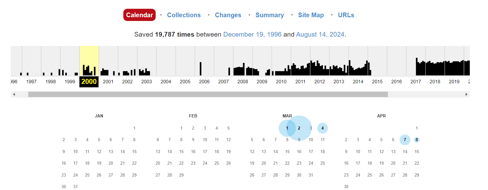
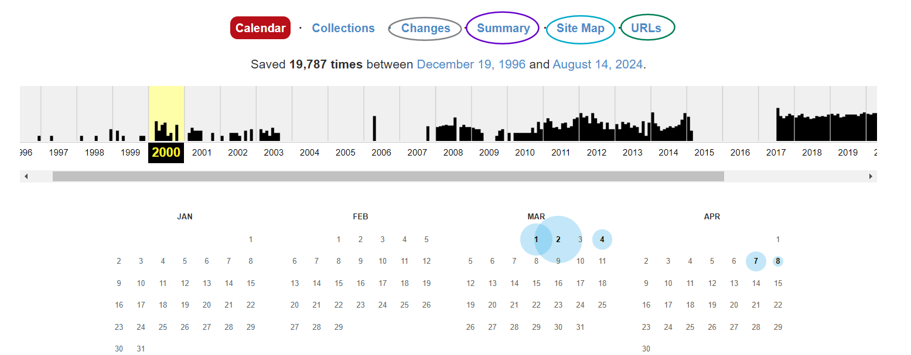
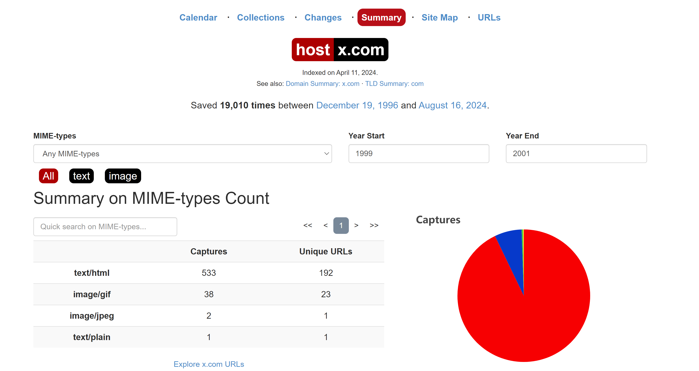
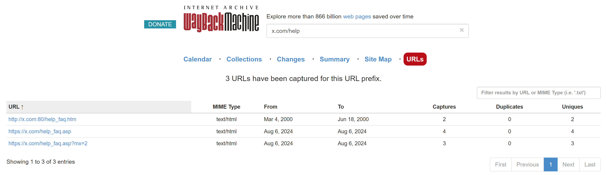
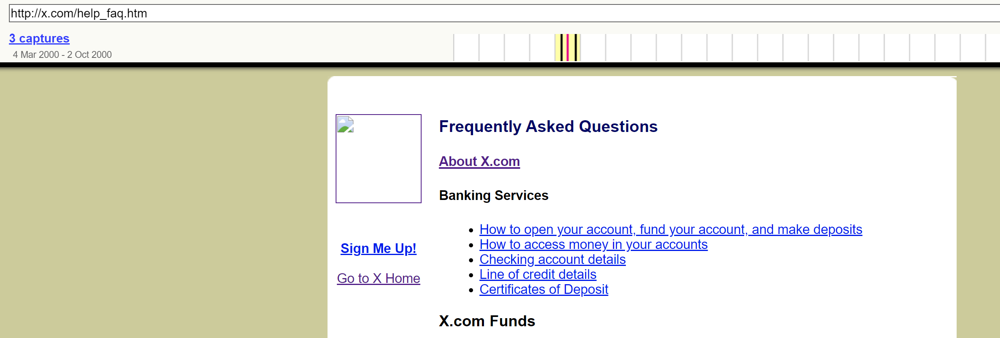
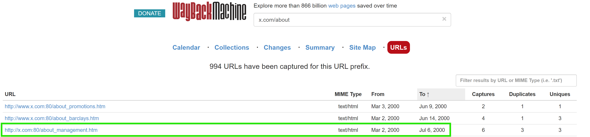

# OSINT Exercise 020
[Link to full briefing](https://gralhix.com/list-of-osint-exercises/osint-exercise-020/) of OSINT Exercise 020  
Creator of Exercise: Sofia Santos

## Task (Pre)-Goal
To find the original OSINT Task that's on this particular URL above.
Right now, it's giving a pseudo-404, and a message from our creator. 

### Part 0: Hunting the OSINT Exercise 
To move past this, one good tool to use is the [Wayback Machine](https://web.archive.org/) - an initiative that helps us look into the archived/older versions of the website. When we insert in the URL of the 20th OSINT exercise, we can get this calendar of the days this URL was captured.  

Going to the earliest capture of the exercise, on 28th August 2023, we can see a confirmation of finding it, and a fuller form of the exercise.  

From this [archive link](https://web.archive.org/web/20230828083935/https://gralhix.com/list-of-osint-exercises/osint-exercise-020/), let's proceed with the task goals.   

## Task Briefing & Goals
The internet is a digital ecosystem in constant transformation. Websites change appearance, domains change owners, businesses open and close, and accounts are created and deleted.  

In July 2023, x.com went from being an almost blank page to redirecting to twitter.com.  

The task is to go back in time, until the year 2000, and find the following information within the x.com website:

1. The Frequently Asked Questions page.
2. The list of members of the management team in July.

**Part 1: Initial Thoughts**  
The website of interest to check in the Wayback Machine is "x.com". That's a [starting point](https://web.archive.org/web/20240000000000*/x.com), and taking it from there. And there's a cut off of 2000.  

This had been the online bank founded by Musk and his team at the time. When glancing quickly into its [Wiki page](https://en.wikipedia.org/wiki/X.com_(bank)), we can see a merger had taken place in 2000, and it subsequently got renamed into Paypal in 2001. Accounting for that, let's look at the 2000's records of this website to see what other features there are.  

**Part 2: FAQ URL**  

Subsequently, across the calendar shots in 2000, the 404 error kept appearing for the FAQ hyperlink that came in each scrape of the X.com website. However, one thing to note, but it could differ, is the listed URL of the FAQs site page: it's listed as "https://secure.x.com/help_faq.asp".  

One computing concept to know between ASP files, and the HTML files (that are often considered the skeletons of websites), is that, in order for a user to interact with a dynamic website, the user's computer will need to interact with a server. In order for that dynamic quality to appear, [server side directives](https://www.differencebetween.info/difference-between-asp-and-html#:~:text=ASP%20is%20used%20to%20embed%20programming%20and%20server%20side%20directives%20into%20an%20HTML%20web%20page.) will need to be embedded within a HTML file. Therefore, this is a hint that our FAQ site page above, is the .asp file. So a corresponding HTML file will need to have been captured by Wayback at some point.  

Hence, to save time of inspecting each calendar capture of the website, let's try another feature from the top.  

Therefore, another tool from the top was required.   

For these, the first to explore was the Site Map. However, when attempting the exercise in Aug 2024, the Map for 2000 didn't render well. So another tool was required. 

The next tool explored is Summary. Here, I played with the year start and end a little more, and got a more narrowed view of the URLs in our x.com domain. 

When clicking the "Explore x.com URLs" from the above screenshot, its results are listed as ["https://web.archive.org/web/*/x.com/*](https://web.archive.org/web/*/x.com/*). 

From there, when exploring the URLs, there are 2 search bars we can use to find our FAQ and Management URLs. 

It just so happened, that Wayback Machine is limited to the results it can render. It can give the latest 10,000 URLs of the x.com site it has scraped, and nothing else earlier. Unfortunately, our links from 2000 are older than that. Therefore, we'll need to narrow the link further in the upper search bar. 

How can we try to find the FAQ URL? We have a clue from earlier. From exploring the calendar shots of 2000, we can see that consistently, the FAQ URL has been this: "https://secure.x.com/help_faq.asp" -- So let's modify our search to "x.com/help..." and let's take it from there.  

After clicking that link, we're taken to the calendar shots of that FAQ HTM page, and we can see it was captured 3 times successfully in 2000. Trying the one in June 2000, that gives us the successfully scraped shots of the [HTML page of the FAQ page](https://web.archive.org/web/20000618112127/http://x.com:80/help_faq.htm). 

**Part 3: Finding the Management URL** 
Similarly, for finding the management URL, it's worthwhile to explore the HTML capture of the website from above, and see the structure of the website.  

The one potential area this management section could be in is in the "About X" section.  

Therefore, it's worth repeating the URL search again with "x.com/about... " and taking it from there with the results. Also, rearranging the results with the earliest one at the top, we can see a feasible result.  

From there, and going to its calendar and choosing the July 6th 2000 capture, we arrive at the [management result](https://web.archive.org/web/20000706205553/http://x.com:80/about_management.htm) from July 2000. 

**Credits**  
Full credits to Sofia Santos for putting together this exercise.
