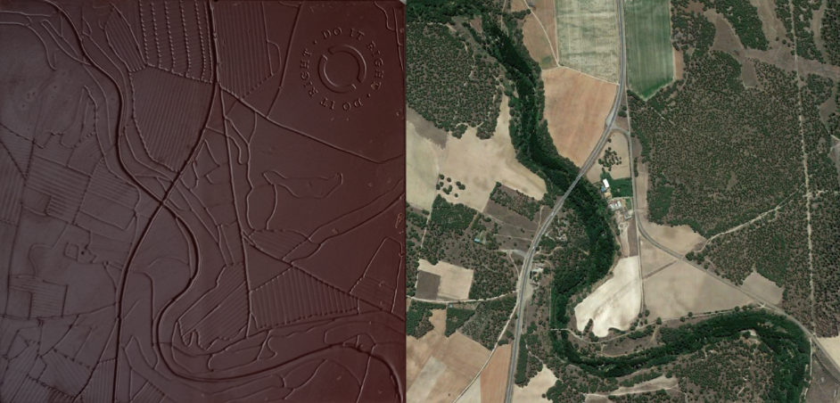
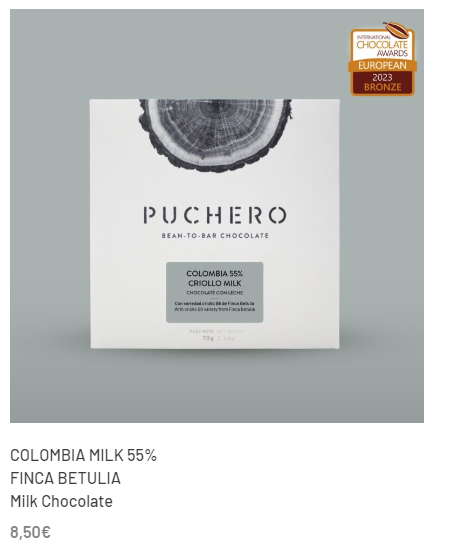
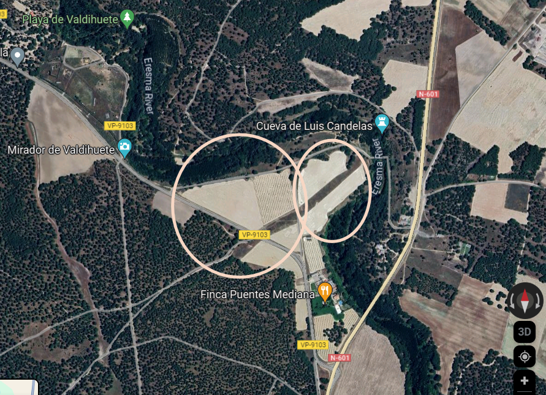

# OSINT Exercise 021
[Link to full briefing](https://gralhix.com/list-of-osint-exercises/osint-exercise-021/) of OSINT Exercise 021  
Creator of Exercise: Sofia Santos

## Task Goal

Maps can appear in the most unique places. In this case, it's in a chocolate bar. Next to it, is a satellite view of the same location.  

The goal is to find the coordinates of the location seen in both images.  

### Write-up and Thought Process

**Part 1: Initial Thoughts & Observations**  
Chocolate tablet looks fantastic. Chances are this is probably from a niche chocolatier as it features a map on it, which is very rare. There's no obvious signature or name of the chocolatier except for the top right corner: a "Do it Right" symbol. It might be in reference to best practices for chocolate manufacturing, and it could be in the small scale.  

 It can act as a first clue for looking up the chocolatier.  

**Part 2: Looking up the chocolatier**  
When googling "Chocolate with map 'do it right'", one promising result is by [Cocoa Runners](https://cocoarunners.com/blog/do-it-right-with-puchero/). They have a write up of a maker called Puchero. Pivoting off that, we can find its [official website](https://somospuchero.com/en/category-product/chocolate-en/).  

When looking up the [bars](https://somospuchero.com/en/category-product/chocolate-en/) Puchero sells, and hovering over each image, they showcase the chocolate as having a similar map to the ones in the task photo.  

 

Therefore, we can confirm that Puchero is the chocolatier we're interested in for this task. 

**Part 3: Geolocating the map on the bars** 
While each bar showcases ingredients from various places around the world, one thing that is good to note is that the map imprinted on **all** the bars is the same. That means, it is a location of utmost importance: it might be the founder's home, or even the locality map of the Puchero factory. As not a lot is mentioned about the founder's hometown (apart from the country they were in previously before starting Puchero), let's first start with the factory's address.

When navigating to the [Get in Touch](https://somospuchero.com/en/contact/) page of Puchero, there is a Google Map of their location in Valladoid, Spain. This is confirmed as well in the write-up by [Cocoa Runners](https://cocoarunners.com/blog/do-it-right-with-puchero/#:~:text=specialty%20coffee%20roastery%20and%20now%20a%20craft%20chocolate%20factory%20in%20Valladolid%2C%20Spain.). When comparing that address's satellite view, against the task image, there are some similarities but more needs to be done.  

Similar to the task's satellite photo, the google map images has these similarities in common, like this triangular land, and the half-cloud one:  

Therefore, it needs to be rotated 180°, to match the orientation of the chocolate bar's map.  

Coincidentally, even the Puchero Factory location falls within the screenshot of the map. Using that marker, and finding its coordinates to roughly be
41.35209215391813, -4.689901804676438.  

**Credits**
Full credits to Sofia Santos for putting together this exercise.