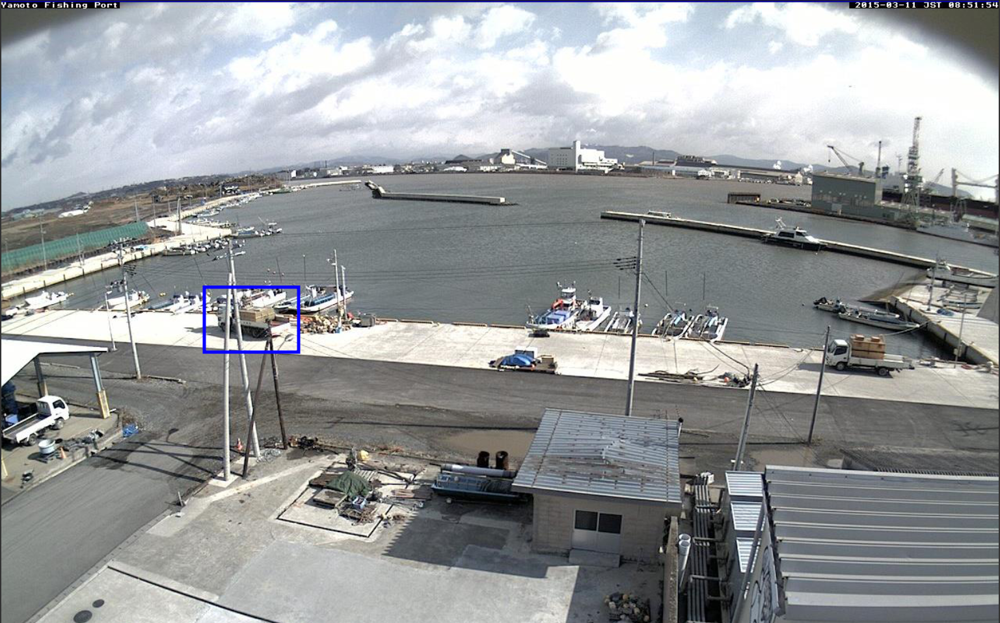
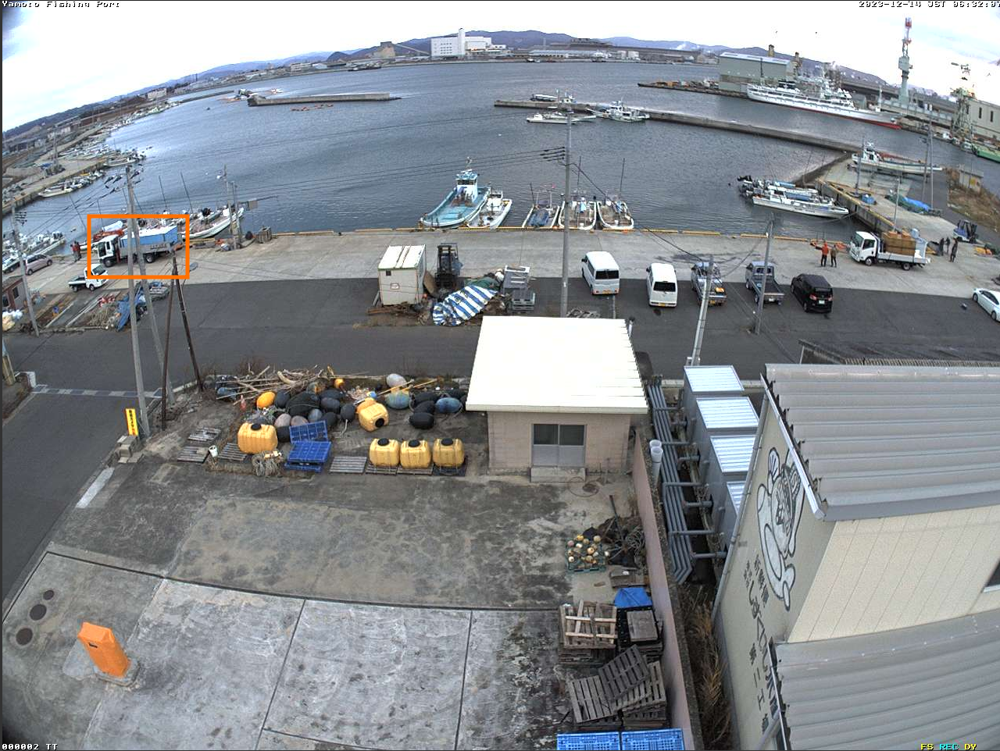
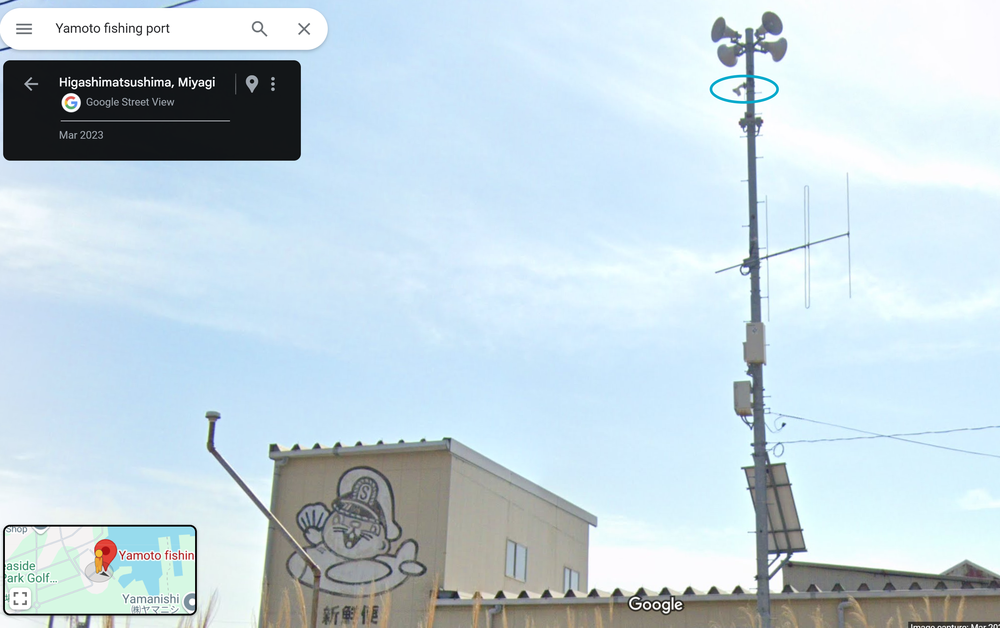
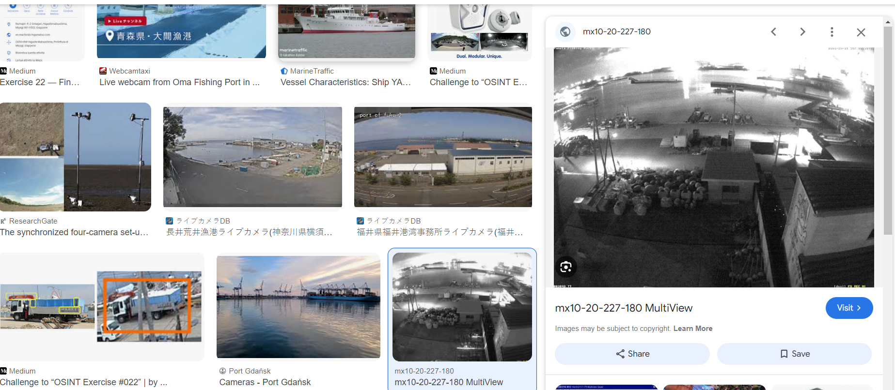
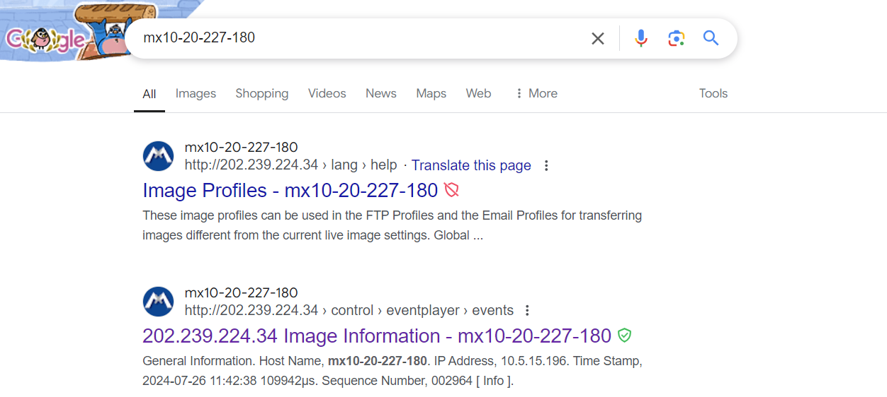
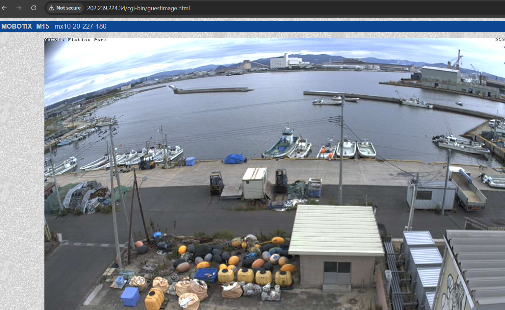
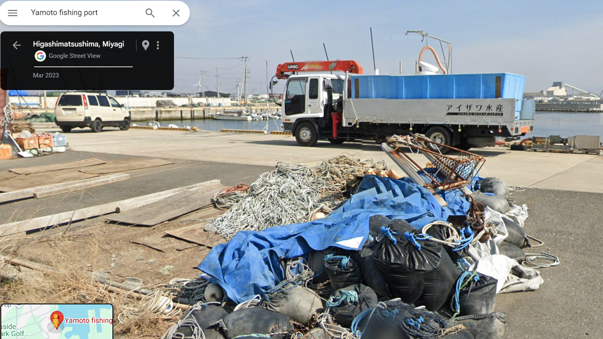
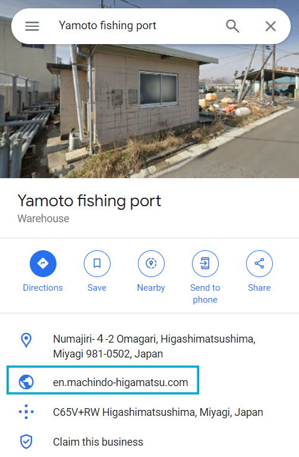
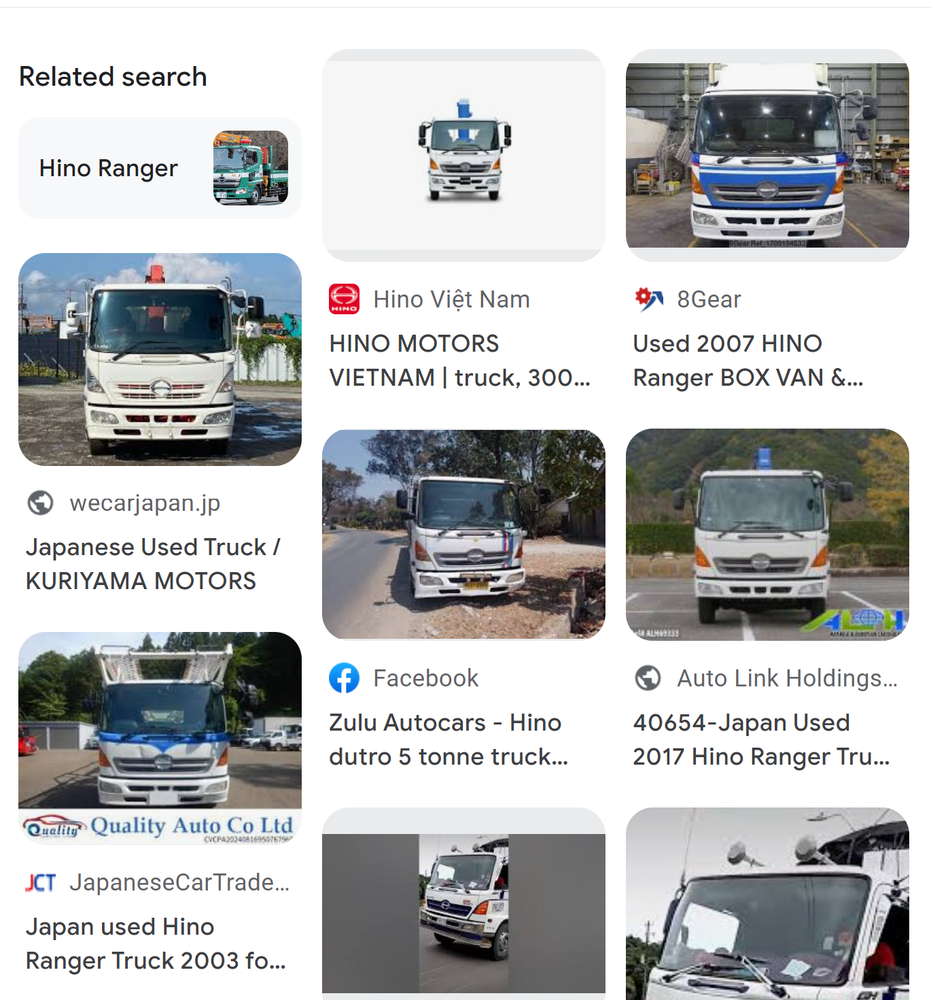
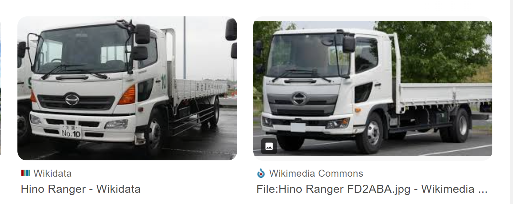

# OSINT Exercise 022
[Link to full briefing](https://gralhix.com/list-of-osint-exercises/osint-exercise-022/) of OSINT Exercise 022  
Creator of Exercise: Sofia Santos

## Task Goals
The two images below come from a security camera overseeing a port. They were taken almost nine years apart. Both have a vehicle highlighted.  

The goals are to find:  
1) Find the link to the camera’s live feed.
2) Geolocate the security camera.
3) Find the license plate* of the vehicle highlighted in blue.
4) Find the licence plate* of the vehicle highlighted in orange.

*For Goals 3 & 4:  
Only provide the bottom half of the licence plate containing 2 sets of numeric values, as such: [XX]-[XX]

  

### Write-up and Thought Process

**Part 1: Initial Thoughts & Observations**  
In both pictures, there are hints in the top left and right corners. The top left mentions "Yamoto Fishing Port" and the right the datetime with the JST timezone. It's helped narrow that this is in Japan.  

Another feature to not is that on the building in the bottom right hand corner, is a mascot drawing. So that can be one confirmation that the buildings are correct.  

**Part 2: Link and Geolocating the Camera**  
With a Google Map search of Yamoto Fishing port, we're brought to [this address](https://maps.app.goo.gl/H6ntLDwr6UXfsxhe7). When doing a man-drop into the address, and getting a 360° view, it can be confirmed the same. 

Seeing the difference in the height and how nearby the cartoon building is, chances are the camera is in the nearest pole/tallest structure from the building. 

Therefore, a viable candidate is this pole, and from the image in Google maps, we can see a camera being attached to it.  

And, from a bird's eye view of the area, the pole is being a shorter wall. So by roughly estimating that, the coordinates of the camera would be: 38.409480, 141.244609.  

**Part 3: Finding that camera's live feed** 
The next goal was to find the camera's live feed. Googling "Yamoto fishing port" kept feeding me back a couple of other OSINT walkthroughs, which was nice, but not what we're after. Until the final search result helped: 

That search result showed the same indication it was of Yamoto Fishing Port again in the top left hand corner. This was a first promising result. The result's title is "mx10-20-227-180 MultiView". 

That's one good start. And searching that up, confirmed some details about the camera that was installed at the fishing port. 

When investigating the [link](http://202.239.224.34/control/eventplayer?get_image_info_abspath=/var/www/server/events/10_20_227_180/002/965/A00001.jpg), the images match the vicinity and angle of the Yamoto fishing port. 

A bit about the URL after the IP address: 
<learn more about the Mobotix, and the FTPs, and the servers used here.>

Therefore, the camera feed's link would be: http://202.239.224.34 - and entering this address at a time of day when the port is busy, can give a screenshot of the vicinity as shown: 

**Part 4: Finding the 2023 Truck and its license plates**  
When doing a man-drop into the fishing port in Google Maps, coincidentally, there was a truck that matches the specifications of the one in the 2023 photo. 

The painted on the truck is "Aizawa Suisan". Looking it up, it's a business name, and its official website of heritage, history, and produce can be found [here](https://www.aizawasuisan.com/). The entreprenuer behind this is doing incredible things. 

However, the website couldn't provide what we were specifically looking for. And so, another approach is required. 

Often, there's a chance that when looking up a place in Google Maps, details about it would appear on the left side, beneath the seach bar. Trying that again for our fishing port, we do get a website appearing!

And when visiting the [link](https://en.machindo-higamatsu.com/aizawa-suisan), we see our entrepreneur (Tadashi Aizawa) again from above of Aizawa Suisan! Potentially, this link could give more details!

At the bottom of the landing page, there's a Facebook page, once again about himself and his business! His photo albums could give a clue perhaps.

And yes, a photo, from the Facebook album does provide the license plate number to his truck that made the appearance in the 2023. This particular truck also matches in terms of the markings as shown in the screenshot of 2023 - in the Mobotix camera and in Google Maps. Therefore, as per the task goals, its respective numbers are found [here](https://www.facebook.com/aizawasuisan/photos/pb.100054424002192.-2207520000/607440969405874/?type=3).

**Part 5: Locating the Truck from the camera shot of 2015**  
Finally, the last goal: gathering the numerical values from the truck screenshot by the camera in 2015. 

Here, we're going off the assumption that this older truck can also belong to the company, Aizawa Suisan, and not another truck from someone else driving by. Given that the photo was captured in 2015, one thing to do, is to see if more photos are captured from that year, in his socials and his website. 

Therefore, revisiting his [website](https://www.aizawasuisan.com/) again, and exploring the options of it. When translated in English, mentions a "Speciality Seaweed Making 2018". And it acts as a dropdown, [with the same content dating back to 2015](https://www.aizawasuisan.com/%E3%81%93%E3%81%A0%E3%82%8F%E3%82%8A%E3%81%AE%E6%B5%B7%E8%8B%94%E3%81%A5%E3%81%8F%E3%82%8A2018/%E3%81%93%E3%81%A0%E3%82%8F%E3%82%8A%E3%81%AE%E6%B5%B7%E8%8B%94%E3%81%A5%E3%81%8F%E3%82%8A2015/). 

Thus, we can explore if there is more media from 2015 that could hint at the truck. And rightly so, at the bottom of section, in a photo carousell, one potential candidate appears. When full-screened, it appears in the final photo of the album: the 55th one. 

When looking at the photo, there's not much clarity on its side profile. When we revisit the screenshot from 2015:  

And zooming it in, there's a fair bit of obstruction to make out more details of its design. Apart from the white body, we can see its door is decorated with 2 windows. 

One idea could be to snip the bit of the photo from the album above, and attempt a google image search on that, maybe to discover more about its model, and see if the door could match with the specifications. 

**Part 6: Narrowing the model of the truck from the 2015 album**  
As I've had to snip a bit of the picture with that vehicle, with a prominent plate number: I'll share the part of its search results. 

So one interesting result that appeared is that the truck can be related to a model called the Hino Ranger. 

When looking at a couple of the results more, there is a model that matches the same window patterns at the doors of the truck.  

Therefore, with a high probability, there's a chance that the truck from the camera's screenshot could be the one from [this album's last photo here](https://www.aizawasuisan.com/%E3%81%93%E3%81%A0%E3%82%8F%E3%82%8A%E3%81%AE%E6%B5%B7%E8%8B%94%E3%81%A5%E3%81%8F%E3%82%8A2018/%E3%81%93%E3%81%A0%E3%82%8F%E3%82%8A%E3%81%AE%E6%B5%B7%E8%8B%94%E3%81%A5%E3%81%8F%E3%82%8A2015/). Also because, by the screenshot in the camera, there is some cargo loaded on it. And in that photo from the carousell in the website, we can see a little bit of load on the top right hand corner of the window.  

**Credits**  
Full credits to Sofia Santos for putting together this exercise.