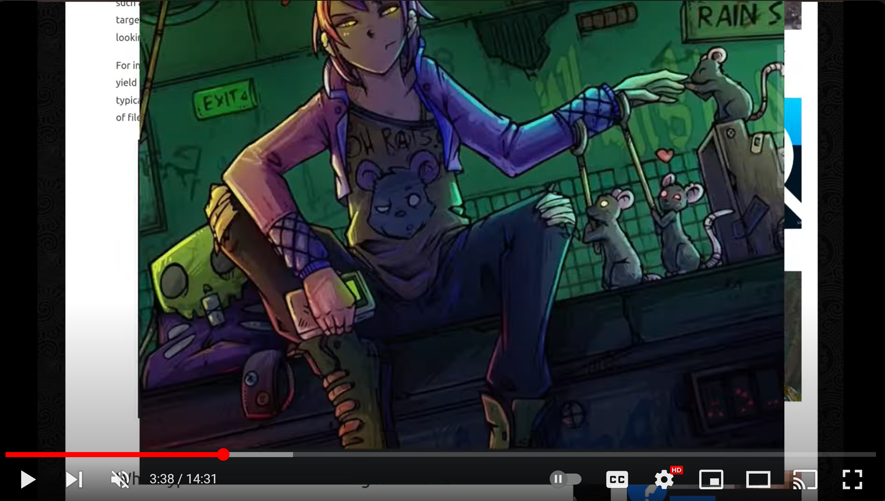
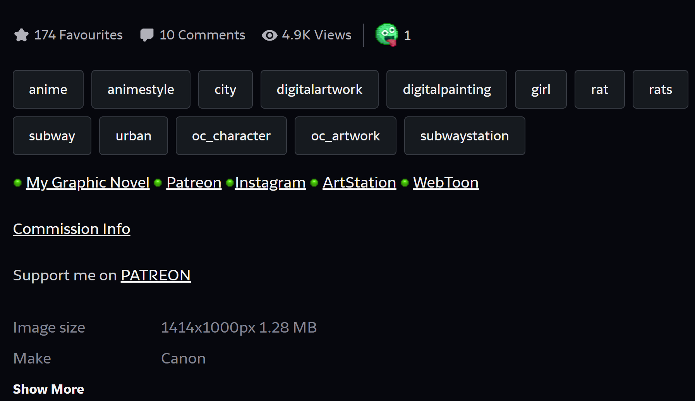

# OSINT Exercise 023
[Link to full briefing](https://gralhix.com/list-of-osint-exercises/osint-exercise-023/) of OSINT Exercise 023  
Creator of Exercise: Sofia Santos

## Task Brief & Goals
Sometimes online footage contains more information than meets the eye. In October 2023, I uploaded a video to my YouTube channel where, for a split second between minute 3 and 4, my desktop wallpaper is partially visible.  

The goals are to find:  
1) Find the title of the illustration, as given by the artist. 
2) Find how much it would cost for the artist to create a similar piece, in size and detail

### Write-up and Thought Process

**Part 1: Initial Thoughts & Observations**  
Already, a lot of initial clues are given in the brief: it's looking for a small lapse in a video from October 2023. And exploring the channel, there is only one video that had been uploaded in that month: the one called ["Filetype: The Best Advanced Search Operator for OSINT Investigators?"](https://www.youtube.com/watch?v=z9gr8yRSPZg). 

It's in this video, we could expect to see the small "lapse" of the wallpaper. 

**Part 2: Finding the Wallpaper Moment**  
Moreover, the brief also says that this wallpaper moment appears between the 3rd and 4th minute. Indeed, when playing the video, between this smaller duration of 3:35 to 3:39, the wallpaper appears. 

However, playing it at 0.25 speed was not enough to capture it, and so to see it frame-by-frame, the [<,] and [>.] buttons had to be pressed to toggle to a suitable frame, the wallpaper was visible enough. 

And by doing so, this is the wallpaper for the task:  

With this found, onwards to the tasks ~

**Part 3: Finding the title of the artwork**  
Naturally, the first way to go for finding some clues about the artist was to attempt an image reverse search. And intriguingly, there was a direct thread result from Reddit's r/Art subreddit. The [thread](https://www.reddit.com/r/Art/comments/z3ogno/involuntary_rat_queen_me_digital_2022/), also mentions its title, which is called the "Involuntary Rat Queen". Crosschecking the title, it also publishes the same artwork, in various forums like DevianArt, Inprnt, and ArtStation. The artist also has the same username across all the platforms. 

**Part 4: Cost for the Artist to make the artwork, with the same size and details**  
After exploring their profiles in the platforms, the most detailed one, is the [Deviantart](https://www.deviantart.com/adamscythe/art/Involuntary-Rat-Queen-938419928) version. Just below the artwork, there are various hyperlinks that tell us more about working with the artist. And amongst the options, one of them is the one about Commission Info. 

And when clicking into [Commission Info](https://www.deviantart.com/adamscythe/journal/Commission-Info-789285042), we can see that the "Involuntary Rat Queen" will fall within the "Complete Illustration" background ~ it comprises of the main character, her side royal subjects, and some kind of detailed background tying both together. And as per their quotes, the _minimum_ cost for making such a piece is $190 (potentially USD).  

**Credits**  
Full credits to Sofia Santos for putting together this exercise.