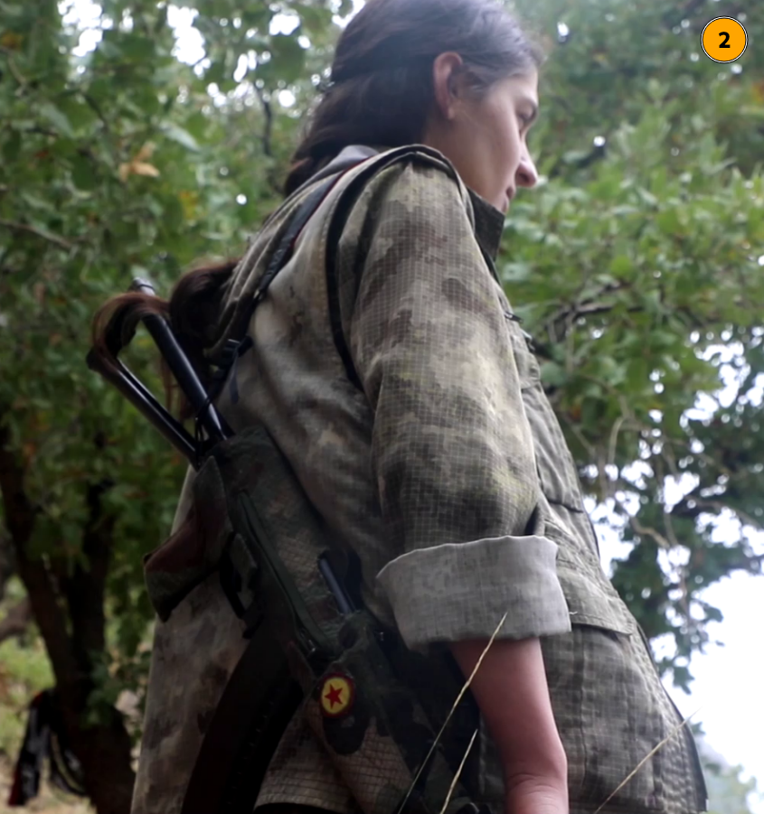

# OSINT Exercise 024
[Link to full briefing](https://gralhix.com/list-of-osint-exercises/osint-exercise-024/) of OSINT Exercise 024  
Creator of Exercise: Sofia Santos

## Task Brief & Goals
There are countless armed insurgent groups spread throughout the globe. The three images below depict individuals associated with internationally recognised terrorist organisations.

Your task is to identify to which group they have pledged their allegiance.

**Part 1: Group featured in first photo**  

When looking at this photo: the first stand out clue, is the colours of the group: being red and black. And also, there's a white coloured letter N in the emblem, as seen on the left band of the person on the right. 

There is also some inkling of an circular emblem from the sleeve of the person on the left. 

Having a look at the surroundings, the vegetation looks as if it's from the tropical zones of the planet. There's a realistic possibility that this group might originate from countries near the equator. 

When looking up "insurgent groups with red and black", there's a promising result of a group called the ELN (Ejército de Liberación Nacional), based out of Colombia. 

**Part 2: Group featured in second photo**  

The most useful symbol here, is the logo of the red star in the yellow circle. When looking up insurgent groups with that symbol, a few results appeared. 

One potential result is the association to Kurdistan. More specifically, the Kurdistan Workers' Party (PKK). In the [Wikipedia write-up](https://en.wikipedia.org/wiki/Kurdistan_Workers%27_Party) of the PKK, there are various sub-groups that have allegiance to the PKK. Amongst them, is the Free Women's Unit or the YJA-STARS.  

Seeing the flag logo of the YJA-STARS and that our photographed subject is female, it's a good starting point to explore, and look up more photographs of this specific branch of the PKK.  

When looking up "YJA-STARS" in a Google image search, there is a good number of results that show the similar type of camouflage uniform as the subject in the photograph. In addition, the star emblem was also visible and located in the rifle's coverings. There's one such example [here](https://anfenglish.com/news/yja-star-carries-out-actions-in-memory-of-july-14-prison-resistance-53468). Furthermore, [one other article](https://anfenglishmobile.com/women/yja-star-guerrillas-call-on-women-to-join-the-freedom-struggle-72200), also helps to verify the camouflage color of the uniform as well.  

Therefore, the group of this second photograph is the YJA-STAR group, based out of the geo-cultural region in West Asia. Its full form is "Yekîneyên Jinên Azad ên Star" in Kurdish, and the Free Women's Units in English.  

**Part 3: Group featured in the third photo**  

Now, onto the third photograph. The most prominent feature is in the flag behind the second trainee from the left. It shows a white triangle in a logo against a black background. With that as a starting point, let's begin looking up some results.  

Amongst the search results, one such result is of a Jihadist Group in Iran, called ["Jaish ul-Adl"](https://www.reddit.com/r/vexillology/comments/ep4ou0/flag_of_jaish_uladl_army_of_justice_a_jihadist/?rdt=42945). A number of the results showcase a few photographs with the same flag appearing, as seen [here](https://encrypted-tbn0.gstatic.com/images?q=tbn:ANd9GcQcCIzeAcSbnAo-HZyRqstavQxBH9CwLH2C4w&s), and [here](https://encrypted-tbn0.gstatic.com/images?q=tbn:ANd9GcRuSLxOKNk1_zbhqC4DXC2vWIo-QK5mKdELDw&s). Not only that the uniform and the shoe colours also match across the images. Its [Wikipedia page](https://en.wikipedia.org/wiki/Jaish_ul-Adl) also confirms the same flag.  

Therefore, the group in the third photograph is the "Jaish ul-Adl" group, operating out of the Sistan and Baluchestan province in Iran.   

**Credits**  
Full credits to Sofia Santos for putting together this exercise.