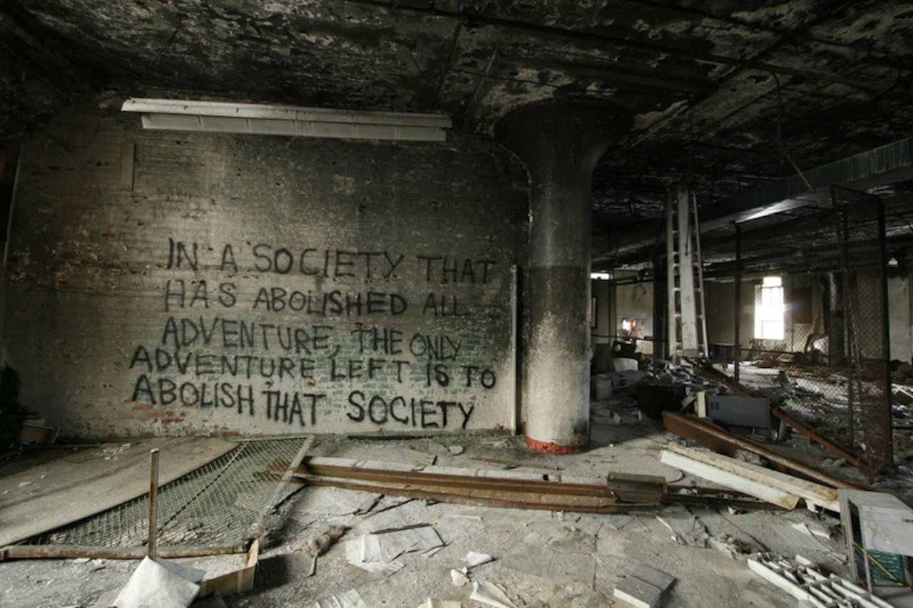

# OSINT Exercise 025
[Link to full briefing](https://gralhix.com/list-of-osint-exercises/osint-exercise-025/) of OSINT Exercise 025  
Creator of Exercise: Sofia Santos

## Task Brief & Goals
The world is full of anonymous quotes. Several are written in the unidentifiable building like the one below. 

The goals of the task are to find:  
1. Building location
2. Find the quote with the word "anarchy" in it. 

**Part 1: Initial Thoughts**  
When analysing the task photo, there are a couple of features to take note of: the first is the fact that the quote is written in a brick wall. The second is the rough green tinge in the middle of the quote, and the third is the type of pillar shape that's seen to the right of the quote. 

**Part 2: Looking up the quote**  
When looking up the quote, the same image appears to be available in various websites. 

The most prominent example is in the last result, which mentions "In Stock", in its subheading. Therefore, chances are likely that it's part of a photographer's portfolio for sale. When entering that [link](https://www.stephanieavery.com/ruins/p/adventure), there's a description of where that location is. 

This tells that the photographer took it at an abandoned computer factory in Rochester, USA. And could be a good location to look for, as the picture also features that green tinge in the middle of the quote, and a very similar brick wall background. With this as a start, there's enough to try and locate the building next.  

**Part 3: Locating the building**  
When looking up the description the photographer's website used, a very interesting, and thorough link, by the [Rochester Subway](https://www.rochestersubway.com/topics/2013/09/inside-the-abandoned-sykes-datatronics-building-rochester-ny/) about the abandoned Sykes Datatronics building from 2013, comes in. When glancing through the pictures, it could potentially be it, as the pillars featured in the photos also match the one seen in the task photo.  

But to further verify, at the bottom of the write-up, there's a credit to an even [older article](https://www.colorblindedphoto.com/blog/2009/10/11/exploring-sykes-datatronics/), that deserves a look in. And its in this older article, we see the photo of our quote get featured again, while talking about the same Sykes Datatronics building. 

Therefore, the location of the quote is the abandoned Sykes Datatronics Building in Rochester, New York. Its address is roughly 392 Orchard Street, Rochester, NY based on this [Google Map link](https://www.google.com/maps/@43.1633824,-77.6345503,3a,75y,246.04h,117.8t/data=!3m7!1e1!3m5!1szBBNqfM7rOzQRa6e4FxnRg!2e0!6shttps:%2F%2Fstreetviewpixels-pa.googleapis.com%2Fv1%2Fthumbnail%3Fcb_client%3Dmaps_sv.tactile%26w%3D900%26h%3D600%26pitch%3D-27.799999999999997%26panoid%3DzBBNqfM7rOzQRa6e4FxnRg%26yaw%3D246.04!7i13312!8i6656?entry=ttu&g_ep=EgoyMDI0MTExMC4wIKXMDSoASAFQAw%3D%3D), that was mentioned in the Rochester Subway link. Its coordinates are roughly 43.163489350707025, -77.63413612553865.  

**Part 4: Looking up a quote with the word "Anarchy"**  
Next, is to find a specific quote within the building that had the word "Anarchy" in it. 

When looking up "Syke Datatronics Rochester building anarchy", a few pictures feature a quote on a pillar, and [ending with the required word](https://www.flickr.com/photos/axle81401/4854252066/in/album-72157621958651052). The quote being: This office was a prison for our brothers and sisters in wage slavery. Let's make it a carnival for our brothers and sisters in anarchy. 

**Credits**  
Full credits to Sofia Santos for putting together this exercise.
