# OSINT Exercise 026
[Link to full briefing](https://gralhix.com/list-of-osint-exercises/osint-exercise-026/) of OSINT Exercise 026  
Creator of Exercise: Sofia Santos

## Task Brief & Goals
The image below shows the content of a zip folder. Inside it, there are four photos of undisclosed locations and a 31-second video recorded during a train ride.  

They're taken by the same individual in Feb 2024. Despite having no useful metadata, they contain enough information to track down this person's movements.  

The main task is to determine:  
At which train stations did the person board and alight?

Bonus tasks include:  
1. To identify the mode of transportation in each image. 
2. Determine the type of train they rode. 
3. Estimate the speed at which the train was travelling when the footage was recorded. 
4. Calculate approximately how far the person travelled overall. 

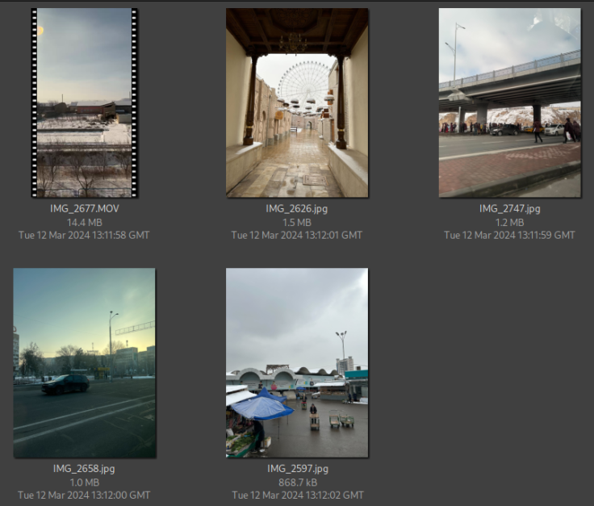

**Part 1: Figuring out the country showcased**  

First, placing the 4 still photographs here and observing one feature they all possess to figure out the country this is in:  

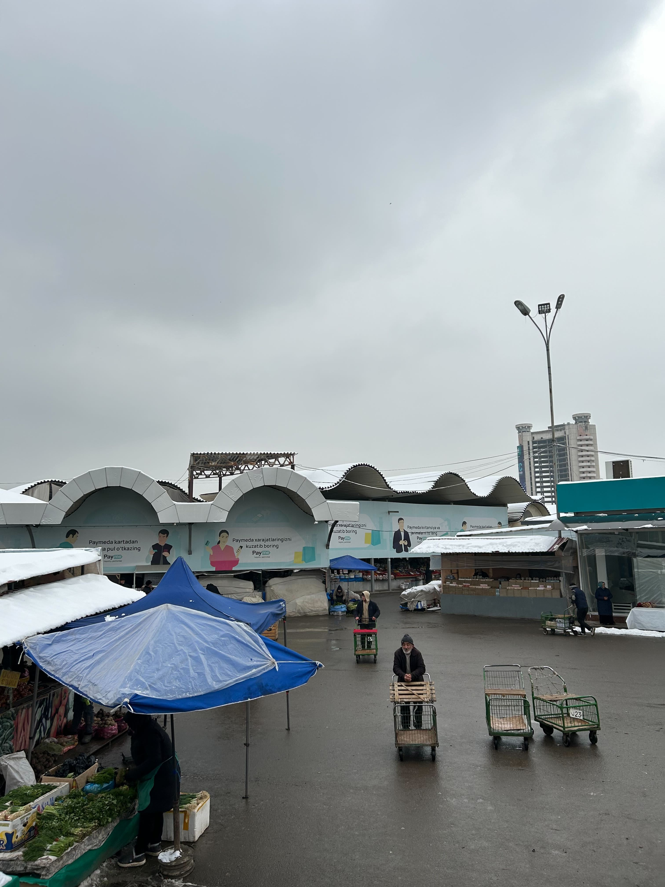  

This first one has various billboards on a "Payme" application. Looking for that particular logo in Google Images, a certain result to download that application's [Android version's package](https://payme-paymego.en.aptoide.com/app).
Looking at its "Info" tab, there's a hint at a country where this application was designed for.  

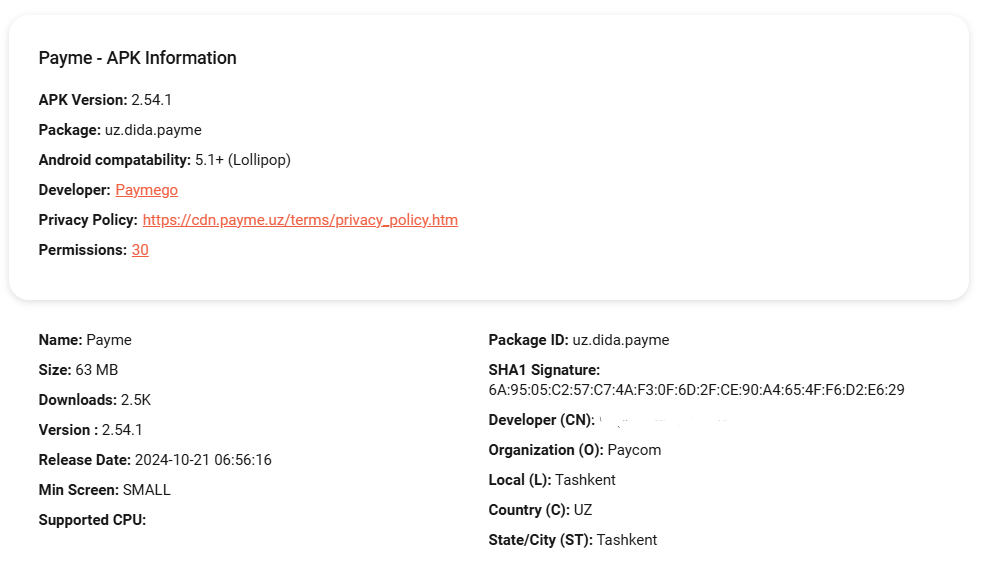

This shows us, it can potentially be in the country of Uzbekistan. To confim that, we would need to look into another still photograph. 
Amongst the remaining three, opting for the one that features the Ferris Wheel. 

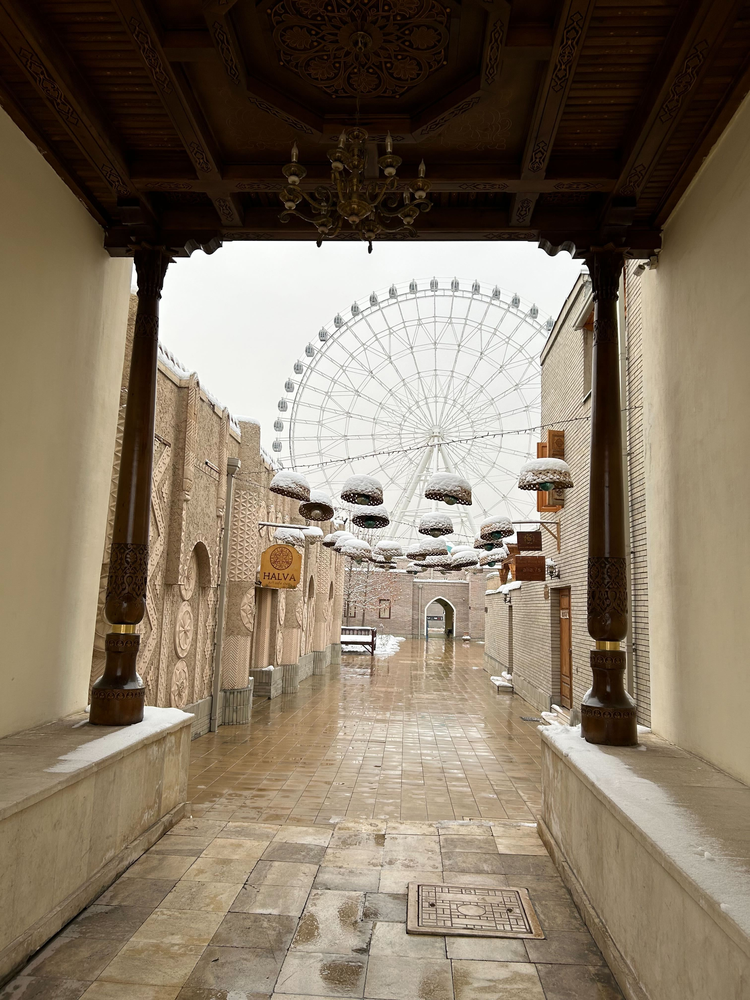

So the second photo has better hints to work with: it mentions a store sign called "Halva: art cafe shop", and a very unique facade with a ferris wheel in the background. 
Let's first locate this Halva store, and see if it'll produce us a result in Uzbekistan as well. 

And intriguingly, when doing a quick search in Google Images, the first result from Tripadvisor appears to be very promising. 

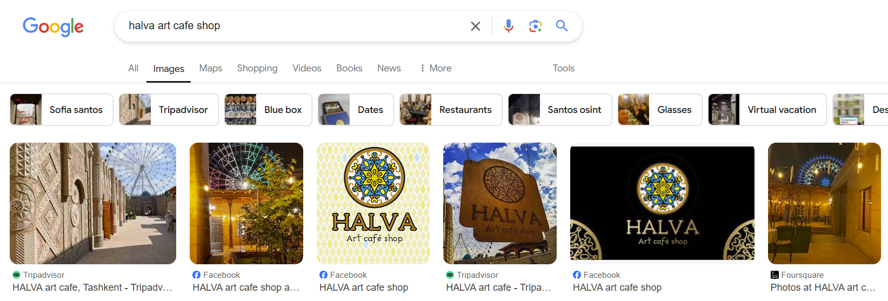

When navigating into that [Tripadvisor result](https://www.tripadvisor.com/LocationPhotoDirectLink-g293968-d21500276-i485000118-HALVA_art_cafe-Tashkent_Tashkent_Province.html), 
the Halva location mentions an address in Tashkent, the capital of Uzbekistan. And so, it's a good promising possibility that the photos would be around in the vicinity of Tashkent, or the country of Uzbekistan. 

**Part 2: Gathering more details about Uzbekistan, and the landmarks shown in the pictures**  

So a big clue we've gathered is that this individual has been based in Uzbekistan: based on the Payme advertisments and the Halva Cafe with that ferris wheel street. 
Having been to Uzbekistan before, there are two major facts about it:
1. Uzbekistan holds the first Central Asian metro system in Tashkent. Its full map is this (from this [source](https://tashmetro.uz/en/subway-map/)):  

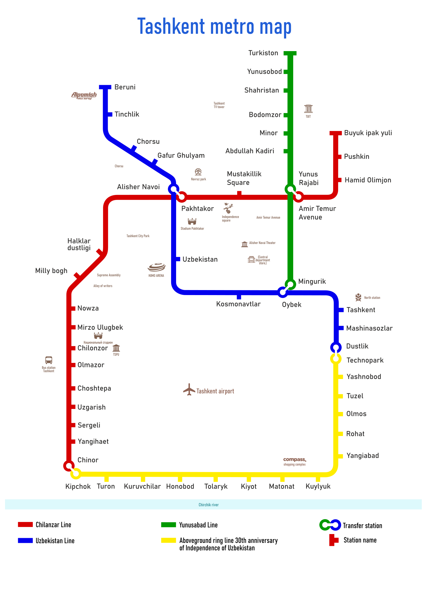. 

2. This metro is [fully underground](https://www.lonelyplanet.com/articles/uzbekistan-underground-inside-tashkents-ornate-soviet-metro), except for the circle line. 

Another source, when looking up Tashkent Metro, also showcases [a similar map](https://ilyabirman.net/tashkent-metro/map-2/). And what's interesting here, is that the map features a single liner "Payme" advertisement too.  
However, using the map image above, let's filter out some potential metro stops that are near the Halva Cafe Store, and the building of the Payme advertisements.  

In addition, as per the metro map, there is a ferris wheel icon with the title Navruz Park. When looking up this park, the tourism board of UZB shares [this piece of information](https://uzbekistan.travel/en/o/navruz-ethnographic-park%20/).

Now, 1 landmark has been narrowed down: the location of the Halva Cafe. The next is to narrow down the building that has the Payme advertisement attached all around it. 

  

Looking back at this, it looks like a circular building, and a couple of other vendors towards the bottom left corner of the photo. There's a large potential it can be one of the Bazaar buildings that are common across Central Asia. 
In Tashkent, UZB, the most popular one would be Chorsu Bazaar. When attempting an image reverse search, intriguingly, the building gets identified as Chorsu Bazaar. 
When cross-checking other results that appeared, another [travel blog](https://blog.naver.com/toto6564/223446199683) confirms this with the building facade and lamp post shape. 

Now, a 2nd landmark is set: it's Chorsu Bazaar. 

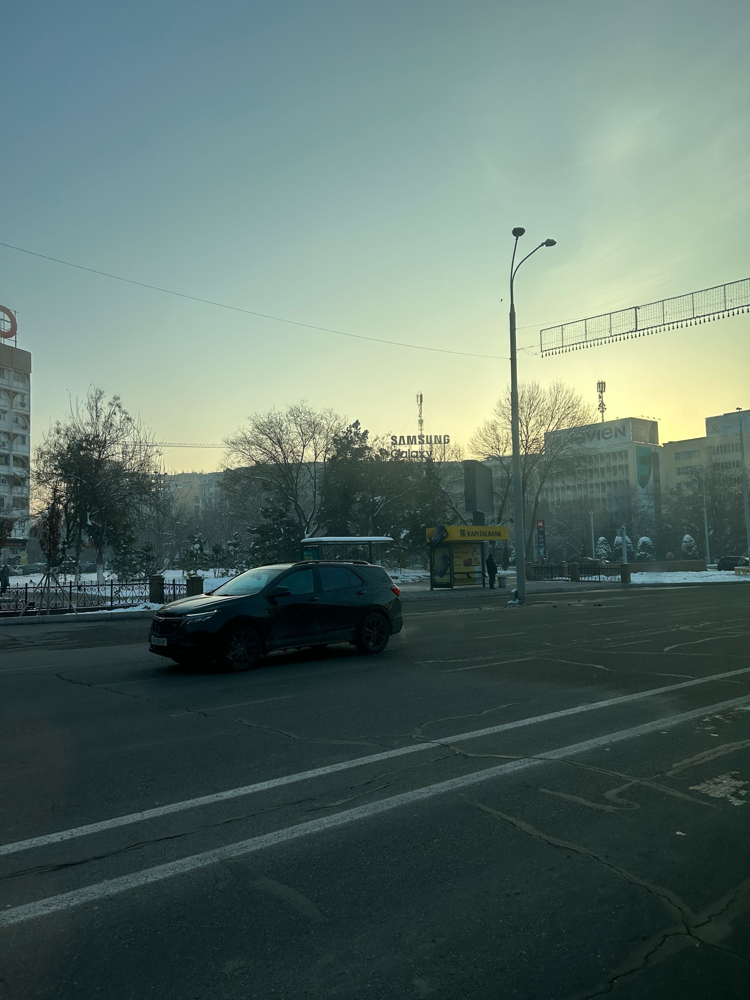

Lastly, to narrow the location of the bus stop. Looking at its background, two other buildings stand out: a Samsung Galaxy building and a (?)ovien building. 
The more standout one to look up is the Samsung one, and so, using that, let's see if an address in Tashkent can appear. 

Some shutterstock results do appear, and they feature the [Samsung Galaxy building](https://www.shutterstock.com/image-photo/tashkent-uzbekistan-october-12-2016-bill-1029366805)
with a similar looking antenna as the photo shows. One interesting result that appears when looking up "Samsung Galaxy Building in Tashkent" with Google images, is a result of ["USSO Designs"](https://www.goldenpages.uz/company/?Id=991), 
a company based in UZB that specialises in advertising methodologies. 

And amongst the projects USSO has executed, the Samsung Galaxy wording is one. Therefore, to find its proper address, a reverse image look-up was done on this particular photo. 

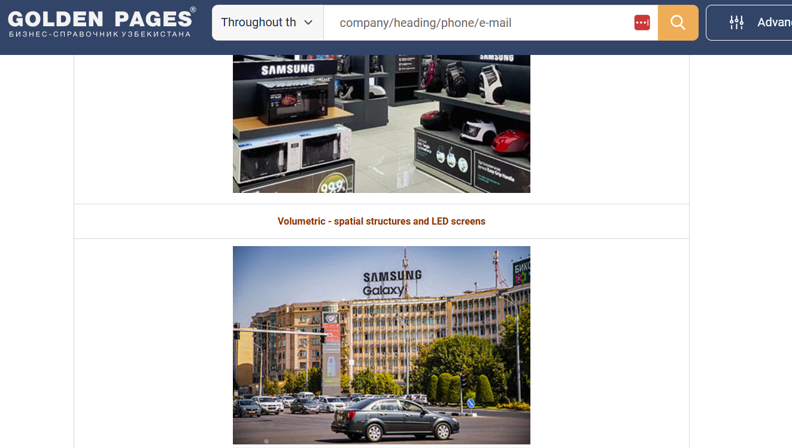

When looking at results post reverse image look-up, [one potential Yandex result shows this](https://yandex.uz/maps/org/140003483486/?ll=69.274508%2C41.298897&z=16): a Medical academy within the Mirabad District in Tashkent. 
Its corresponding coordinates also appear [in this link](https://yandex.uz/maps/10335/tashkent/?ll=69.274508%2C41.298897&mode=whatshere&whatshere%5Bpoint%5D=69.274598%2C41.299059&whatshere%5Bzoom%5D=16&z=16) as 41°17'56.6"N 69°16'28.6"E. 
When attempting a man drop into those coordinates in Google Maps, the same building can be spotted in its 360° view. 

And correspondingly, the KapitalBank featured in the photograph that shows the Samsung Galaxy building in that particular angle is not fully far off from it.

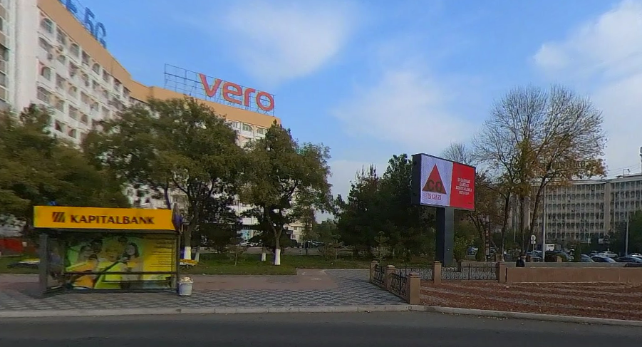

And so far, that's 3 landmarks around Tashkent narrowed down. Their consolidated address and coordinates (rough coordinates on where the photographer would be standing) are therefore:

| Landmark Name  | Address     | Coordinates |
|----------------|-------------|---------|
| Halva Art Cafe | Labzak Street 12a/10, Tashkent, Tashkent, Uzbekistan | 41°19'34.3596"N, 69°15'55.6452"E|
| Chorsu Bazaar  | Tafakkur ko'chasi 57, Тashkent, Tashkent, Uzbekistan | 41° 19'36.714"N, 69°14'6.0756"E|
| Samsung Building Bus Stop|  Afrosiab Street, Tashkent, Tashkent Region, Uzbekistan |41°17'57.696"N, 69°16'22.584"E|

**Part 3: Plotting out the places in Tashkent, and how they navigated**  
With 3/4 of these addresses found, a rough plot of these places look something like this. 

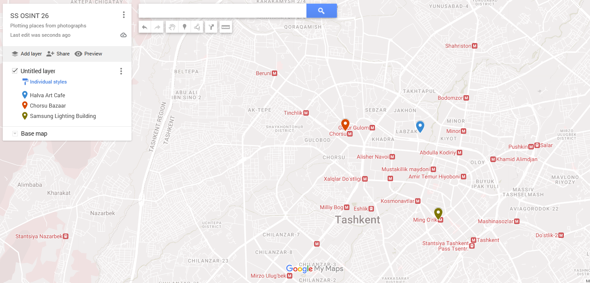

After this plot of places: the next is to figure out the sequence in which they were visited. And for that, we can look back at the original task photo:  

This shows that, given the sequence of the image numbers: the first location was Chorsu Bazaar (2597), followed by the Halva Cafe place (2626), the Samsung Galaxy building (2658), the video (2677), and then the bridge photo (2747). 
Overall, it's looking like this person, might've seen these places in Tashkent first, before taking a train out. And, something else confirmed is whether the train is intercity or cross-country. 

We've discovered from above that it likely cannot be the Tashkent metro system as it's purely underground.
The video, depicts the train travelling above ground. Therefore, chances are, this train is a cross-country train. The person might've toured Tashkent first, and took the video of the train ride, and possibly a photo of a stop with a bridge.  

Therefore, the next thing to figure out, is where they might've headed to from Tashkent, and from where they might've boarded it from. 

**Part 4: Figuring out the train and its destination**
So, we've established that the video and the last bridge photo is of a journey on a cross-country train. It must be a train that had Tashkent in its route to go somewhere else. 

Plus, when looking back at the map plot of the places the person visited, and zooming into a corner of the map:  
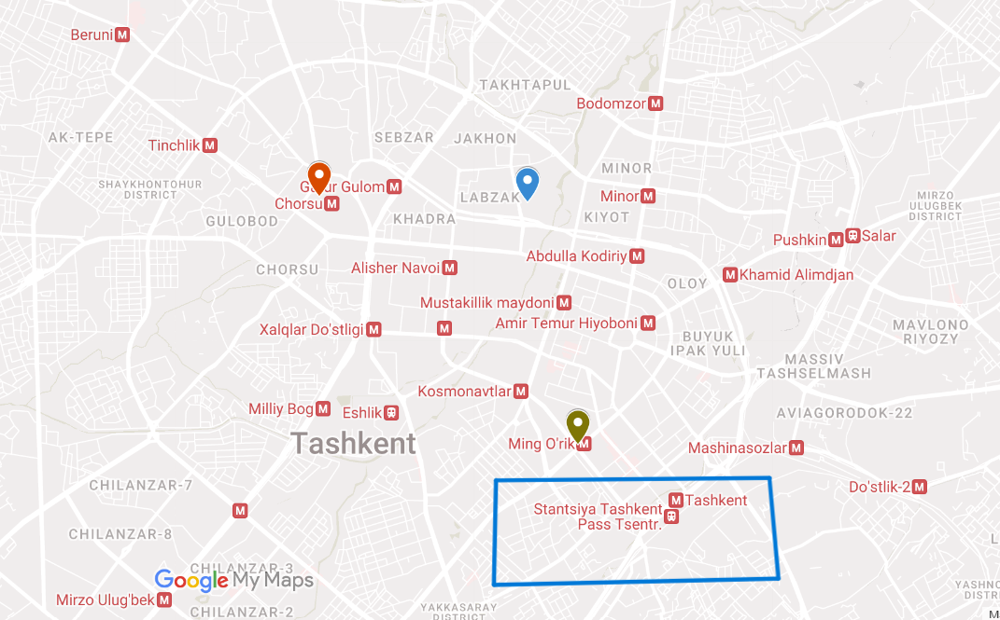

We can see two train stops with differing symbols: an M and a train image. Seeing the names of the station, there's a chance that the person boarded the train at Stantsiya Tashkent Pass Tsentr, or also known as [Northern Tashkent Central](https://eurasia.travel/uzbekistan/tashkent/railway-station/)

Given the order of the photos the person took, it can make sense that they wrapped up a tour across Tashkent, to catch a train at the end of it. 
Now, leaves a final destination to find: where did they alight off after the train journey?

Here is where the final photo can give a better clue. Zooming in on the last photo more deeply:  

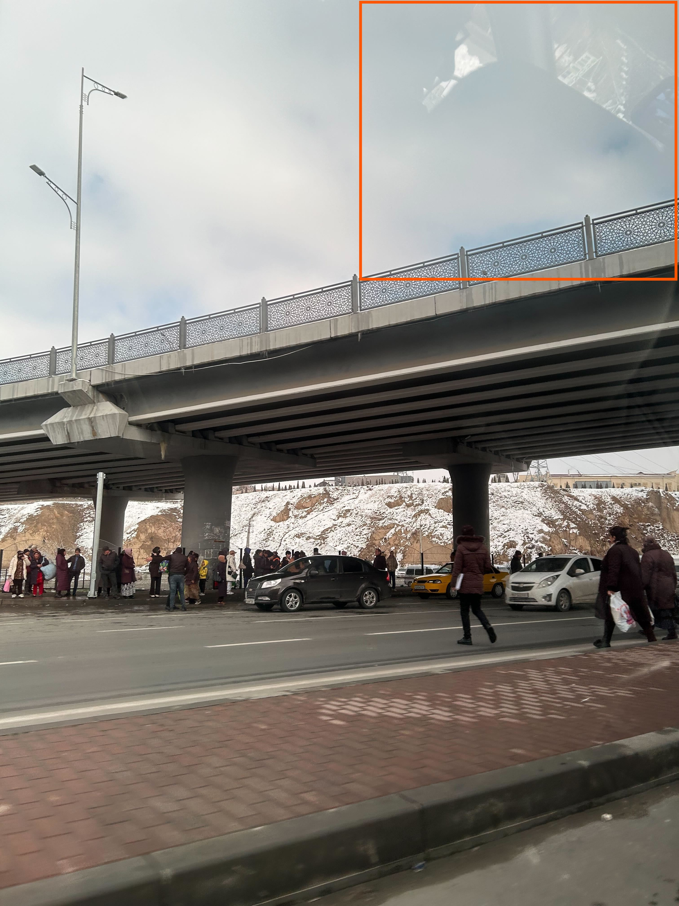

After the video, we can see that there's a rough reflection of a car that our traveller would've taken. Likelyhood, it's a taxi, and it passed underneath a bridge. 
So we can say our traveller would've boarded a taxi after their train journey. 

Doing a reverse image search on the last photo, a [potential Facebook result appeared](https://www.facebook.com/photo.php?fbid=650718470567338&set=pb.100068875725353.-2207520000&type=3), saying it is part of Samarkand. 
It might be it, as the brown hilly terrain, the yellow building on top of it, the cars parked, and people waiting for cars looks like a similar scene to the one by our traveller. 

Let's explore this further, and see if the traveller did go from Tashkent to Samarkand. 

**Part 5: Confirming final destination**
In Google Maps, now zooming into Samarkand: some features of the last photo show some features to look out for: that includes the brown hills, and the overbridge with that floral design. 

The first thing that easier to spot in Maps, are the brown terrain hills. Starting with the biggest potential area possible, there are 2 overpasses that could possibly fit the final photo. 

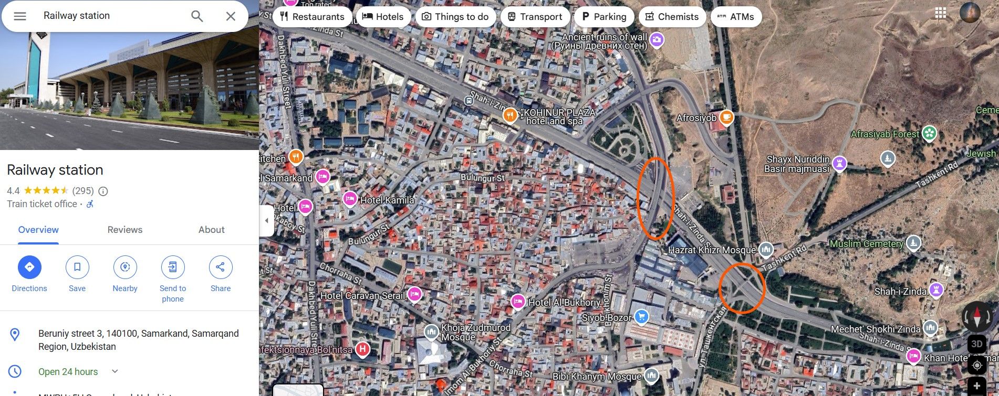

Man-dropping into the first one: it gives a result of high confidence. 

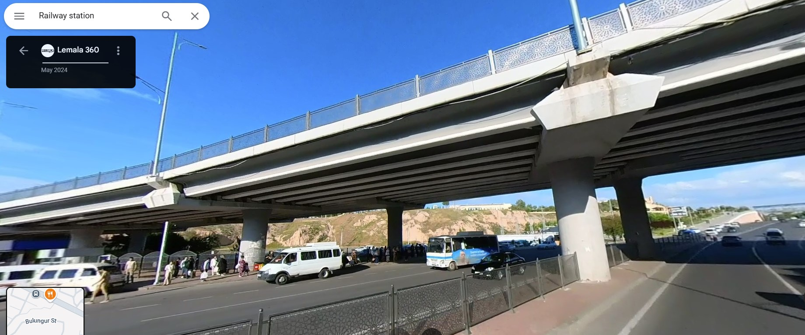

From above, the place is called the [Siyab Bridge](https://maps.app.goo.gl/wxwcmxBSJgiTxAcK7). 

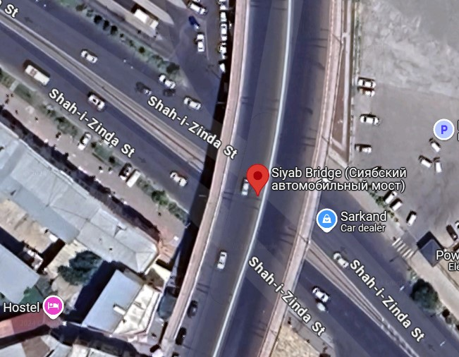. 

Now confirmed that our traveller came from Tashkent to Samarkand, it would therefore mean that he took a train from the starting station: Stantsiya Tashkent Pass Tsentr (or the Northern Tashkent Railway station) into [Samarkand Railway Station](https://uz.wikipedia.org/wiki/Samarqand_vokzali)

**Bonus Qns Attempts**

To facilitate this, plugging in the map plot here again. 

1. To identify the mode of transportation in each image. 
- Chorsu Bazaar: observing where the traveller is standing, he's in a bit of an elevation to the ground. He might be at the top of flight of stairs.
- Mode of Transport: By walking

- Halva Cafe: Seeing the narrow alleys, it looks the least car friendly. Given it's located inside Navruz Park, it'll likely only be feasible to enter it by foot. 
- Mode of Transport: By walking

- Samsung Galaxy Building: Seeing the order of the photos, the traveller went from Halva Cafe to the Samsung Galaxy Building vicinity. Seeing the complexity of those two locations, chances are it might be with the help of a taxi. 
- Mode of Transport: By Taxi 

- Video: Would be taken in the cross-country train ride. 
- Mode of Transport: By Train

- Siyab Bridge at Samarkand: Reflection on the photo shows the driver's side of a car. 
- Mode of Transport: By Taxi
  
2. Determine the type of train they rode.
The major train used in this traveller's journey is the one from Tashkent to Samarkand. Having a look at the picture, and video he took, one thing we can observe is that it's relatively sunny. Seeing the shadows of the video,
it's probably at a time close to midday. And our traveller, did come into Samarkand where daylight is still prominent. 

Seeing some sources of train timetables: this one by [Adventour](https://www.advantour.com/uzbekistan/trains/tashkent-samarkand.htm), shows that a morning Afrosiyab train might've been used. 
 
3. Estimate the speed at which the train was travelling when the footage was recorded. 
For this section, dissecting the video is the best way to navigate. Looking at the video, there's a significant place of interest at about the 7th to 10th second. 
There's a major road, and two petrol stations on either side of it. 

Geolocating that on Google Earth, it gives us these rough coordinates: 40° 5'50.77"N , 67°48'10.88"E. Placing a placemarker there, we can now see where along the train goes. 
The end of the video shows some sort of gate enclosing more trees, so let's find that landmark on Google Earth. 

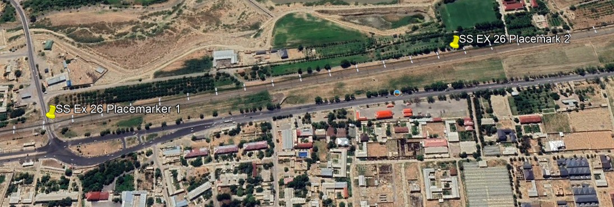

And so, we now know what was covered between roughly the 10th second and the last second of the video (31). For a time of 21 seconds, the train covered this much distance. 

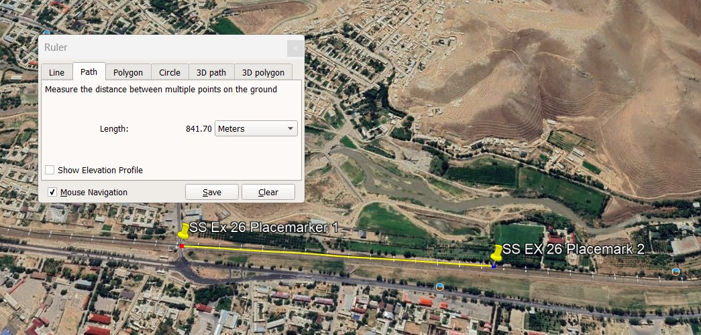

This comes to roughly 841.7m in 21 seconds. In km/h, that's around 144km/h, which is within the speed range the Afrosiyab train could travel in. 
Rough speed is therefore: 144km/h

4. Calculate approximately how far the person travelled overall. 
Accounting for his tour in Tashkent, the train journey, and Samarkand station to the Siyab Bridge (the traveller doesn't stop at the bridge, he goes past it).

Chorsu to Halva Art Cafe: 3.5km 
Halva Art Cafe to Samsung Building: 3km
Samsung Building to Tashkent Railway Station: 1.6km

Tashkent to Samarkand: roughly 300 - 332km

Samarkand Railway to Siyab Bridge: 5.2km

Given the documentation so far, with Siyab bridge as the final landmark,
Total Distance would come to roughly: 345.3km

**Credits**  
Full credits to Sofia Santos for putting together this exercise.
