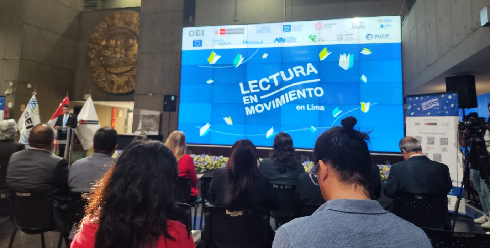
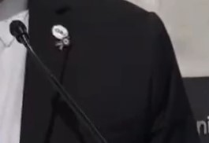
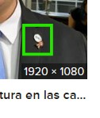

# OSINT Exercise 027
[Link to full briefing](https://gralhix.com/list-of-osint-exercises/osint-exercise-027/) of OSINT Exercise 027  
Creator of Exercise: Sofia Santos

## Task Brief & Goals
The image below shows a group of people sitting in front of a large screen that reads "Lectura en Movimiento en Lima". A speaker can be seen standing on the left-hand side in front of the three large flags.

The task goals are to find:
1. Speaker's name
2. Identify what he was wearing on his lapel. 
3. Find footage of his speech.

**Part 1: Initial Thoughts**  
To try and execute some initial translation first. "Lectura en Movimiento en Lima" from Spanish translates to "Reading on the Move in Lima". 

Using this, starting out search engine queries. 

**Part 2: Finding details about this talk** 
A google search on the original Spanish title of the talk, brings us to [two interesting results](https://www.google.com/search?q=Lectura+en+Movimiento+en+Lima&sca_esv=4dc0f076ae9218b7&source=hp&ei=hJIoZ_ufGOr54-EP_c6koQ8&iflsig=AL9hbdgAAAAAZyiglMKcsWtBie7afGeXP53KO0qWcSRZ&ved=0ahUKEwj78bKtrcKJAxXq_DgGHX0nKfQQ4dUDCBg&uact=5&oq=Lectura+en+Movimiento+en+Lima&gs_lp=Egdnd3Mtd2l6Ih1MZWN0dXJhIGVuIE1vdmltaWVudG8gZW4gTGltYTIFEAAYgAQyBRAAGIAEMggQABiABBiiBEj6BVCLA1iLA3ABeACQAQCYAT2gAT2qAQExuAEDyAEA-AEC-AEBmAICoAJPqAIKwgIQEAAYAxjlAhjqAhiMAxiPAcICEBAuGAMY5QIY6gIYjAMYjwGYAxCSBwEyoAfuAQ&sclient=gws-wiz).

The first is this [article](https://oei.int/oficinas/peru/noticias/lectura-en-movimiento-en-lima-una-iniciativa-que-une-a-14-entidades-para-promover-la-lectura-en-el-pais) by OEI, Organización de Estados Iberoamericanos. This was published on 18th July 2023. Their logo is also on top in the slide's header, showing they might be the major organisers behind this.  

Reading through the article, we see a photo of our speaker of interest, and we can find out that he's Juan Carlos Luiz, the director of OEI Peru. 

For footage of his speech, comes from the second result: [a Facebook publication of the event's speech by Cultura24.tv](https://fb.watch/vEjxKI2mO8/). This was the day's speeches broadcasted live of the event. And Juan's speech, begins at the 9:40 mark of the video, and ends at 18:12. 

And in this segment, his lapel is more visible. 

**Part 3: What's there in his lapel?**

Taking a small screenshot of the lapel shown:  

From the shape of the lapel, it looks like a white circle with OEI in it, and a ribbon shape attached to it. To specifically find it, googling the speakers name, also shows another photo whereby he's wearing the lapel, like [this one](https://www.google.com/imgres?q=lectura%20OEI%20Peru%2C%20Juan%20Carlos%20Ruiz&imgurl=https%3A%2F%2Fmarketdata.com.py%2Fwp-content%2Fuploads%2F2023%2F07%2Ff1cc0328618806f898fa0b2eeb24657dc142602c.jpg&imgrefurl=https%3A%2F%2Fmarketdata.com.py%2Fnoticias%2Finternacionales%2Fperu-y-la-oei-promocionan-la-lectura-en-las-calles-y-el-transporte-publico-de-lima-112311%2F&docid=Rgl0Wi7WjKSRIM&tbnid=ek_2yHLrgl99MM&vet=12ahUKEwiLuvfMs8KJAxXnTGwGHaz2PJcQM3oECBwQAA..i&w=1920&h=1080&hcb=2&ved=2ahUKEwiLuvfMs8KJAxXnTGwGHaz2PJcQM3oECBwQAA), and the same event's name is in the background. 

Therefore, it's safe to say that the lapel worn by the speaker is a pin that has both the OEI logo and an orange ribbon. 

**Credits**  
Full credits to Sofia Santos for putting together this exercise.