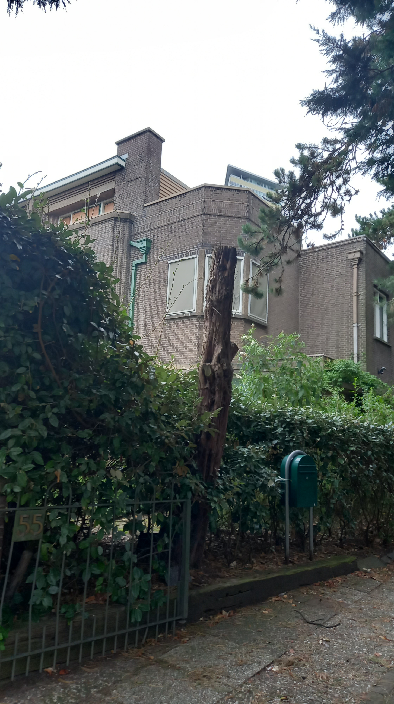
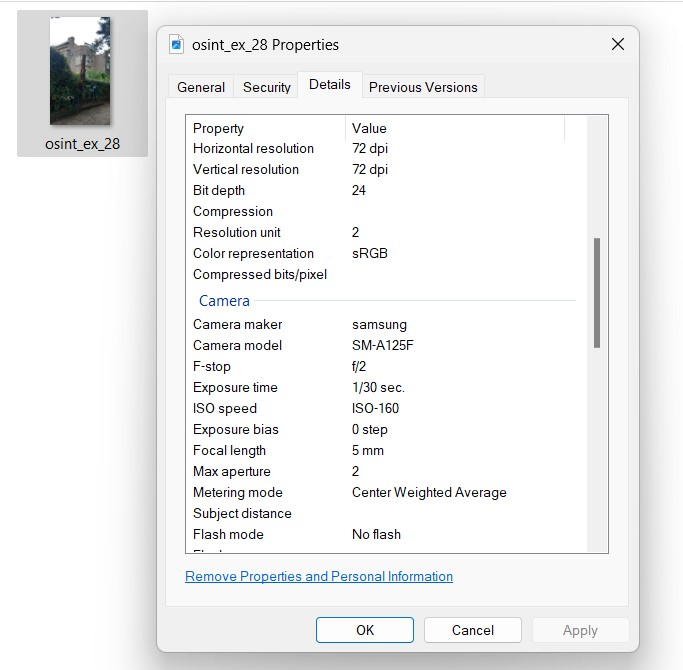
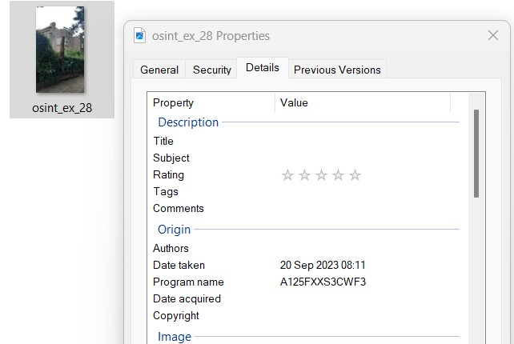
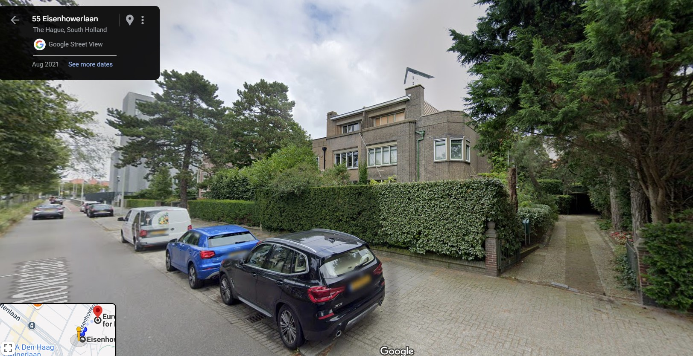
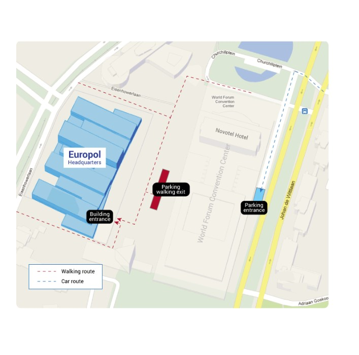
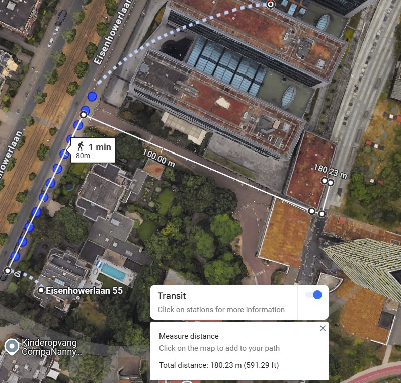
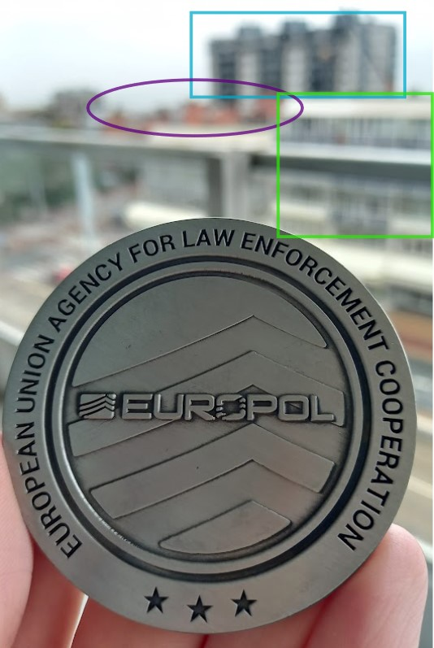
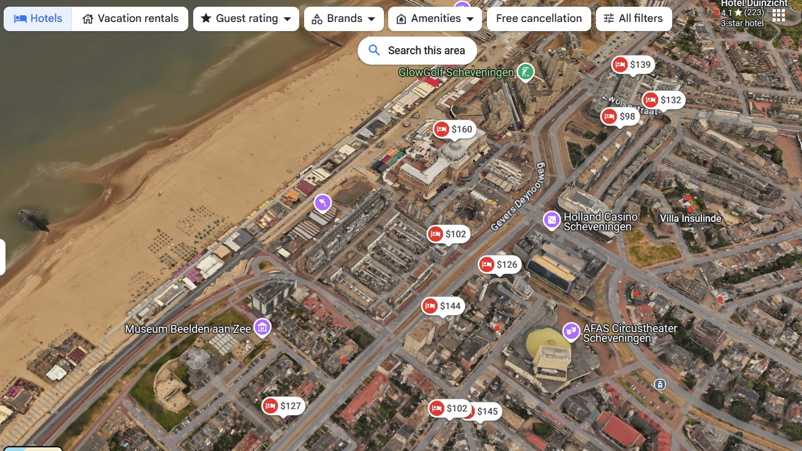
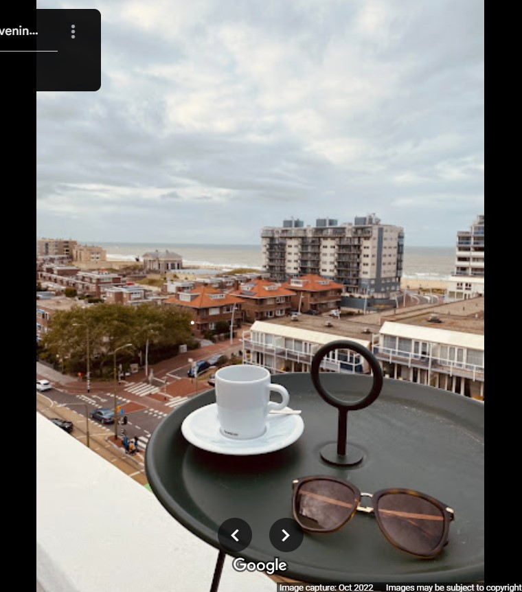

# OSINT Exercise 028
[Link to full briefing](https://gralhix.com/list-of-osint-exercises/osint-exercise-028/) of OSINT Exercise 028  
Creator of Exercise: Sofia Santos

## Task Brief & Goals
Sometimes, the fastest way to geolocate an image is to track down the movements of the person behind the lens. 
Photographer took the image on 20th Sept 2023, at 08:11 local time. 

The goals of this task are:
1. To determine the device used to take the photograph. 
2. Where the photographer was headed
3. How far the photographer was from the entrance of their destination. 

Bonus Task: to determine the hotel the photographer used. 

**Part 1: Initial Thoughts**  
Looking at the image, two striking features are: the gate having a number "55" on it, and potentially, a green mailbox. 
As for the first question, there's a good chance we can determine that from the photograph's metadata. 

**Part 2: Finding out the device** 
First, before utilising external tools: tried Windows' built-in Properties tab. And within in, the "Details" subcategory, there's a good clue in the Camera make and model. 

There's a high possibility that the photo was taken with a Samsung device, of that particular model code: SM-A125F. Looking up this code, this shows us that [it's one variation of Samsung's Galaxy A12](https://doc.samsungmobile.com/SM-A125F/MID/doc.html)
When crosschecking another feature from Properties, we can see that it matches a particular build number that was released back in late June 2023. 

**Part 3: Direction the photographer was going towards**  
As this was an exercise involving our creator, one big clue (and permission) is that something about this day could be mentioned in their social media accounts. 
Double checking the social media channels our creator is a part of: chose to narrow down into Mastadon and Twitter. 

Given the date of the photo, a bit of Google Dorking was necessary. 

The search done to narrow it on Twitter was: "site:twitter.com/@gralhix" with a date range of the last ten days of September. 

Intriguingly, to execute the same on Mastodon, with a date range: it didn't give anything promising. 

But once the date parameters are removed, Gralhix's profile appears. 

Having a look into the Mastadon profile manually, there was a promising result both accounts showed, and that was the Europol event called: 
SIRIUS CTF Finale, and the role of women in OSINT Investigations. Looking across the photographs of the post, it appears that it was held in a Europol HQ, in the Hague, in Netherlands. 
In addition, the final photo, that showcases the event's presentation, it matches the date the task photo was taken. And so, it could be a fair inference that Gralhix would've taken the photo enroute to the event, as it's also quite early in the morning.  

Specifically, Europol's HQ address is: Eisenhowerlaan 73, 2517 KK Den Haag, Netherlands

**Part 4: How far was the photographer from their destination?**  
In essence, we found out that Gralhix was headed to the Europol HQ in the Hague, NL. 

And looking back at our task photo, we see a number 55 on the gate of the building. As a first guess, it feels like both buildings could be along the same street. 
And seeing that they're both odd numbers, 55, and the HQ being at 73 Eisenhowerlaan, the first action was to geolocate 55 Eisenhowerlaan. 

And interestingly enough: 55 Eisenhowerlaan is the location of the task photo. 

When zoomed in, the same house, gate, green mailbox, the slender shaved tree(?) and the number 55 plaque all match. 

But, when walking along the route with the man-drop, it wasn't fully clear where the entrance of Europol's HQ was for people coming in by walking.
Given that this was a larger event, and that many attendees would've been required to come or conduct some security check, and to collect their event pass. 
A specific entrance must've been there. 

So looking back at what we've narrowed: we now need to find a walking route into the Europol HQ. Looking at [this part about entrances](https://www.europol.europa.eu/contact-us#:~:text=Building%20and%20Parking%20Entrances),
it specifies a certain way to enter the building if choosing to walk. 

Now, the next goal is to trace and measure that in Google Maps. 

It can come as a potential distance, but given the route: it might come within this range, possibly plus or minus 10m. 
With the rough measurements, the walking route might be 180.23m.

**Part 5: Bonus - What's the potential hotel Gralhix might've stayed at?**  
For this, I had to revisit the photos featured on the social media platforms. Amongst the 4, this one, [of her medal](https://pbs.twimg.com/media/F6zCiJmW8AAUW3I?format=png&name=900x900), 
might be a best bet in figuring out a potential hotel - as two are of the event and another is the certificate she was awarded. 

The background is blurry, but some stand out buildings are as follows:

In blue: the taller three black buildings  
In purple: the series of orange roofs  
In green: the white building with a window-heavy facade.  

In addition, it's a room with a balcony. So a good chance, it might be a place with a better view. As NL is a flat country, it could be facing the sea. 

With 3D feature enabled in Maps, and looking up hotels by the Pier/beach: some potential options come up: 

And interestingly, the black and white, zebra-esque buildings are seen near the Museum Beelden aan Zee, and near that, are roughly 3 orange roofs. 

Following that line of view, the hotel with the $144 marker could be a candidate. That hotel, is the [ibis Style Den Haag Scheveningen](https://maps.app.goo.gl/NsHNVwdYwU1HGigQ7). 
To see if it indeed matches, looked through a couple of photos from its publicly available album on Maps, and found a similar photo from a balcony with the same few buildings. 

It roughly matches the blurry background, and therefore, the hotel would be this ibis Style Den Haag Scheveningen.  
**Credits**  
Full credits to Sofia Santos for putting together this exercise.
