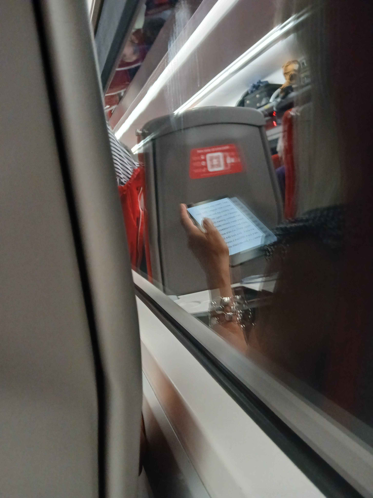
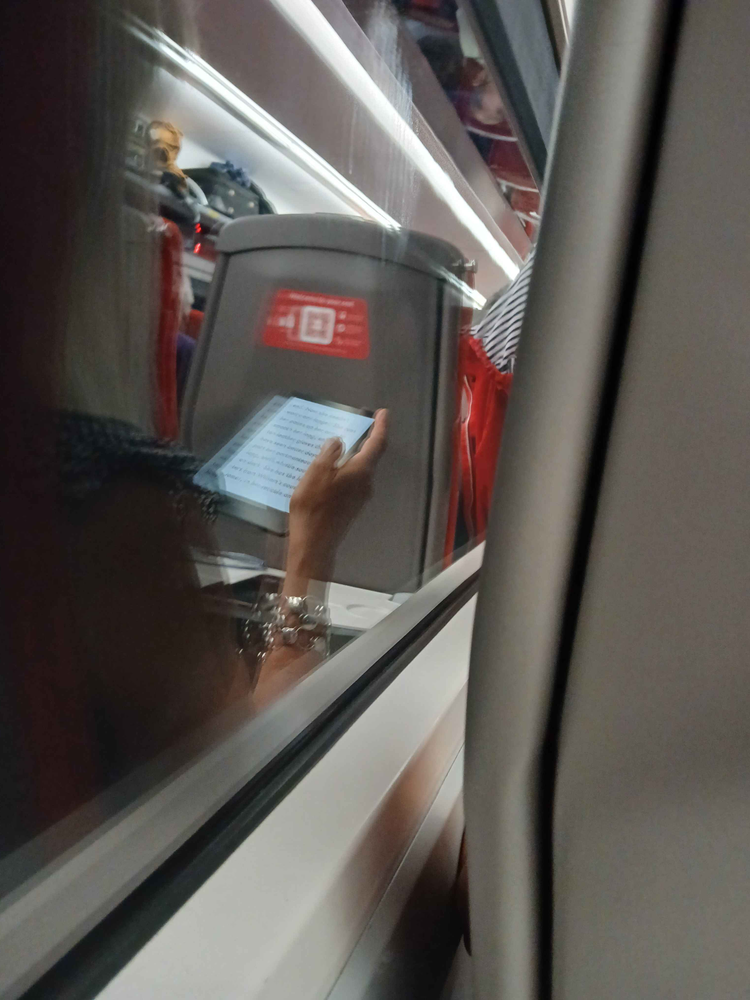
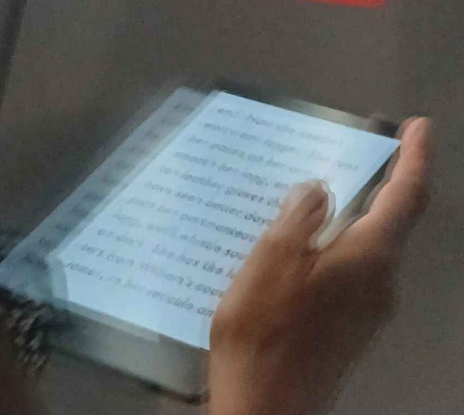
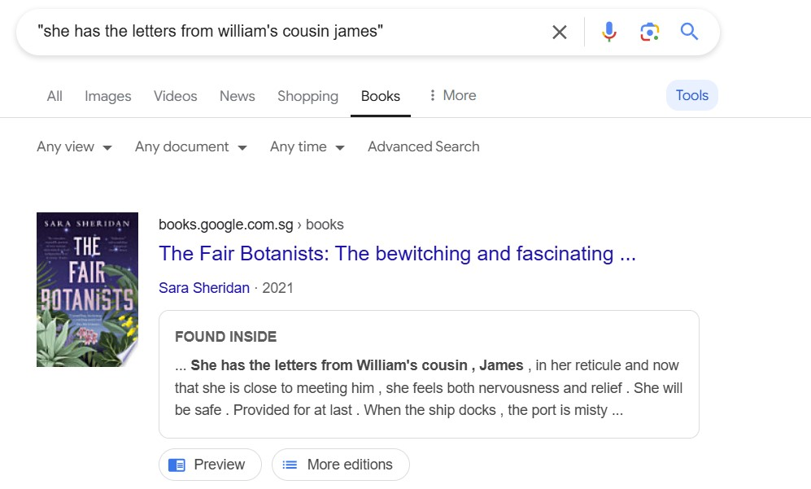
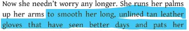
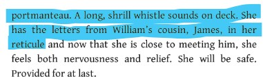
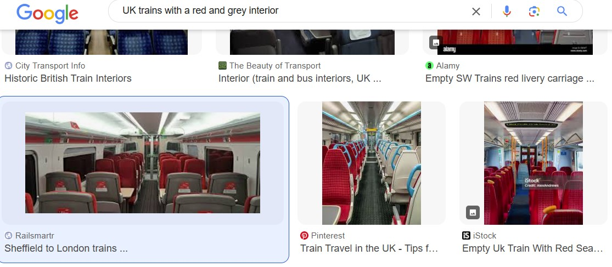
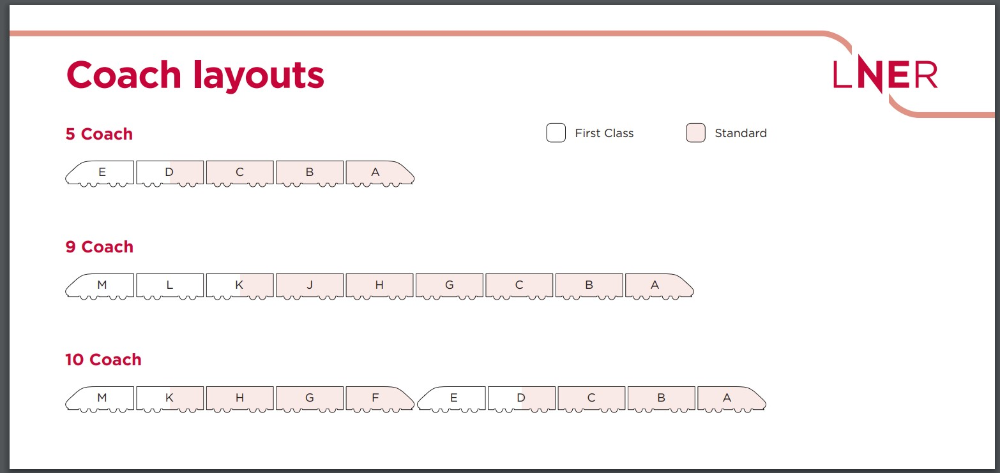
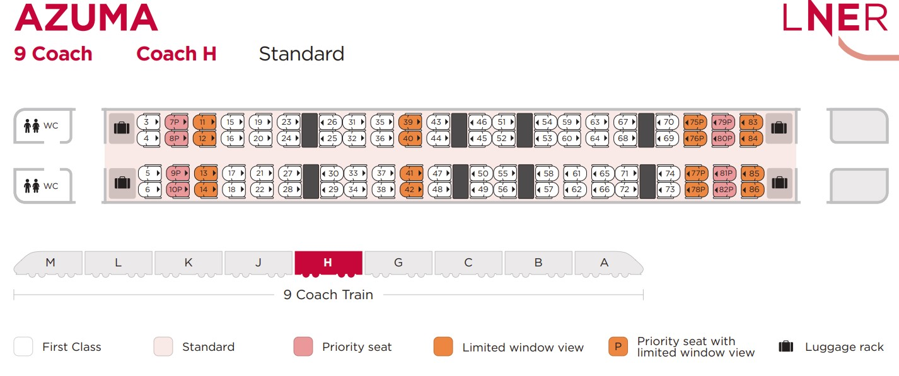

# OSINT Exercise 029
[Link to full briefing](https://gralhix.com/list-of-osint-exercises/osint-exercise-029/) of OSINT Exercise 029  
Creator of Exercise: Sofia Santos

## Task Brief & Goals
This photo was taken whilst riding a train in the UK. Sofia's preference is for quiet areas where no one can be seated behind her because, in a public 
place, no information is truly private. 

The task is to find the following:  
1. What the person in front is reading. 
2. Identify the train model.
3. Identify Sofia's seat number. 

**Part 1: Initial Thoughts**  
A few observations first of the train's interior. 
1. There's a grey and red colour scheme. Grey hardseats, with red linen-cushioning. 
2. A baggage rack above. 

And as the image is laterally inverted, some mirroring tool is required to get a better decipher of the text on the kindle device. 
One such inverting tool I'd opted for was [Img2go](https://www.img2go.com/). 

The resulting image was in this form:  

When zoomed in more thoroughly, some of the words that are visible in the screen are:

1. "leather gloves"
2. "have seen better days"
3. "She has the letters from William's cousin, James, in her <> and..."

Amongst the decipherable words, the final sentence shows some promise. And so, using that, let's try to find out a potential piece of literature this can come from. 

**Part 2: Finding out the reading material**  
With that decipherable longest phrase, a search on Google to find potential books was done. And this was a promising result: The Fair Botanists. 

And within the [book](https://tinyurl.com/mvbswc97), the exerpt that was shown through from the reflection, was just found in the previous page, and had the same words
found earlier from the zoomed in mirror image. 

Therefore, the reading material is called: The Fair Botanists, by Sara Sheridan.

**Part 3: Identifying the train model** 
Reverting back to the inverted photo:  

The color scheme of the train interior is a hint: grey chairs with red linen and cushioning. 
There's also a foldable tray table as seen in the reflection. 
As for the seats: there's a grey "curve" at the top, and for its back, there's a "molding" that looks like an angular indentation.

A luggage rack
A QR code at the back of every seat. 

And while it's not fully confirmed, and seeing the opposite side's luggage rack quite close, it feels like this is a train model with a 2 x 2 seating arrangement. 

The first thing to do, is to look up "UK Trains with a grey and red interior". Amongst the results, this [article by Railsmatr](https://railsmartr.co.uk/sheffield-to-london-trains/) talks about an option. 

In its article, it shortlisted a train type called the LNER (London North Eastern Railway). And the featured picture is of Standard Class on a LNER. 
The back of the seat matches what the inverted task photo depicts. And there's visibility of a tray table. 

There's a high possibility it can be this LNER train variety, it has another alias called Azuma and that it's from its Standard Class cabin. 

To find it's official model name: investigated a little into the LNER's wikipage. Under the [Rolling Stock section](https://en.wikipedia.org/wiki/London_North_Eastern_Railway#Rolling_stock), and within its current fleet: this key [sentence](https://tinyurl.com/nham38d6):
about Class 801 trains being based on Hitachi A-train design and LNER retaining the Azuma brand for those units. When going into [its hyperlink](https://en.wikipedia.org/wiki/British_Rail_Class_801), 
this model appears to match the task photo best. 

Hence the model's full name would be the British Rail Class 801 Azuma trains, that is part of the London North Eastern Railway fleet. 

**Part 4: Identifying the seat number**  
And finally, to narrow down the seat number. For this, it's worth to revisit the original task photo. 

From the photo, we see an inverted right hand holding the kindle. Therefore, it's the passenger's right hand side that's closest to the window, same as the photographer. 
In addition, in the task brief, it was mentioned that Sofia prefers a seat where no one will be seated behind her. Plus, her right side does have access to the window. 

Using this as a hint, the next is to find out Azuma's seating plan, in the Standard Class cabins. 

And so, from the FAQ portion of LNER, there's a link to [LNER's seat maps](https://www.lner.co.uk/support/on-board-faq/seating/lner-seat-maps/), and in that [slideshow](https://www.lner.co.uk/globalassets/_page-structure/azuma-content/azuma-seat-maps-aug2021-min.pdf), some interesting bits of information appears. 

1. Azuma Trains, come in 3 varieties: a 5-coach, 9-coach, and 10-coach trains. 
2. There is one train type: the 9-coach, that appears to feature a Quieter Coach, in Coach H. 

And the slides also confirm this layout in its various train types. 

The first standout is this quiet coach H in the 9-er train, so let's dig into that seat map. 

Given that there's a preference to not be seated infront of anybody, and there's a window on the right hand side of Sofia, either Seat #6 or #83 would be the possible candidates. 

To narrow it down further, the best way is to revisit the task photo. 

The top of the photo shows a reflection of the passengers from below. There's one gentleman we can witness, and behind him, are 2 extra seat rows. 
As it's possible to see more of his front, chances are he's at a booth table. 

Matching these three seats that face the photographer with a table, the best bet would be at seats 59, 63, 67 (where the gentleman would've been) and the table. 
The next best option would've been 57, 62 and 66. But from Seat #6, that's quite a distance, and there's a bit of uncertainty if the reflection might've captured there. 

Hence, Sofia's seat is highly likely #83. 

**Credits**  
Full credits to Sofia Santos for putting together this exercise.