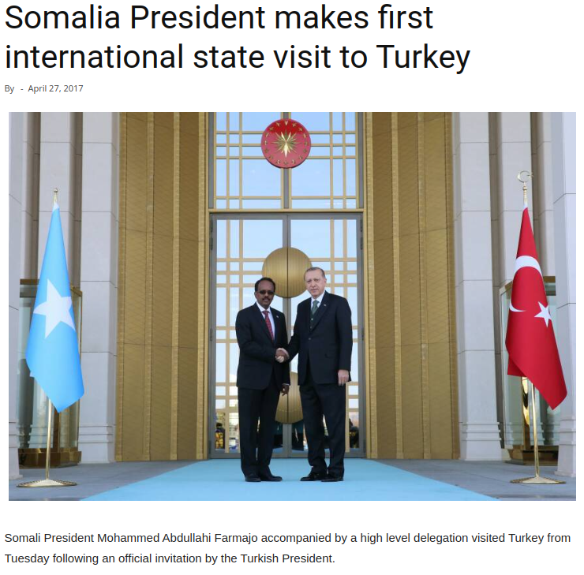
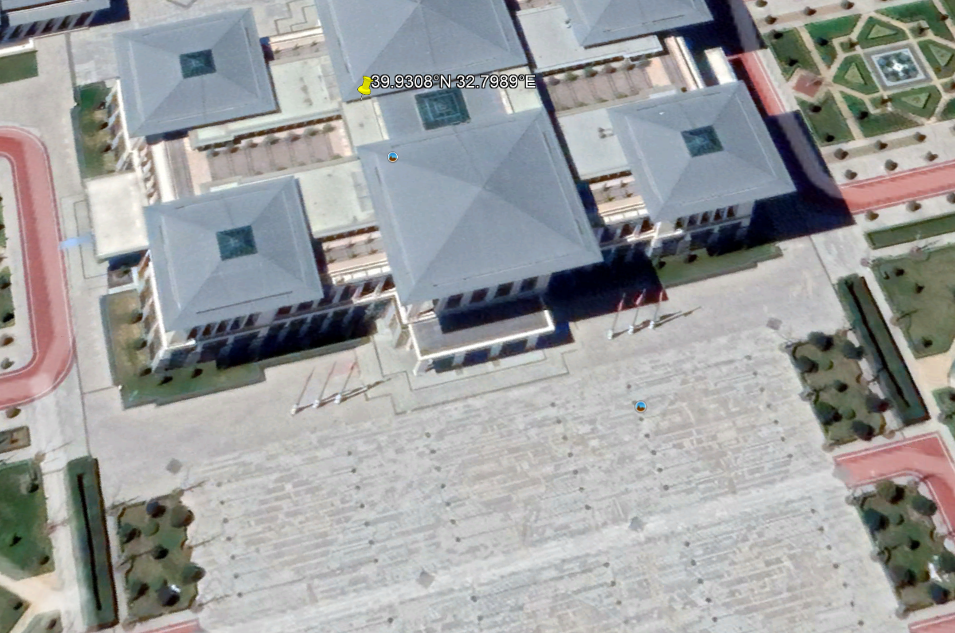
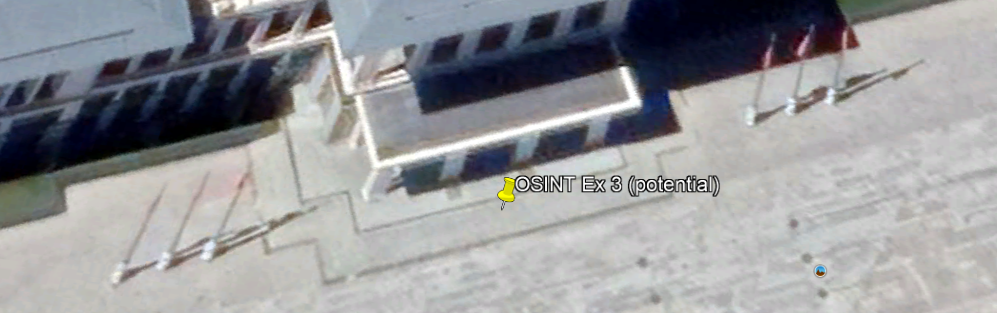

# OSINT Exercise 003
[Link to full briefing](https://gralhix.com/list-of-osint-exercises/osint-exercise-003/) of OSINT Exercise 003  
Creator of Exercise: Sofia Santos

## Task Goal
To identify:  
Name and coordinates of the location in the published photo

### Write up and Thought-Process
**Part 1: Initial Thoughts**  
Photo clearly shows an official looking building. Has both diplomats' countries' flags on either side. Chances are it could be an official building used to host other international figures by Türkiye. 

Attempting a Google reverse image look-up of the photo below without the headline.   
Link of [image](https://gralhix.com/wp-content/uploads/2023/08/osint-exercise-003-picture.jpg) to use. 

**Part 2: Image Reverse Lookup**  
After uploading the image, there are a number of matches shown [here](https://lens.google.com/search?ep=gsbubb&hl=en-SG&re=df&p=AbrfA8qvt3ZIQiBOG8JHdv1py0Pdxi5vkxOwJAnwLiQf96jersH66JAxgxVfFipSHSVjTbssxQgDgs1nBQXxFQe2Rsl6Aa7zw_HH2x5XWWz8FKtWv1VMlHBaWUXUerpSgPYf8FOzRtq3mmMoJ6Dm6Ze8VFpteSX2oRViBNidUOKAwSncWlDzFt1VbqScq_--nqcYVSKhtqYTzWLcMxCrj_kvGzZBJDYjetxQuwtZSNAKo29fPKWtA_fCM4WdZKLtbOZoban5WGNiPpJlhXgiouL-rnUCkRKC2jt7BnPMuhI6cdw%3D#lns=W251bGwsbnVsbCxudWxsLG51bGwsbnVsbCxudWxsLG51bGwsIkVrY0tKR0l3WmpZelpqSXpMVGN6TW1FdE5EbGlNQzA0TWpjekxUSTVOakkzTkRZM1lXUmxZaElmU1hoM2VFbFlTRzlGZVRCWU9FZHRjM3A0VFdaRGJIWXpZelJuVUVOb2F3PT0iLG51bGwsbnVsbCxudWxsLG51bGwsbnVsbCxudWxsLG51bGwsWyIxYjk2ODEwMC1mZGQ4LTQ5ODktODI4Ni1mNzViZThhNWU5NWMiXV0=) that this is an official building that Türkiye uses for meeting foreign dignitaries. 

Let's explore an articles from this search result, and see if it would explain the location more. 

Amongst the search results (at the time of writing), is this [article](https://www.reuters.com/world/europe/turkish-parliament-approves-finlands-nato-accession-2023-03-30/). 
This also indicates the same location for another meeting, and the footnote of the photo in that article states Ankara, Türkiye. The first clue is that this building is in Ankara. 

A quick google search of "Ankara Türkiye official buildings" showed some potential candidates. One of them is the [Presidential Complex](https://en.wikipedia.org/wiki/Presidential_Complex_(Turkey)). 

From here, after attempting a [google image search](https://www.google.com/search?sca_esv=8d785069c21da656&q=presidential+complex+turkey&udm=2&fbs=AEQNm0BKxFXqFZETuC92mLOmXO9xJMdcEc6vsS8xotR_o6JIE2lxJVbfbQf0QBF0bvfl3GFNBPTQACMdFh6XPuV1Z0Eg9hjj1mCoiKv3FGCZSoL8LFWndMdM2XR4aGD0cSNlCtcWfG2Uxx1VHbESZZGtTLqJIpWorIEiBwoLHBotrxsca8c17DXljhODP05SZ-xKH05k1jwUlGV8PNmYih-FkegBBuFe9w&sa=X&ved=2ahUKEwiq0rmFz56HAxUFV2wGHQL2BloQtKgLegQIDRAB&biw=1536&bih=695&dpr=1.25#vhid=mAR2RyZQ2pkTiM&vssid=mosaic) of "presidential complex Türkiye", the facade of the building looks similar to the published image. 

But one confirming image was [this](https://images.app.goo.gl/8MjryAAaghC92hVt7) article's photo. 

Hence, it is indeed the **Presidential Complex of Türkiye**. 

**Part 3: Narrowing the entrance**  
To narrow down the part of the palace these 2 delegates met, let's use other clues in the surroundings. 

From Google Earth, after narrowing down the entrance to the palace, the next is to confirm the buildings where they snapped the photo. It would need to be at the first building from the entrance, because press and media people would be gathered there, and it can't be too interior of the palace. 

With that hint and the "wind-back-the-clock" tool in Google Earth, this is the rough building at which the photo was taken. The flagpoles are a big clue indicating the entrance.

Hence, by zooming into the entrance of the building, in the image below, this might be the potential place for the photo. 

Its coordinates are:
39°55'52.05"N,32°47'58.75"E. 

### Credits:
Full credits to Sofia Santos for putting together this exercise
