# OSINT Exercise 030
[Link to full briefing](https://gralhix.com/list-of-osint-exercises/osint-exercise-030/) of OSINT Exercise 030  
Creator of Exercise: Sofia Santos

## Task Brief & Goals
The refugee crisis in Central Africa has been ongoing for decades. 
With millions of people fleeing violence, humanitarian agencies play a critical role 
by providing assistance, including emergency shelters. 

The video below, published in Oct 2007, shows the situation in a refugee camp in the Democratic Republic of the Congo. 
The structures seen in the footage are long gone, as the conflict in the regions waxes and wanes. Geolocating temporary accommodations is often challenging, 
as satellite images are scarce and the situation on the ground is volatile. 

It is, however, still possible. 

The task, is to find the exact location of the white tent seen in the video below at the 1:16 mark. 

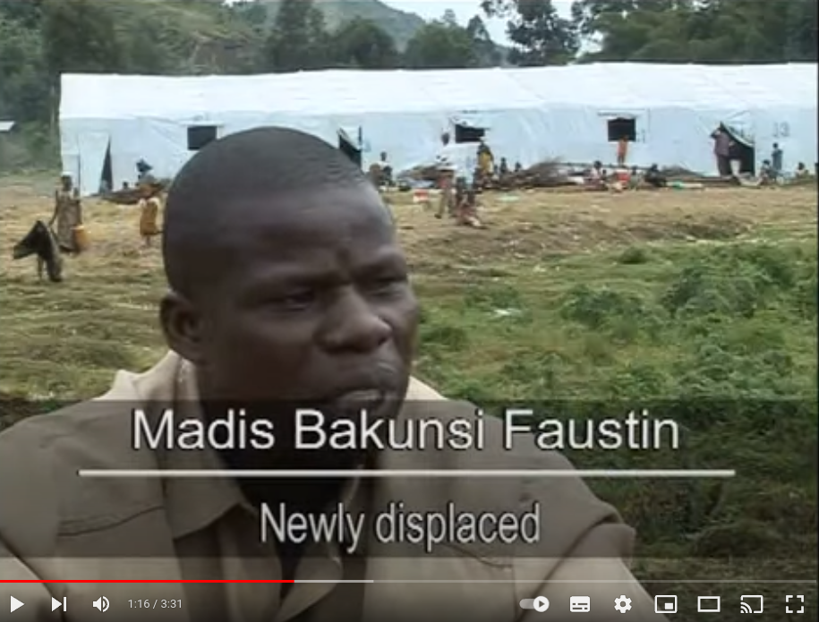

**Part 1: Initial Thoughts**  
Possibly, the first way of going about the exercise is to first try and find the source video the screenshot above is from. 
Seeing the bottom border of the video, it's three and a half minutes long, and given the widgets, it's available on Youtube to this day, as they're up to date. 

After looking up the displaced gentleman's name, with two additional search filters of type as "Videos" and duration as "Under 4 minutes" like so:  

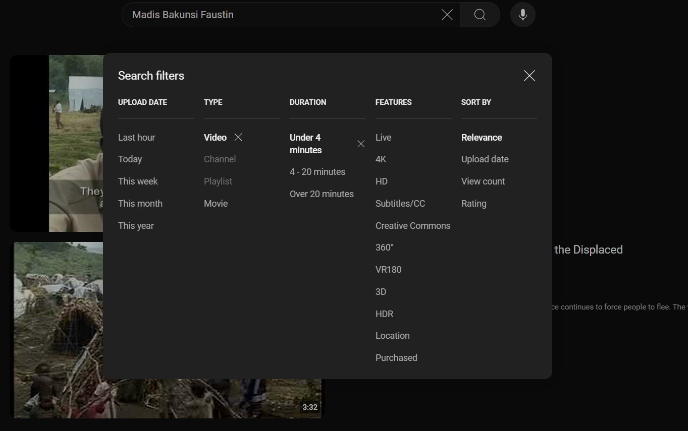

It's the 2nd video, [uploaded by UNHCR](https://youtu.be/BRoQva6wX24?feature=shared), it's more plausible in terms of its upload date, and the duration. 
Potentially, this video can help us narrow down the part of the country this camp could be based in. 

**Part 2: Summary, and clues from the video** 
The video opens up with the title of "Helping the displaced in North Kivu". 

In summary, the video speaks about new clashes that have occured in the eastern part of DRC that has limited humanitarian aid from reaching to those in need. 
The alternative to that has been to assist as many as possible with 20 makeshift campsites in the North Kivu province. This particular exodus of people mentioned in this video
had been triggered by a clash between the Congalese Army and rebel soldiers who are loyal to Laurent-Nkunda from the previous week. 
(Given the upload date of the video, potentially the week of 14th - 20th Oct 2007). 

Specifically, in one particular camp: the Belengo(?) Camp in West Goma, rebel soldiers were forcibly conscripting any man they can find. Then, we hear from Faustin, the gentleman from the task photo.
He too did have the rebel soldiers come after him to conscript. 
The video then continues to elaborate on the problems the campsites are facing, with the increasing number of displaced people. 

**Part 3: A potential location** 
So, the area of interest in the DRC has been narrowed down to the North Kivu province. 

Given the editing of the video, and the timing of Faustin's statements, the potential camp featured in the background might be Belengo(?) Camp in West (of?) Goma. 
Looking up some search results, it turns out its name was [Bulengo Camp](https://www.unhcr.org/us/news/unhcr-moves-displaced-new-camp-north-kivu) and it has reached its capacity at the end of September 2007. 

To find its location, the following google search gave a promising result with [ReliefWatch](https://reliefweb.int/report/democratic-republic-congo/democratic-republic-congo-humanitarian-disaster-north-kivu-demands-urgent-response).
Seeing the description of the camp from the video, it is westwards of Goma. 

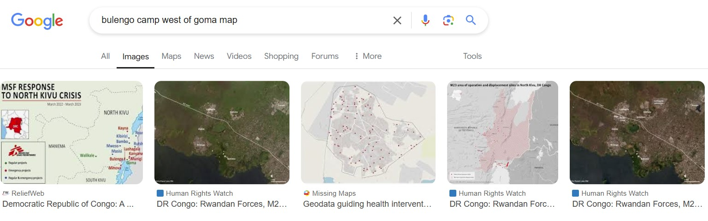

Oddly, when looking up "Bulengo Camp" in Maps, there's a chance to keep getting directed into an address within Goma. That's actually not the camp itself, and so, a bit of toggling is required. 
From the map above, we can see that the original Bulengo camp and Goma are along the perimeter of a water body. Using that as an outline, and looking up "Bulengo", there are some options available. 

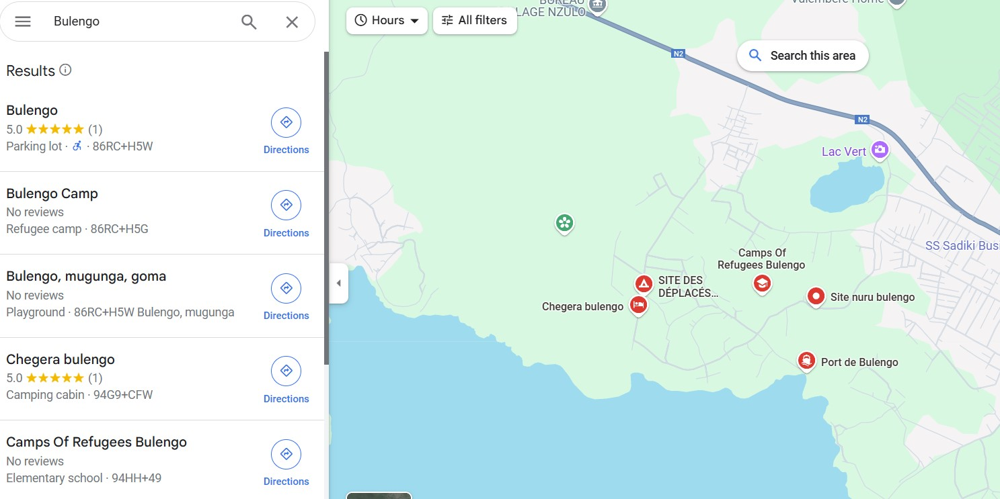

When looking at the Bulengo area in general, and in Terrain mode of Maps, this is visible as satellite image. 

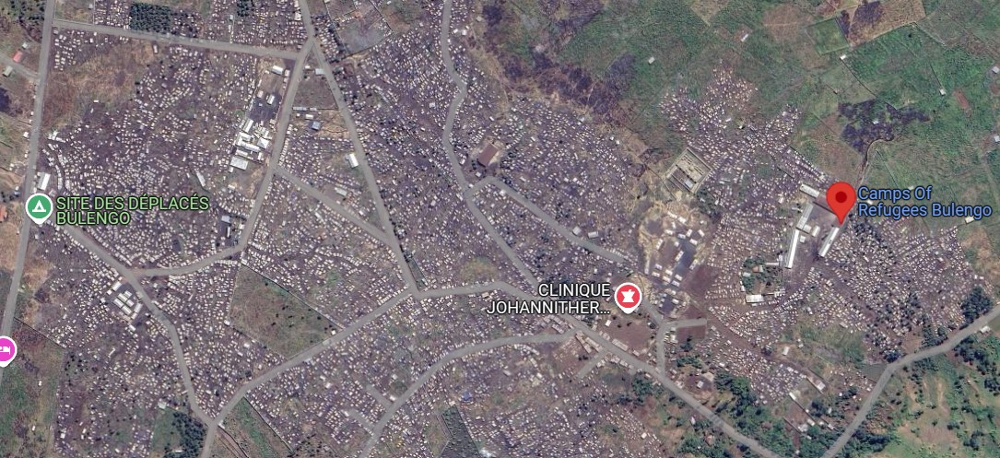

Using the Map coordinates of "SITE DES DÉPLACÉS BULENGO" (-1.622056052517671, 29.119089459327675), looking that up more thoroughly in Google Earth.

**Part 4: Inspecting the Bulengo Area more**  
The same coordinates in Google Earth, didn't provide the best images on Bulego Camp back in 2008. It just provided blurry images instead. 
Therefore, another avenue is needed to try and find aerial photo of the camp instead. Or like Ex 29, potentially a blueprint PDF of the camp (if that's possible). 

Luckily, there is one result of Bulengo Camp, from [another UN resource](https://media.un.org/photo/en/asset/oun7/oun7665707). As per its description, it is possible to view
Bulengo camp in the background. 

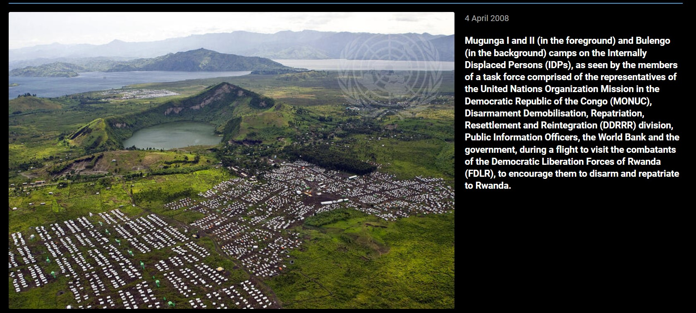

Given the broader view of the landscape Bulengo Camp is in, there are geographical features that are possible to geolocate this vicinity. The highlight to look for here is the crater lake. 
Going back to Google Maps, with the above coordinate, it is shown that it's called Green Lake. The next two features are the shoreline and the hilly/volcanic islands jutting out of the water. 

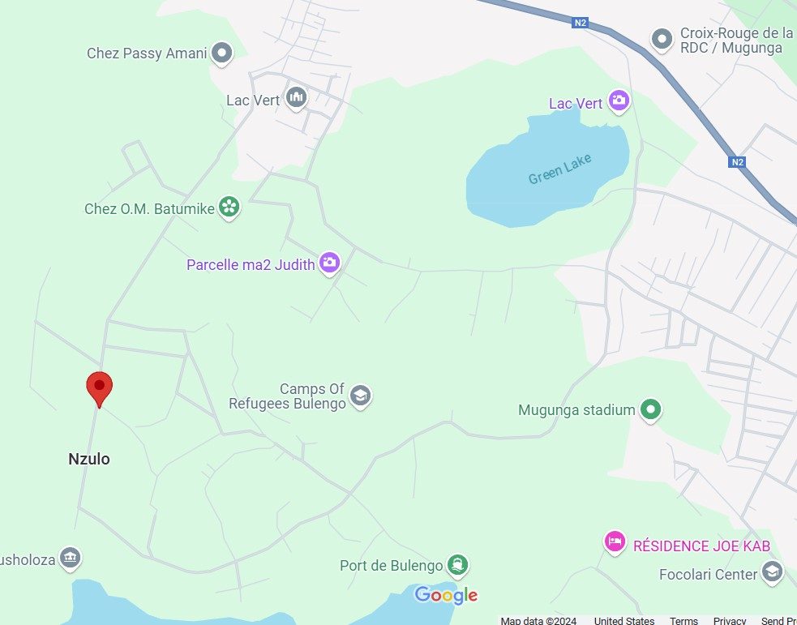

So, let's now use Green Lake's coordinates instead, to narrow down into the direction of Bulengo Camp. Interestingly, there's a vantage point up in Green Lake, that can come in handy, called Lac Vert. 
With this, we can try and orient on Google Earth to match the photo we see. The coordinates for this point are: -1.6116429071796978, 29.13732921426638. 

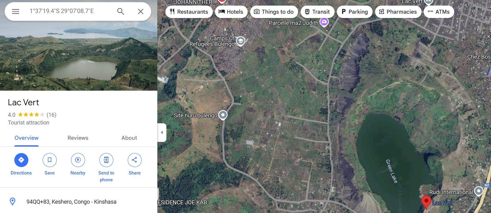

Using this, let's return back to Google Earth. And indeed, we've narrowed down the potential Bulengo area more steadily, and drew in a rough outline that could be there. 

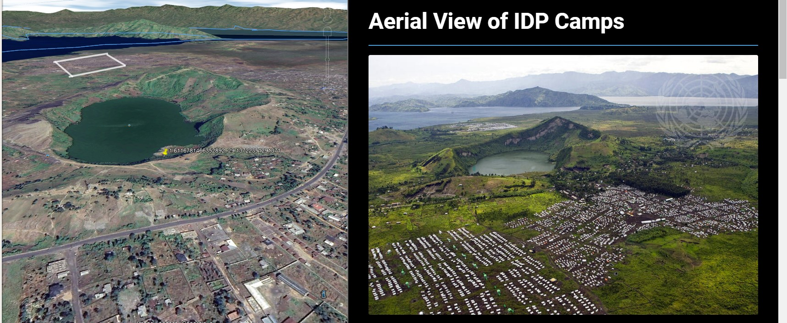

Now, the next part is to estimate coordinates and review the video once again for more landmarks to find the position of that tent from 2007. 

**Part 5: Finding the coordinates of the white tent** 
Revisiting the video, there were some useful time markings on more geographical clues around the white tent. A couple of potential points in the video include: 

1. The presence of a thicker set of trees just directly behind the tent, and a few of the windows and doors that are visible in the tent.  
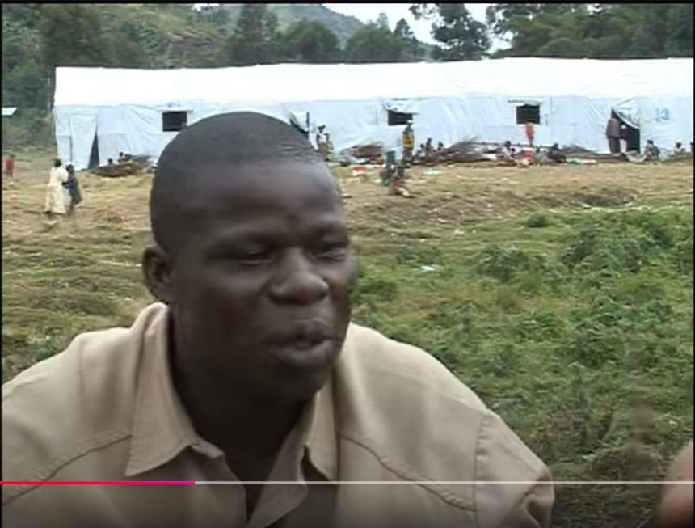

2. The background having a coastal line, and a mountain poking out of the water.  
 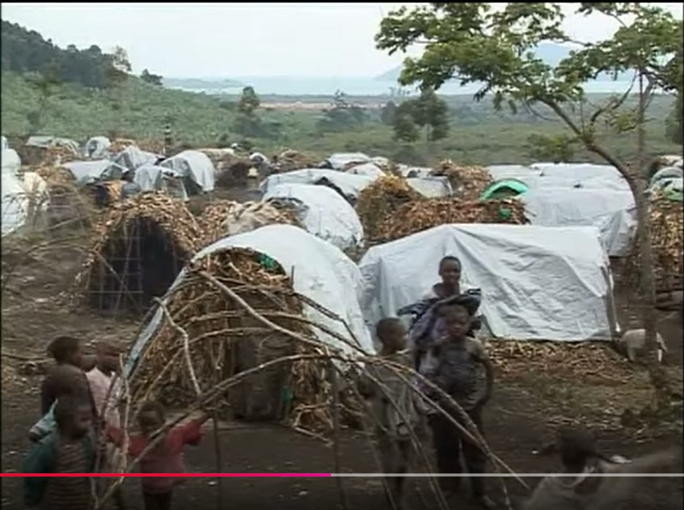

3. The tent being visible right at the edge of the frame. And behind the registration table, a tree being there in the right hand side of the scene.  
 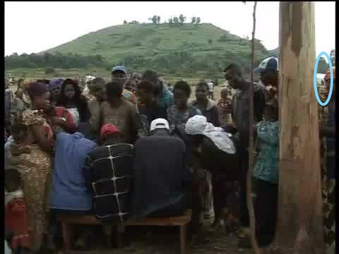

The biggest feature to hunt for next is the hill visible in the last frame, with the denser trees being present at its foot. 
The video shows the hill as having a flatter top, and so the rough coordinates for it could be 1°37'24.59"S, 29°7'45.97"E on Google Earth. 

Therefore, the tent would be in the vicinity of the foot of that particular hill, in that orientation. 
Looking at the first photo, the tent has several physical features behind it. There are two hills and more dense trees right behind. 
Hence, there's a good chance, the tent might be in this vicinity, in front of the hills and trees. 

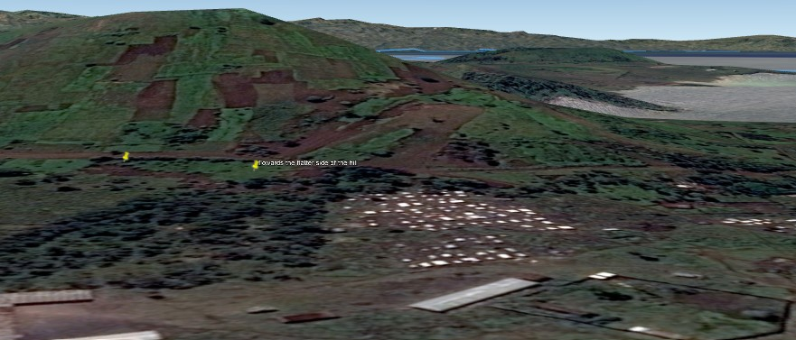

Seeing the area from a bird's eye view: this can be the potential position of the tent. To estimate that, accounting for the tree that might've been there (assuming it's around roughly in 2014 from 2007), and the tent 
being at that estimated distance, this can be the position of the tent from 2007. 

After making the polygon, and modifying its properties a bit, there's a way to make it into a building: with altitude, and extending it to its sides.

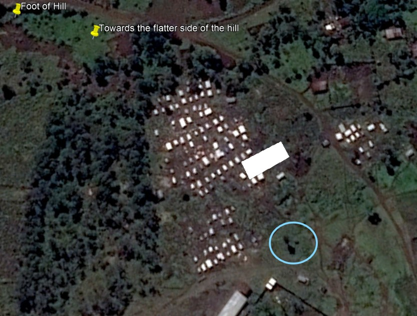

**Part 6: Verifying the tent**
So for now, on Google Earth, a polygon building has been made for the tent. And in order to verify it, there is a need to confirm it against the aerial photo from the UN. 
Going back to this [source from Part 4](https://media.un.org/photo/en/asset/oun7/oun7665707). 

Downloading that and taking a zoomed-in look, the white tent could possibly be this one. 

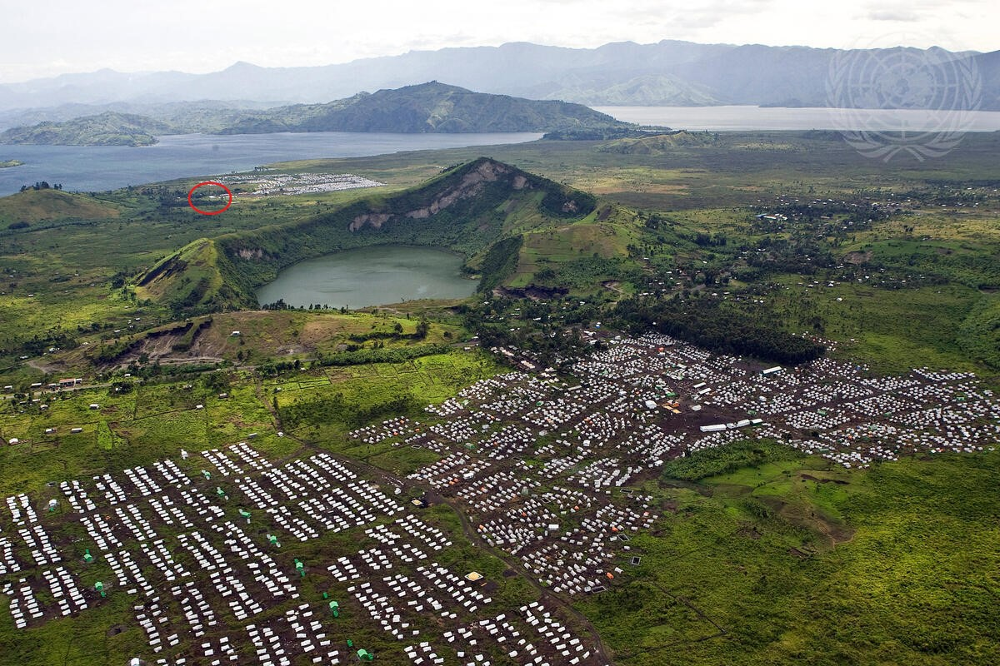

And comparing them both the UN photo, and the polygon building in Google Earth:  
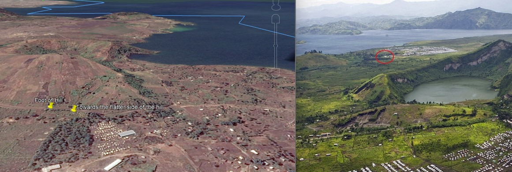

Based off the tent polygon created, the white tent from 2007 has the estimated coordinates of -1.623558, 29.128217 (1°37'24.81"S, 29° 7'41.58"E). 

**Credits**  
Full credits to Sofia Santos for putting together this exercise.