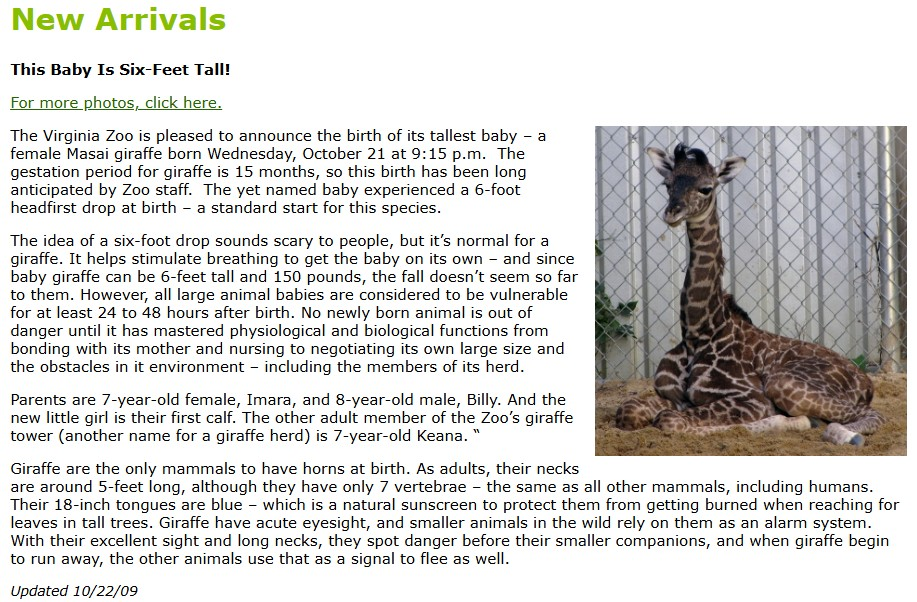
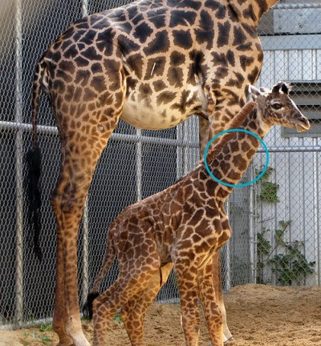

# OSINT Exercise 031
[Link to full briefing](https://gralhix.com/list-of-osint-exercises/osint-exercise-031/) of OSINT Exercise 031  
Creator of Exercise: Sofia Santos

## Task Brief & Goals
  

This newborn giraffe seen in the photo belongs to an endangered species. Individuals such as this one, born in captivity, often participate in conservation programs. This may include transfers to accredited facilities for carefully planned breeding efforts aimed at ensuring the survival of their species.

Your task is to find the following information regarding the individual seen below:

1. Location and date of birth.
2. Current residence and date of arrival.
3. A photo in its current habitat.

**Part 1: Initial Thoughts**  
First off, what a sweetie.  

Secondly, let's start with some small research of Giraffes and conservation of them first to get a better understanding of what our parameters are for this exercise: 
i.e. how many subspecies are there, some facts about them.

**Part 2: The David Attenborough Takeover - Giraffes** 
Looking up some cursory reading in the [Giraffe Conservation website](https://giraffeconservation.org/giraffe-species/), it turns out that there are 8 subspecies of giraffes that are about. 
Amongst the eight, our little one belongs to one of them.

Also, when looking at some [facts](https://giraffeconservation.org/facts-about-giraffe/14-fascinating-facts-about-giraffe/) about the Giraffe here, one interesting fact is that each giraffe has its own unique coat pattern.
As for [about baby giraffes](https://giraffeconservation.org/facts-about-giraffe/faqs-about-baby-giraffe/), we can make a rough estimation of how long the calf would've been with its family 
before moving elsewhere to another residence (to keep in mind for RFI #2). 

Now, we can try and do an image reversal of the sweetie's photo next. 

**Part 3: Image Reversal Findings** 
More OSINT walkthroughs appeared than the actual result, but one promising lead, is the website called [Zooborns](https://www.zooborns.com/zooborns/2009/10/baby-giraffe-calf-at-the-virginia-zoo.html#more). 

Here, we find out that our sweetie was born in Virginia Zoo, in Norfolk, VA, in the USA. The blog has two conflicting dates about its birth: it's quoted as the 23rd Oct 2009 above, and later below, 21st Oct 2009. 

So, to verify further, the next best thing is to try and look at an older version of the Virginia Zoo website. 

**Part 4: Winding back the clock to 2009** 
For this step, the WayBack Machine proved to be more handy than Google Dorking. As we have narrowed down dates for the newborn, we can zoom into a snapshot of the website in October 2009. 
With the snapshot taken on [Oct 22 2009](https://web.archive.org/web/20091022052823/https://virginiazoo.org/), and navigating into sitemap, there's a section that comes up called "New Arrivals and Births". 

There's a good chance that news of our newborn would be around there. 

However, when navigating into the section, the latest news of that screenshot is from Sept 2009. 
When navigating into that particular "New Arrivals and Births" section, the Wayback URL is now specific to New Arrivals and Births. 
It's no longer the general Virginia Zoo one. 

Therefore, the next best thing to do, is to toggle across the snapshots of New Arrivals and Births in the top right corner with the blue arrows. 

And sure enough, proceeding to the [next snapshot](https://web.archive.org/web/20091031015448/http://www.virginiazoo.org:80/about-the-zoo/new-arrivals.asp), there could be news 
published of our sweetie in question. Plus, the reporting lingo is almost similar to the ZooBorns website.

Comparing the photos between the Wayback Snapshot, and ZooBorns, 2 photos are common in both sites. 

The photo that needs verifying is the 3rd photo in ZooBorns, which is the task photo. 
For that, we will try and compare the task photo with a photo that shows the newborn's right side. 

**Part 5: Verifying the newborn**  

Comparing against the task photo, this photo (that's on both sites), on the giraffe's right profile show a couple of matching patches. 

Therefore, both sites are speaking about the same newborn, and as per the [snapshot](https://web.archive.org/web/20091031015448/http://www.virginiazoo.org:80/about-the-zoo/new-arrivals.asp) of the official write-up from the zoo, it has quoted that 
the newborn was born in Oct 21st 2009, 9:15pm local time (located at the Virginia Zoo, Norfolk, VA, USA).

**Part 6: News about the Newborn**  
So, it's established that this newborn giraffe was born at the Virginia Zoo on Oct 21st 2009. As per the Conservation website found in Part 2, [calves would tend to depend on their mother's milk for 9 - 12 months](https://giraffeconservation.org/facts-about-giraffe/faqs-about-baby-giraffe/#:~:text=For%20how%20long%20will%20a%20giraffe%20rely%20on%20its%20mother%E2%80%99s%20milk%3F). 
It's probably in this segment of time, more news about the newborn's health will get published. 

Once again. navigating to the sitemap, there are several snapshots we can try. At this point, this [sitemap](https://web.archive.org/web/20100412202519/http://www.virginiazoo.org:80/about-the-zoo/site-map.asp), snapshot, 
is from April 2010, and health of the newborn giraffe would be around. Given the categories listed, it's highly likely updates will be given in the "News and Press" category. 

**Part 7: Movement of the newborn giraffe, Willow** 

As suspected, more news of the newborn giraffe is shared in the press releases. One article verifies she's now called [Willow](https://web.archive.org/web/20100613032941/http://virginiazoo.org/zoo-happenings/MeetWillow.asp), and has begun to spend [time outdoors](https://web.archive.org/web/20100613033106/http://virginiazoo.org/zoo-happenings/willowexhibit.asp). 
This article also mentions her parents are Imara (Mom), and Billy (Dad).

It's in the article about Willow spending time in the outdoor exhibits, it is written she's in the Masai subspecies of giraffes. Now the next thing to do is to find out, where Willow went, after growing up in Virginia Zoo. 
For this, once again, choosing a later capture of the sitemap will work well. From part 6, we've learnt that newborns will be with their mums for 9-12 months. Counting from Oct 2009, going to Oct 2010, any further news of her would happen 
after she's grown up to some extent. So adding in an extra side of caution, it's best to look up a [Newsroom snapshot from 2012](https://web.archive.org/web/20120818011926/http://www.virginiazoo.org/zoo-happenings/news-and-press.asp). 

And there's one article that's a good hint, the article called ["Nearly Six Feet at Birth"](https://web.archive.org/web/20120719173610/http://virginiazoo.org/zoo-happenings/20110729_Baby_Giraffe.pdf.pdf). 
This article speaks about another offspring Willow's parents had, and at the bottom, it is mentioned that Willow was then at Disney's Animal Kingdom in Florida (as of July 2011). 

So the article gives us a hint that Willow had left before July 2011, and with a simple google search of "willow giraffe disney's animal kingdom", one article by [Windsor Palms Florida](https://www.windsor-palms-florida.net/latest-news/disneys-animal-kingdom-gets-a-new-baby-giraffe)
shared Willow came to Disney's Animal Kingdom (Florida, US), on Oct 12th, 2010. 

**Part 8: Is Willow still in Florida's DAK?**  
The other thing the Windsor Palms Florida article had hinted at is Willow being part of a herd that will eventually get released into Kilimanjaro's Safari Ride. The question is if as of 2025, if she's in Florida, Kilimanjaro, or elsewhere. 

*Okay, my mistake*, the Kilimanjaro Safari Ride is an attraction of Disney's Animal Kingdom (DAK). So for now, let's find more evidence if Willow is still at the DAK. 

When googling more on "willow giraffe in Disney's Animal Kingdom", there's a [2024 video](https://youtube.com/shorts/DZ4A3dkiKs8?si=XtadsAao2XimOyAJ) that verifies it's Willow. 

And back at her baby picture, that heart patch is indeed visible. 

With a high probability, we'll assume the 2024 video is the most recent media of Willow, and find how her habitat in DAK is. When looking up more results of Willow in the DAK, there's
a report that [she's became a mother in 2020](https://www.clickorlando.com/theme-parks/2020/12/04/disneys-animal-kingdom-welcomes-pair-of-masai-giraffe-calves-to-savanna/). While this was sometime back, 
the article is focused heavily on Willow and her offspring. And not only that, the article's second and fifth photo features Willow, once again with the heart patch visible. 

Therefore, the 2024 video shows Willow in her habitat (but only a small segment of it), and the photo from when she became a Mum, shows a more extensive version of her habitat. 

**Credits**  
Full credits to Sofia Santos for putting together this exercise.