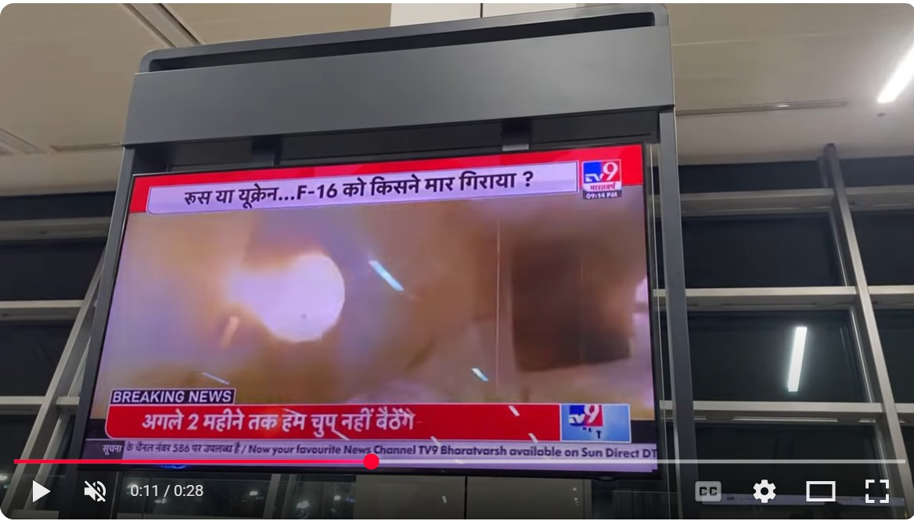
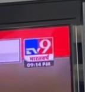
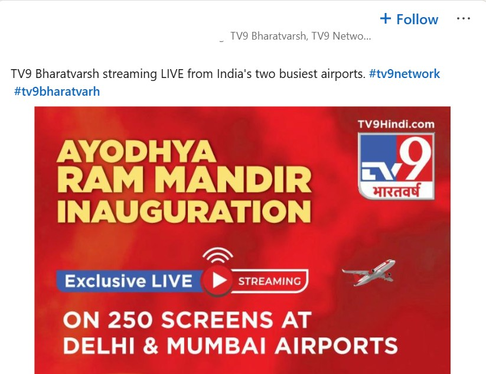
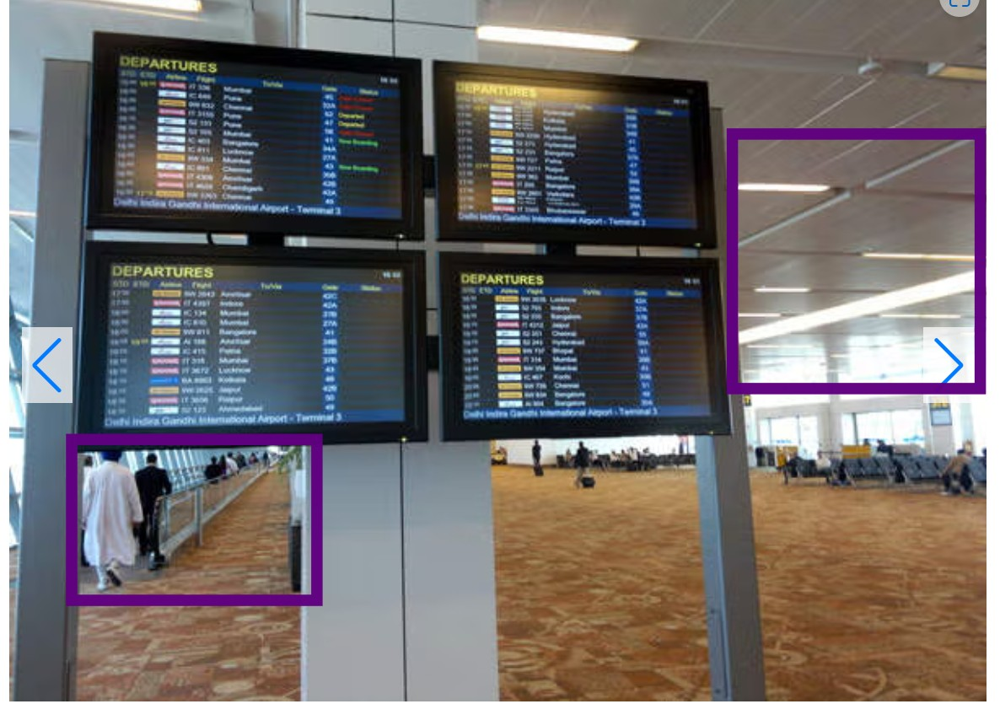
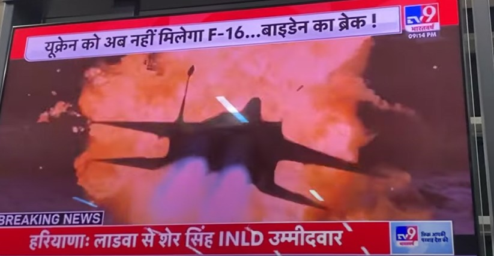
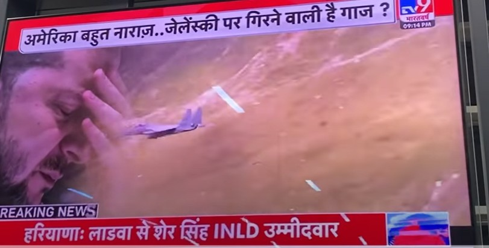
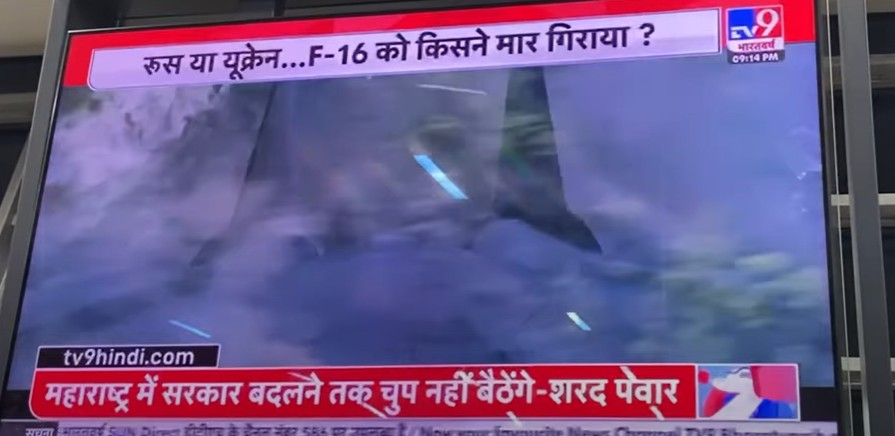
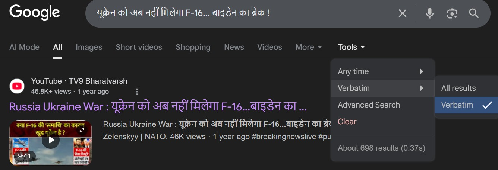
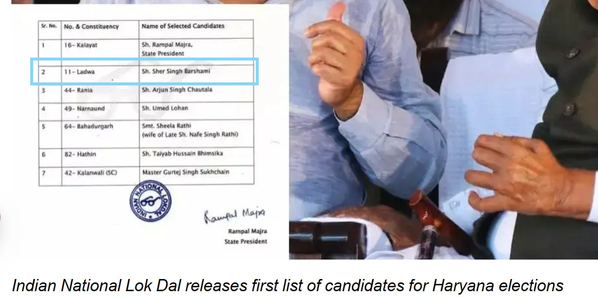

# OSINT Exercise 032
[Link to full briefing](https://gralhix.com/list-of-osint-exercises/osint-exercise-032/) of OSINT Exercise 032  
Creator of Exercise: Sofia Santos

## Task Briefing
Airports are global hubs where cultures, languages, and lives briefly intersect. Millions of people pass through them each day. On an undisclosed date and at an unknown location, one of these travellers recorded a TV screen for 28 seconds. The video can be found below.

Your task is to:  
a) Determine the exact date and time when the video was recorded.  
b) Identify the airport and the terminal where the TV screen was located.  

### Write up and Thought-Process

**Part 1: Initial Thoughts**  
First, let's have a watch of the video... in HQ. And afterwards, I paused at roughly the 11th second of the video, and using the comma/period keys from the keyboard, inspected it frame-by-frame. 

 

At a clearer frame: this is what we can first find: 

1. The time at the top right shows 09:14pm. 
2. The ticker tape below the news segment says "Now your favourite TV9 Bharatvarsh available on Sun Direct". 
3. The logo, indeed confirming to be "TV9". 
4. Some linear lights are reflected in the TV screen, so we have some small indication of the lighting system in that part of the airport. 

Now with these confirmed first: let's proceed. 

**Part 2: Geolocating the country first (possibly airport?)**  
Before attempting to find the date of the video, it made more sense to first figure out the country this could be in. A quick search on "TV9 Bharatvarsh" indicated that it is an Indian Hindi-language news channel, and as per its [Wiki writeup](https://en.wikipedia.org/wiki/TV9_Bharatvarsh), it's also offered in many various regional languages. 

To double check: when closing up on the TV screen's logo, the language indicated below TV9, is indeed Hindi, as seen from its Wiki page. 

  

So, we can now be sure of the following: at an Airport in India, the Hindi version of TV9 is common to be broadcast in its TVs.  

Next, is to find potential airports that can be broadcasting TV9.  

Somehow, out of a stroke of luck, when searching up "TV9 Bharatvarsh and airports they are broadcast in, I came across a Linkedin Post with the following photo:  

This individual who is part of the company, had published an event in that had actively been broadcast in the time it was happening in the Delhi and Mumbai airports.  

That's a big primer for us: because Delhi - the capital city, would tend to use Hindi, the national language, in its airport signs, announcements, and likely, TV broadcasts there.  

The other city, Mumbai, has a high likelihood of using Hindi language in public areas, because, wait for it... it's the cinema capital of India. Bollywood ventures tend to originate from this city, and by proportion, their biggest produced movies by language, are Hindi language films. As it could be a potentially shallow correlation, I opted to look up more articles to see if Hindi might be part of its infrastructure, like airports. When searching up languages used by the airport, we have [this article](https://timesofindia.indiatimes.com/city/mumbai/marathi-signs-at-airport-by-march-mial/articleshow/101971734.cms) indicating that a third language, Marathi, is meant to be included in the International airport of Mumbai as well. The two existing languages, are Hindi and English.  

So we now have two candidate airports in India that the footage above could be from: 
1. Mumbai International Airport (aka Chhatrapati Shivaji Maharaj International Airport Mumbai) - IATA Code: BOM  
2. Delhi International Airport (aka Indira Gandhi International Airport) - IATA Code: DEL  

Let's now proceed with seeing if there are more clues from the footage, or from social media ~ Possibly airport vloggers? 

**Part 3: Extra hints from the video**  
I opted to revisit the video once again. There had to be something to tap on, somehow to see what else we can find. 

I did come across some other bright and shiny something - that had been at the bottom right hand corner of the video. It was roughly in the last 8 seconds of the video. 

So it almost looked like another video's reflection is visible in that corner of the video. Looked like a lady twirling, with bits of her hair being seen towards the end. 

And, when paying attention to that, we can see people walking by. They oddly seem to be moving faster than normal. A place where travellators would be present? And already, near the videographer, there's another video screen being present focused on something else. 

While it is hard to see what that reflected video might be about, normally, based on my own stereotypes, assuming if it were an advertisement, a lady twirling about might be about a perfume or some fragrance. Products like these might normally be in the Duty Free shops.. So could this section of the airport potentially be past the check-in counters? 

There's not a lot of supporting obvious evidence to conclude on the reflected video as such, but it gives some structure to what this section of the airport might look like. 

Hopefully, we can somewhat see what airport vloggers might say about these airports. 

**Part 4: Reconnaissance on airports**  
From here, I opted to look into images from google on how the airports could look, past check-in areas. Beginning with Delhi airport first, I looked up "delhi international airport past check in area", just as a primer. 

There was an [old article from 2020](https://www.airport-technology.com/projects/indira-gandhi-international-airport-terminal-3/?cf-view) about how Terminal 3, of DEL, is meant to serve as the International terminal. 

I looked into the carousel of images that were present in the article, and saw potential matches to some elements that were visible in the first video from Youtube. 

There are some matches with the linear lights being present and the travellators, which explains why there might have been people walking much faster than normal. Is the same place as where the person took the video, it's hard to determine still. 

However, before seeing if Delhi airport's Terminal 3 could be the place we're interested in, I first wanted to cross check if we could rule out Mumbai's Airport by this point. Thankfully, as a search result, there came up [another video of a vlogger](https://youtu.be/eWSqdODH_uU?si=xiVIOSUUE0mjpLw2) walking through the check-in counters, and all the areas he had walked by before arriving at his gate. Paying attention to the ceiling, it felt like this could not match the facade seen from the original task video. 

Therefore, we've managed to solve the 2nd question first; It's highly likely from Indira Gandhi International Airport in Delhi, Terminal 3. 

Onwards to finding out the date the video was shot in. 

**Part 5: Figuring out the date of when the video was taken**  

For this, I opted to revert back to our original task video. We know for a fact that it was broadcasting TV9 Bharatvarsh in Hindi. From there, I tried to find the relevant points at which the video showcased some news headlines, and hopefully find matching articles published by Bharatvarsh for some days. 

Within the first 5 seconds, we can see that the headlines below, in the red box was stationary, but the one on top, in the white box changed rather rapidly. Therefore, I opted to take a screenshot at certain timestamps of the video. Specifically, a few frames before the first second (use the `<` key on the board to rewind frame by frame), the third second, and at roughly the ninth second. 

Let's sequentially review them, and the news things they mention. 

#### From the 1st second  
  

When pushing this up on Google reverse image search, the lines of the screenshot were pulled out, and here is its translation

| Original Text in Hindi | Translation into English |
|------------------------|--------------------------|
|यूक्रेन को अब नहीं मिलेगा F-16... बाइडेन का ब्रेक ! | Ukraine will no longer receive F-16s... Biden's break! |
|हरियाणाः लाडवा से शेर सिंह INLD उम्मीदवार | Haryana: Sher Singh is the INLD candidate from Ladwa |

#### From the 3rd second  
  

| Original Text in Hindi | Translation into English |
|------------------------|--------------------------|
|अमेरिका बहुत नाराज़.. जेलेंस्की पर गिरने वाली है गाज ? | America is very angry... is Zelensky going to be punished? |
|हरियाणाः लाडवा से शेर सिंह INLD उम्मीदवार | Haryana: Sher Singh is the INLD candidate from Ladwa |

#### From the 9th second  
  

| Original Text in Hindi | Translation into English |
|------------------------|--------------------------|
|रूस या यूक्रेन...F-16 को किसने मार गिराया ? | Russia or Ukraine...who shot down the F-16? |
|महाराष्ट्र में सरकार बदलने तक चुप नहीं बैठेंगे-शरद पेव्र | Will not sit quiet until the government changes in Maharashtra: Sharad Pawar |

Okay, we have a lot of news that were briefly flashed in just 10 seconds from this very intense news video snippet. The fact that this much had appeared within 10 seconds, at 9:14pm of the day, there are some things to consider:

1. It can be a recap of all that might have been covered in the day. 
2. Likelihood, these might also have been published in the same day in the digital version of the channel. So it might be helpful to have a look there. 

From its Wikipedia write-up, the website for TV9 Bharatvarsh in Hindi is https://www.tv9hindi.com/ . I thought if I could consider building a Google Dork from there, ensuring the `site:` parameter is tv9hindi.com and attempt a search with the `and` parameter on those news titles we've seen. I also opted to switch my Google to Google India to land hits as given some of the news headlines, were of candidates from Ladwa, potentially a place near Delhi.

The first dork I attempted is this:  

~~~
site:tv9hindi.com "रूस या यूक्रेन...F-16 को किसने मार गिराया ? " AND "हरियाणाः लाडवा से शेर सिंह INLD उम्मीदवार" AND "अमेरिका बहुत नाराज़.. जेलेंस्की पर गिरने वाली है गाज ?" 
~~~

Possibly, due to its complexity, this didn't lead to anything good or useful. Google came back saying no results were found. But a workaround, albeit repetitive, started showing a bit of promise. In each new tab, I put in a news headline string in its Hindi letters, and tried to ensure that the "Verbatim" results appeared. 

When trying it on the first phrase, a top result had been a YouTube video. Towards the end, a little bit of the original video appeared, at nearly the [9:23 timestamp](https://youtu.be/hD7ys2jzu9Y?si=zf3A5r9xfx5J0H4V&t=563). The first headline that appeared is the one about America being angry: "अमेरिका बहुत नाराज़.. जेलेंस्की पर गिरने वाली है गाज ?" . And 4 seconds later, after an animation, it's the one that starts with Russia or Ukraine, and who shot the F-16s ~ "रूस या यूक्रेन...F-16 को किसने मार गिराया ? "

Amongst the 5 unique headlines we spotted, two of them appeared in the same rapid manner in a video. Looking into when it was released into YouTube, it mentions Sept 2, 2024. That's something to keep in mind, but I continued with the rest of the titles we can work with first. 

Now, let's proceed to another headline we can make use of: The one about Sher Singh being an INLD candidate:  

| Original Text in Hindi | Translation into English |
|------------------------|--------------------------|
|हरियाणाः लाडवा से शेर सिंह INLD उम्मीदवार | Haryana: Sher Singh is the INLD candidate from Ladwa |

Let's try and find Verbatim results for this particular headline. It had been hard to try and get the same named article or news report from TV9 Bharatvarsh itself, however, many news agencies had covered this particular election. One such article, when modified to the "Verbatim" search results was [this one](https://www.timesnowhindi.com/elections/inld-released-second-list-of-candidates-for-haryana-assembly-elections-article-112970570) by Times Now Hindi. Plus, the photo of the article, also confirms the name of Sher Singh being the INLD candidate from Ladwa.  

This was published on 1 Sept 2024, at 1933 Hours IST Timezone. Going back to our initial video's timestamp, from the logo zoom in picture, it says 9:14pm. 

  

There is a substantial chance that the Youtube video might have released a condensed version of what it might have been broadcasting live from the previous 24 hours. As for the election news, on who the candidate is, it is also highly plausible that after that article, like many others, announcing and confirming those candidate names, it could've been pushed and announced through TV9 Bharatvarsh that same evening. 

That is why with a good amount of confidence, I would venture the video was shot originally, on 1 Sept 2024, at 9:14pm. Inside Terminal 3 of Indira Gandhi International Airport. 

**Credits**  
Full credits to Sofia Santos for putting together this exercise. 
