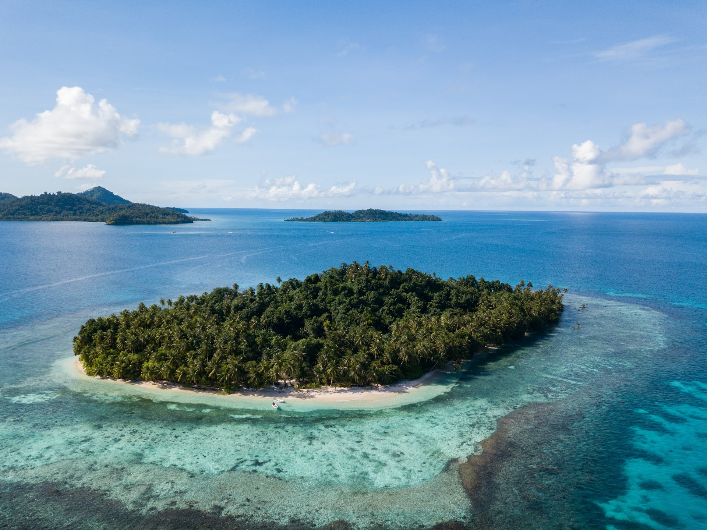
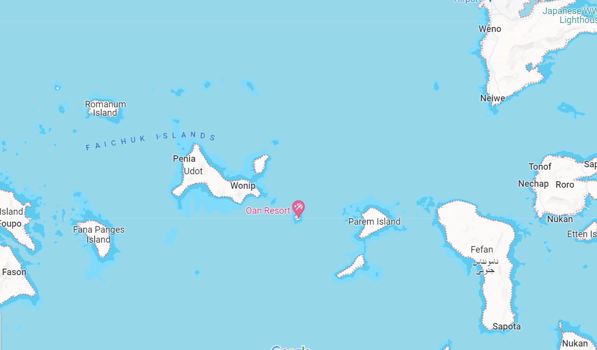
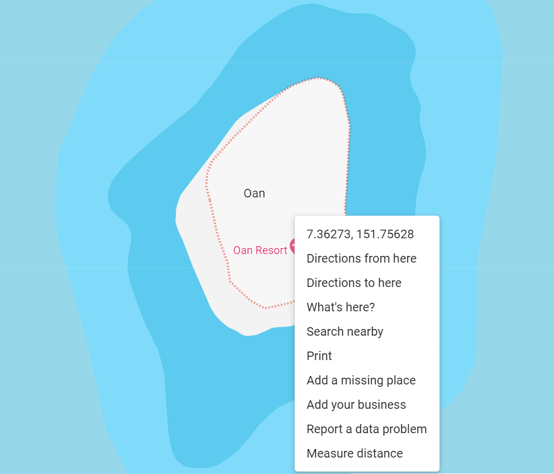
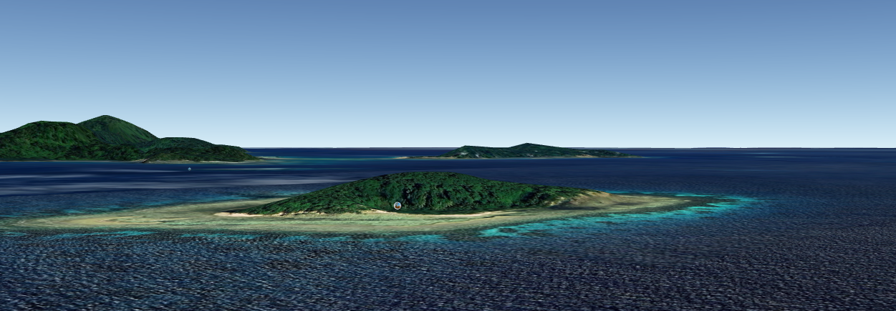
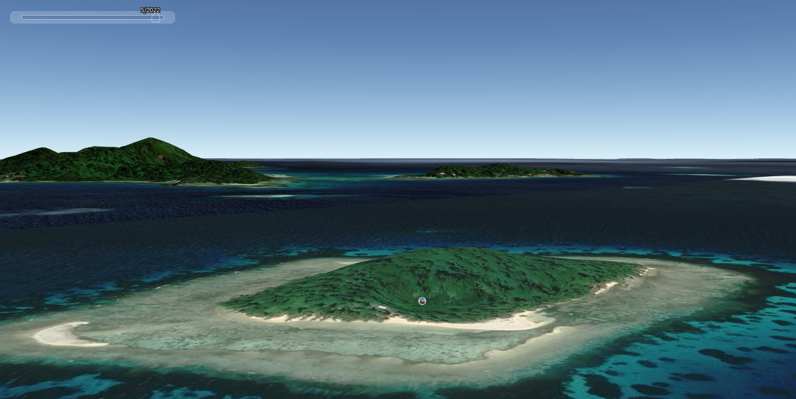

# OSINT Exercise 004
[Link to full briefing](https://gralhix.com/list-of-osint-exercises/osint-exercise-004/) of OSINT Exercise 004  
Creator of Exercise: Sofia Santos

## Task Goals
To identify the features of this photo of a resort located on an island:  
I. What is the name of the resort?  
II. What are the coordinates of the island?  
III. In which cardinal direction was the camera facing when the photo was taken?

### Write up and Thought-Process
**Part 1: Image Reverse Lookup**  
Just executed [Google Image search](https://lens.google.com/search?ep=gsbubb&hl=en-SG&re=df&p=AbrfA8pCRFjCWnWQJ-SSOuiQrdxwdZNOTGwW_R8gW29cTqgqE4BwZ6PVPLtwRo6qeyaCwWMw26buqS2y7sLB-Q7vrpM4l9v4V5WDta0qguHdqrsodEfgwArkYGGykN-ENOvFIWGNSCRzcI8SkCmD2lNsbasB4D_sHMkw6Hx6MKcklSI_5KQQLOVT3zlw4Ok5jTV01wjvDeKW6BhLuhPgS-PspgjeIwroeB6bisO29CdGhL9lERut98-m26s9X_6NLR1aIw2cq-Q9Ympf3W_DhdXF-DnC9Aiu5TAEzQPNWnb8hqg%3D#lns=W251bGwsbnVsbCxudWxsLG51bGwsbnVsbCxudWxsLDEsIkVrY0tKREEzTW1NMlpEUm1MVGd5Wm1RdE5EVTVaQzFoT1dVMkxUWm1OMkZpTURjNU16TmxPQklmYXpSRVkxWjBVM0o2VEVGaWMwWldkMUYzZG5veE4wVXlMVmRGY0VOb2F3PT0iLG51bGwsbnVsbCxudWxsLDEsbnVsbCxbbnVsbCxudWxsLFswLDAsMTAwMDAwLDEwMDAwMF1dLFtudWxsLG51bGwsW11dLFsiODEwYjg1YTctNmNjMC00MmY5LTk1Y2ItMzllN2Y2OWU3M2JiIl1d) on the photo from the write-up and looked for exact matches. 

The [second result](https://www.facebook.com/oanresort/) is a Facebook profile for an "Oan Resort". Amongst its photos is the [same one in the write-up](https://www.facebook.com/photo.php?fbid=493724296086908&set=pb.100063480255744.-2207520000&type=3).

**Part 2: Coordinates of Island**  
Looking up "Oan Resort" more, its [official website](https://oanresort.wixsite.com/chuuk/about) is also published. This has an introductory video of where Oan Resort is located. It mentions its part of the Federated States of Micronesia, and zooms into one of its island states, the Chuuk state. And within that state, into the Chuuk Lagoon.

Using this clue, let's investigate on Google Maps.  

After zooming into the Lagoon more, interestingly, an Oan Resort icon shows up. 

Therefore, we can decipher the resort's coordinates like below in the photo:

And in a similar manner using Maps, the coordinates of the island at roughly:
7.363490783966962, 151.75577412425892. 

Let's now insert this coordinate into Google Earth to see the terrain, and play around with the views better. 

**Part 3: Camera position & direction**  
From seeing the island up close, it's coming together that Oan Island itself is photographed. But it's the background that give a bigger clue on which direction the camera had to be pointed towards. 

When revisiting the task photo from above: we can see a short island, and part of an atoll with its cluster of islets.

Orientation of Google Earth was crucial here, so toggling with the shift key and arrow keys to get close to an eye-level view like so:

With this orientation, it is easy to just press Shift + left/right, and get a 360° view. 

Coincidentally, the rough shapes based of Google Earth matches with what is seen in the first eye level picture. However, choosing to "wind-back-the-clock" to see the satellite imagery from a few years back, close to 2022/2021. Reason being, we can see any changes that happen to Oan's coastline.  

As Micronesia is a place that's subject to a lot of physical geographical change, it's good to see if we can come close to how it did look at the time the photo was taken. 

And likely so, in 2022, the sand in the satellite image of 2022 was more obvious, as it had been in the task photo. 

Hence, we can confirm this was the direction the camera was facing: North-West.

So, the results for the goals in this exercise:  
I) Oan Resort  
II) Coordinates of island: 7.363490783966962, 151.75577412425892  
III) Camera's facing the North-West direction

### Credits:
Full credits to Sofia Santos for putting together this exercise.

Additionally: to help decipher the physical geographical aspects of FSOM: [Geography Now's Micronesia episode](https://www.youtube.com/watch?v=_gSBvcYOuu4)
