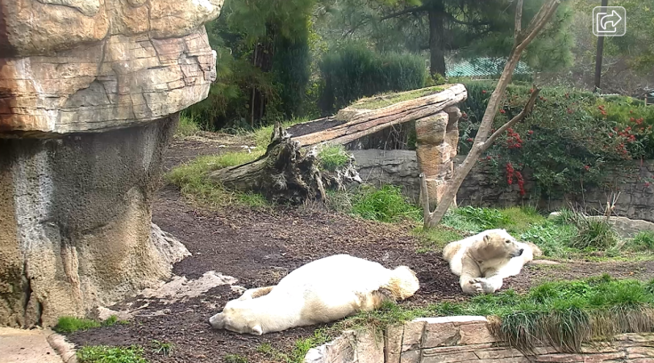
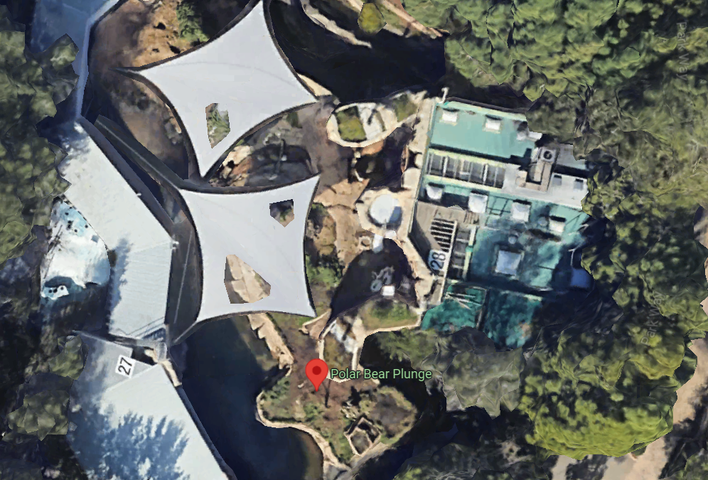

# OSINT Exercise 005
[Link to full briefing](https://gralhix.com/list-of-osint-exercises/osint-exercise-005/) of OSINT Exercise 005  
Creator of Exercise: Sofia Santos

## Task Goals
To identify the following from the screenshot of a zoo live cam:  
I. In which zoo are these polar bears located?  
II. What was the temperature at the time of the screenshot?  
III. The exact coordinates of where the bears were lying down?  

More details of the image:
The image below is a screenshot from a zoo live cam. It was taken on January 15, 2023 at around 2pm local time.

### Write up and Thought-Process
**Part 1: Google Search and Image Reverse Lookups**  
Did a simple Google search of [polar bear enclosure webcam](https://tinyurl.com/2rays3fm) and got these results. 

Navigated to the first search result, the San Diego Zoo link, and delved deeper. The live cam view of the polar bear enclosure in San Diego didn't budge, and the watermark from the top right hand corner was missing too. 

After which, I proceeded to an image reverse look-up, but it wasn't the best way. Tineye, and Yandex didn't help. And Google brought other OSINTers write-ups of this exact task. 

Attempted this one more time with Bing, to see if it gave anything, and this image appeared, with a similar watermark on the top right hand side. 

The screenshot helped affirm that the enclosure was the correct one. Plus, the [article](https://www.makeuseof.com/tag/virtual-travel-experiences-family/) the picture was from mentioned the San Diego Zoo. 

**Part 2: Temperature on Jan 15th, 2023, 2pm Local Time**  
Google searched up "historical temperature san diego" and used this [Weather Underground tool](https://www.wunderground.com/history/daily/us/ca/san-diego/KSAN/date/2023-1-15) and looked up the temperature for the day. At close to 2pm, it's roughly 63°F (or 17.2°C). 

**Part 3: Coordinates of Polar Bears Lounging**  
So, it's established that they're part of a Polar Bear enclosure in San Diego Zoo. Let's first find that on Google Maps. 

Estimating that the polar bears were lounging roughly where the pinpoint is for for the polar bear plunge on Google Maps, at thereabouts: 32.734453180155164, -117.15457469249506. It's quite accurately inside the enclosure and after toggling the camera views of the pictures captured of the enclosure, that could be where the polar bears were lounging within the enclosure. 

So, the results for the goals in this exercise:  
I) San Diego Zoo  
II) 63°F (or 17.2°C)  
III) Rough coordinates of lounging: 32.734453180155164, -117.15457469249506

### Credits:
Full credits to Sofia Santos for putting together this exercise.

