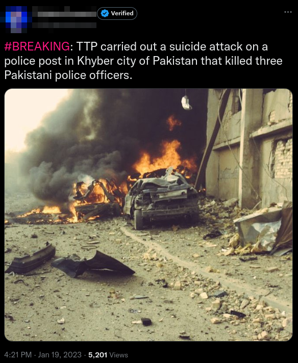
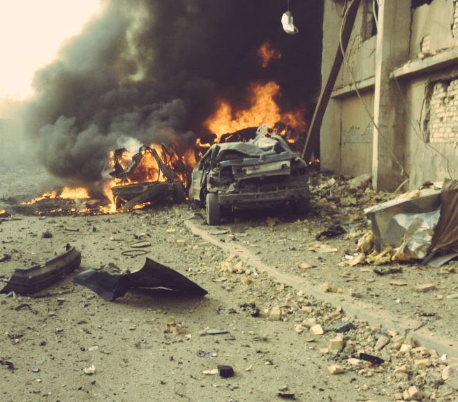

# OSINT Exercise 006
[Link to full briefing](https://gralhix.com/list-of-osint-exercises/osint-exercise-006/) of OSINT Exercise 006  
Creator of Exercise: Sofia Santos

## Task Briefing
On January 19, 2023, a journalist with almost 140k followers on Twitter shared an image of a destroyed vehicle amidst a large cloud of smoke and fire. The tweet said:   "BREAKING: TTP carried out a suicide attack on a police post in Khyber city of Pakistan that killed three Pakistani police officers."

## Task Goals
The photo is not of the event described by the journalist.  
a) Verify the statement above.

### Write up and Thought-Process
**Part 1: Google Searches of the headline**  

Tried a google search of the headline, and it did get confirmed that this report of the attack happened. Some links include:
I) A [news agency](https://www.thenews.com.pk/latest/1032268-khyber-agency) from Pakistan  
II) Another [article](https://www.mashaalradio.com/a/three-policemen-killed-in-suicide-attack-in-khyber/32230945.html) sharing the same thing.  

But the next is to find the source of where the image came from: we'll do an image reverse lookup for that blast photo used. 

**Part 2: Original Source/News of the blast photo**  

Using the photo above, I attempted a reverse image look-up, to see if there was another news article that reported this. 

From the [search results](https://tinyurl.com/48vjm8r5) one article about a blast in [Turkish-Controlled Syrian Town](https://english.aawsat.com/home/article/2549496/18-killed-bombing-turkish-controlled-syrian-town) makes use of the same photo, and a number of articles use them for reporting about radical violence in various places on the planet. The search results also gave the actual journalist's link to his tweet from above.

Amongst the links, [this one](https://en.m.wikipedia.org/wiki/File:WaziriyaAutobombeIrak.jpg) caught attention. It is an example of archival records of the photograph used through the years. 

It mentions that the source is an old one from 2006. Likely, the photo was snapped back in Aug 2006 in Iraq. And scrolled down, it has details of the device used to take the photo as well. 

So to roughly conclude:  
There is a good chance that an attack did take place in Khyber back in Jan 2023, but the photo used wasn't an accurate one. 

### Credits:
Full credits to Sofia Santos for putting together this exercise.

