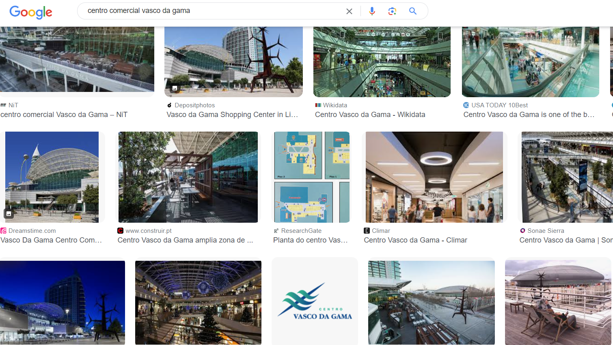

# OSINT Exercise 007
[Link to full briefing](https://gralhix.com/list-of-osint-exercises/osint-exercise-007/) of OSINT Exercise 007  
Creator of Exercise: Sofia Santos

## Task Goals
To find the following details about the photo:  
I) Where was the photo taken?  
II) In which year was the photo taken?  
III) The big poster in the right contained a link. What was the link?  

### Write up and Thought-Process
**Part 1: Google Searches of the headline**  
Attempted a image reverse look-up, and from the results, [this link](https://tinyurl.com/4t4tatz2) looked promising, especially a few pictures in the photo rolodex. The stand-out photo is [this](https://tinyurl.com/9evpyt68). 

The location of this photo is mentioned to be Centro Comercial Vasco de Gama, at Parque das Nações, Lisboa, PT. 

Verifying this with a google search, and narrowing it to images shows a few more images with the same art figure. 

And so, the location is indeed at the shopping mall Centro Comercial Vasco de Gama, in Lisboa, Portugal. 

**Part 2: Verifying the year the photo was taken**  

Referring to the task photo once again:  

One potential big clue is in the Egyptian Mummy poster on the upper right hand corner of the photo.  

Next thing is to verify, what that building is, that's opposite to the shopping mall, and seeing if there were any potential Egypt-related events in that vicinity.  

The first was to attempt a man-drop in the area of where the photo was taken, so that we could then orient ourselves into the street. The landmark to find near the mall is the art figure.  

On Maps, from a top view, with the satellite layer activated, the area this art structure is at, is at the back of the mall. 

And from the task photo, it's understood that it's a pedestrian friendly area, a man-drop could be done to orientate facing the building with the egyptian photo. 

After man dropping, the vicinity could be verified because the flagpoles behind the structure were still around:  

In addition, there was a feature called "See more dates", which means it show photos of the same area in the past. After toggling a little bit to the past, there was a photo from the past with the Egyptian poster. 

The rough date of the photo was Oct 2019. 

**Part 3: Getting the link on the poster**  
One thing to note, when maneuvering Maps' drop-man, while it might navigate the user to pedestrian friendly areas, there's a chance the date could change. That's what I had encountered when trying to move closer to the wall with the Egyptian poster when the date was set to Oct 2019. 

Let's first see if any results happen when looking up Egyptian events in October 2019, in Lisbon. 

Using Google Lens, zooming into the poster, the [name of the king on exhibit](https://tinyurl.com/yc6rkaa4) was "Tutankhamun". However, searching "Tutankhamun Lisbon 2019" into Google didn't fully help. One other thing to do was to try the Portuguese domain of google. With that, some of the more promising results began to show. A number of images with the similar [poster began to appear](https://tinyurl.com/3wcabwu3)

From the results, it could be seen that the link in the poster was: "www.tutankamon.pt". 

And so, the results of this Exercise are:  
I) Centro Comercial Vasco de Gama, in Lisboa, Portugal  
II) Year was 2019  
III) Link was "www.tutankamon.pt"  

### Credits:
Full credits to Sofia Santos for putting together this exercise.

