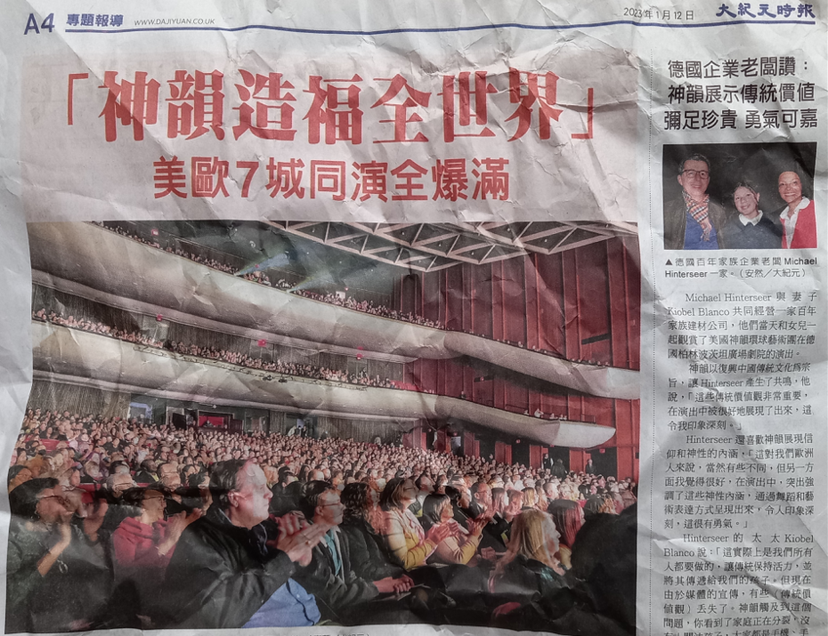
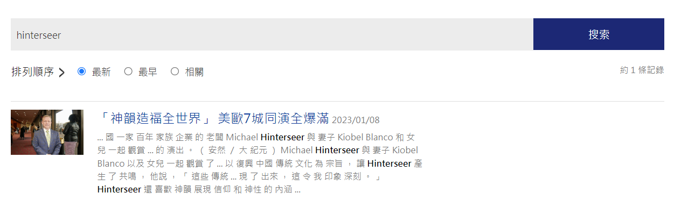
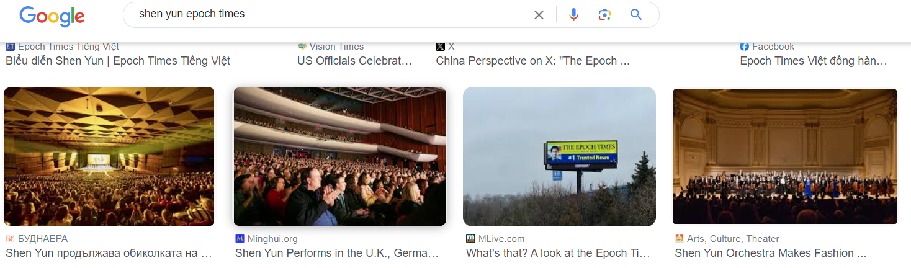
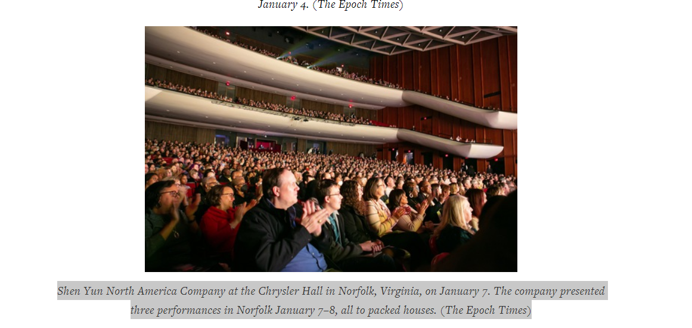

# OSINT Exercise 008
[Link to full briefing](https://gralhix.com/list-of-osint-exercises/osint-exercise-008/) of OSINT Exercise 008  
Creator of Exercise: Sofia Santos

## Task Goals
To find the following details about the photo:  
I) What was the audience applauding?  
II) When was the photo taken?  
III) What is the name of the venue?  

### Write up and Thought-Process
**Part 1: Quick details to pick out from the image**  
Number of clues are in the image about a couple of things:
- The date: article was reported on 2023, January (月 translates to month), 12th (日 translates to day).  

- Couple of English names/phrases are present in the reporting: "Michael Hinterseer", "Kiobel Blanco"  

- The E-version/website of the same newspaper appears to be present in the top left: "www.da(ji)yuan.co.uk" --> assuming its "ji" in the brackets, might be another character.   

Maybe worth a shot to find hints of this article online in the website first.

**Part 2: Investigating the website**  
Entering this website from above to try and see if there's an online version of the article, or something else. 

Entering that, brings us to: https://www.epochtimes.com/

Within that, tried to search up a term used in the article. Decided to give the "Hinterseer" term a go. 

While the date was not the same, as the newspaper, it was worth digging in, as the term appears quite frequently. And intriguingly, so did the other name: "Kiobel Blanco".

Also, [their photo](https://www.epochtimes.com/b5/23/1/8/n13902211.htm#:~:text=Owner%20of%20century%2Dold%20German%20family%20business%20praises%20Shen%20Yun%20for%20displaying%20traditional%20values) from the newspaper articles appears once again. 

So, this is an article mentions about Shen Yun North American Art Troupe's performance. From their tour in Jan 2023.

**Part 3: Gathering details of the task photo**  
So we've narrowed the performance group, and the news agency that reports on them. But let's see if there are more searches we could do, to narrow out that photo used in the article. 

So a bigger picture is coming to place, this artistic troupe is often spoken about by the new agency. And respectively, for each global branch of the troupe, there is a collection of articles. In our case, we're keen on the [North American one](https://www.theepochtimes.com/shenyun/shenyun-north-america-company). Unfortunately, this didn't give the best results. And kept getting stuck at a paywall. So the next approach was to try an image search. 

This resulted in the task photo appearing again as part of the results. Clicking into the photo, the article features the task photo [here](https://en.minghui.org/html/articles/2023/1/13/206159.html#:~:text=Shen%20Yun%20North%20America%20Company%20at%20the%20Chrysler%20Hall%20in%20Norfolk%2C%20Virginia%2C%20on%20January%207.%20The%20company%20presented%20three%20performances%20in%20Norfolk%20January%207%E2%80%938%2C%20all%20to%20packed%20houses.%20(The%20Epoch%20Times)) 

It shows us the venue: Chrysler Hall, Norfolk, Virginia. For the show taken place on Jan 7th 2023. 

And so, the results of this Exercise are:  
I) A performance by the Shen Yun Troupe. In the case of the photo, by the North America company  
II) Taken on Jan 7th, 2023  
III) Venue was Chrysler Hall, Norfolk, Virginia 

### Credits:
Full credits to Sofia Santos for putting together this exercise.