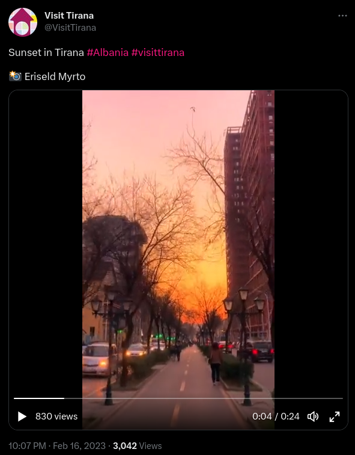
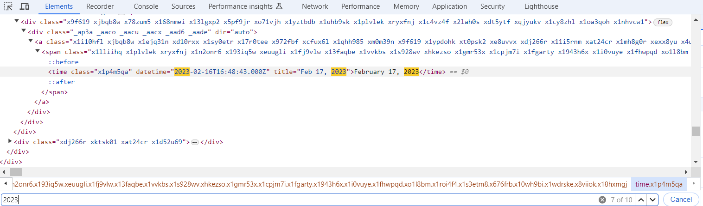
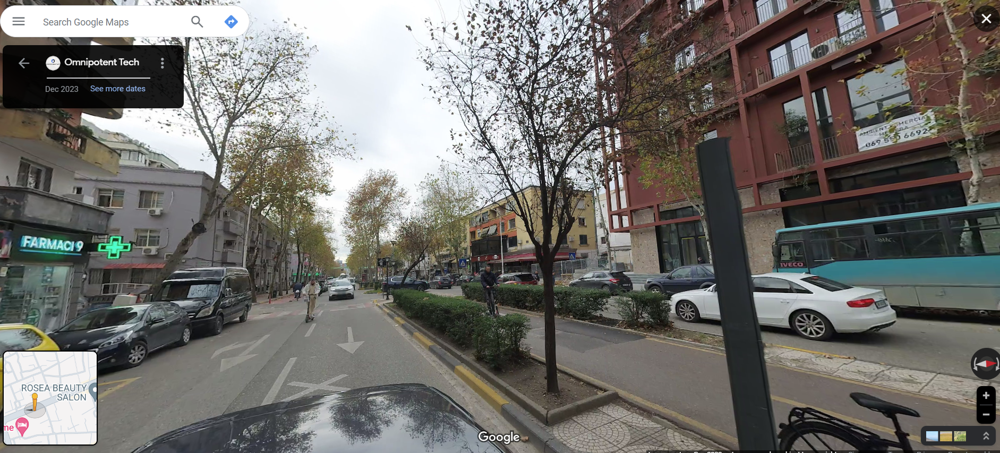

# OSINT Exercise 009
[Link to full briefing](https://gralhix.com/list-of-osint-exercises/osint-exercise-009/) of OSINT Exercise 009  
Creator of Exercise: Sofia Santos

## Task Goals
To find the following details about the photo:  
I) To the best of your knowledge, at what time was the video recorded?  
II) Find the coordinates of where the person was walking at the time of the recording.  

### Write up and Thought-Process

**Part 1: Quick details to pick out from the image**  
The screenshot gives a good number of hints. It's in Tirana, Albania. A video of a sunset, and the name of the photographer. (Big hint, we might need to have a look at the original photographer's works for this video instead.)

The date of the posted video by the Visit Tirana account also gives a clue: chances are, it would need to be a video they borrowed from the photographer before the upload date. So let's browse through the photographer's portfolio from before Feb 16th 2023, 10:07pm local time. 

**Part 2: Looking up the photographer's work**  
After some digging, there was a potential alias the photographer used. With an IG handle of (four_s34sons), and looking at the portfolio from Feb 16, 2023 and earlier, there was the [video](https://www.instagram.com/p/CouwRhAjsQ6/) that was used. 

To check the time it was recorded, had to dig into its metadata. Opening the video in a new tab, and using the Inspect tool. That would give a clue on the video recording time. 

Assuming the video is taken in 2023, let's look for "2023" in the inspect page of the upload. 

After looking for the string "2023" in the index, there came a potential datetime:  

Given that timestamp, chances are it was uploaded at 16:48:43 local time in Tirana, on Feb 16th, 2023. 
Therefore, for recording the video, and pushing it up immediately after: perhaps 16:45-16:46 local time. 

The displayed date is showcased as 17th Feb 2023 here because of being located in a timezone ahead of Tirana.

**Part 3: Coordinates of where the video was recorded**  
So, a few more hints to consider: it was taken at sunset, roughly at the local time of 16:48. Using these hints, we can try to manipulate the layers in Google Maps, and see what shakes. 

Another clue to note is that the photographer is walking towards a flashing green sign - a potential pharmacy. And there was a tall red building to his right side. Also, he's walking towards the sunset, so some west direction is there as well. 

With these clues, let's look into Tirana on Google Maps. 

For this view of Tirana, I chose to add pharmacies in the area, a typical traffic situation at 4.45pm local time, and look for a street that extends out towards the West. 

With those features, it narrowed the street down to this one:  

Seeing the traffic on either side of the video, given the car density, the red portion of the street is a good place to start "walking down" from. To that area, let's try a man drop.

**Part 4: Mandrop into Street**  
After mandropping into the street, it shows us that it's at Kavaja Street. There is a pedestrian divider as shown in the video. Walking towards the direction of the sunset, I'd almost missed the area the red building would've been at, because the date time went back. After choosing to update the date on Google Maps, it could be confirmed that the area matches the video. 

Backtracking a few steps, from the building, the rough coordinates, along Kavaja Street, would be: 41.326760, 19.806688

### Credits:
Full credits to Sofia Santos for putting together this exercise.
